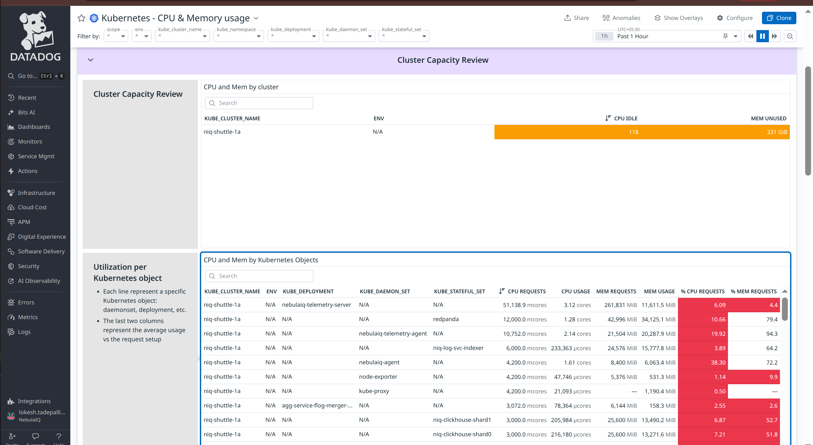
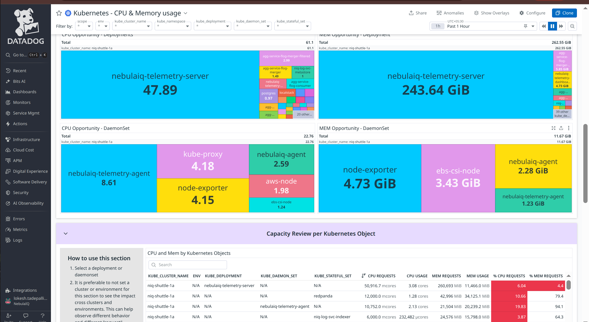
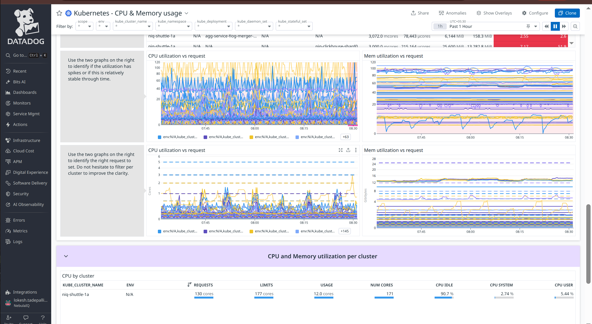
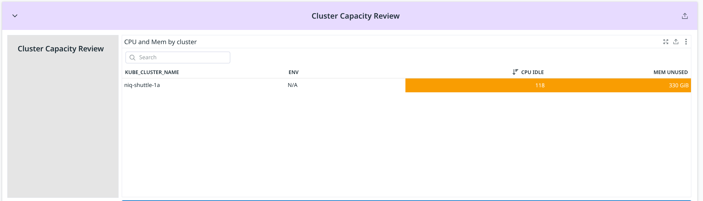
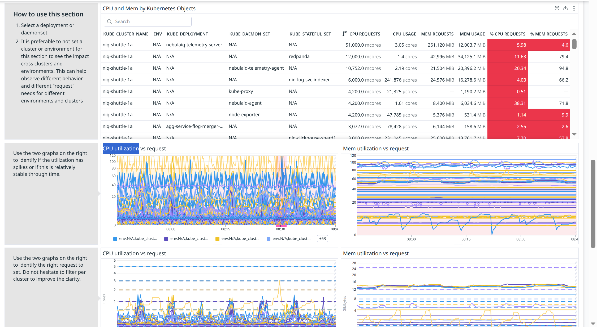
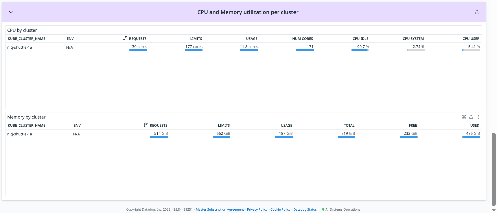

# CPU & Memory Overview





## Cluster Capacity Review



### **CPU and Mem by cluster**

**Metric(s):**

- Metrics used: `kubernetes.memory.requests`

**query** :

```
sum:kubernetes.cpu.requests{*} - sum:kubernetes.cpu.usage.total{*} / 1000000000
```

**Type** : Guage

**Unit** : byte

**Description:** The requested memory

**Tags:** -

---

### **CPU and Mem by Kubernetes Objects**

**Metric(s):**

- Metrics used: `kubernetes.cpu.requests`

**query** :

```
sum:kubernetes.cpu.requests{*}, sum:kubernetes.cpu.usage.total{*}, sum:kubernetes.memory.requests{*}, sum:kubernetes.memory.usage{*}, sum:kubernetes.cpu.usage.total{*} / (sum:kubernetes.cpu.requests{*} * 1000000000) * 100, sum:kubernetes.memory.usage{*} / sum:kubernetes.memory.requests{*} * 100
```

**Type** : Guage

**Unit** : Core

**Description:** The requested cpu cores

**Tags:** -

---

### **CPU Opportunity - Deployments**

**Metric(s):**

- Metrics used: `kubernetes.cpu.requests` , `kubernetes.cpu.usage.total`

**query** :

```
x
```

**Type** : Guage

**Unit** : -

**Description:** -

**Tags:** -

---

### **MEM Opportunity - Deployment**

**Metric(s):**

- Metrics used: `kubernetes.memory.requests` , `kubernetes.memory.usage`

**query** :

```

```

**Type** : Guage

**Unit** : Gib

**Description:** -

**Tags:** -

---

### **CPU Opportunity - DaemonSet**

**Metric(s):**

- Metrics used: `kubernetes.cpu.requests` , `kubernetes.cpu.usage.total`

**query** :

```

```

**Type** : Guage

**Unit** : -

**Description:** -

**Tags:** -

---

### **MEM Opportunity - DaemonSet**

**Metric(s):**

- Metrics used: `kubernetes.memory.requests` , `kubernetes.memory.usage`

**query** :

```
x
```

**Type** : Guage

**Unit** : GiB

**Description:** -

**Tags:** -

---

## Capacity Review per Kubernetes Object



### **CPU and Mem by Kubernetes Objects**

**Metric(s):**

- Metrics used: `kubernetes.cpu.requests`

**query** :

```
sum:kubernetes.cpu.requests{*}, sum:kubernetes.cpu.usage.total{*}, sum:kubernetes.memory.requests{*}, sum:kubernetes.memory.usage{*}, sum:kubernetes.cpu.usage.total{*} / (sum:kubernetes.cpu.requests{*} * 1000000000) * 100, sum:kubernetes.memory.usage{*} / sum:kubernetes.memory.requests{*} * 100
```

**Type** : Guage

**Unit** : Core

**Description:** The requested cpu cores

**Tags:** -

---

### **CPU utilization vs request**

**Metric(s):**

- Metrics used: `kubernetes.cpu.requests`

**query** :

```
sum:kubernetes.cpu.usage.total{*} / (sum:kubernetes.cpu.requests{*} * 1000000000) * 100
```

**Type** : Guage

**Unit** : core

**Description:** The requested cpu cores

**Tags:** -

---

### **Mem utilization vs request**

**Metric(s):**

- Metrics used: `kubernetes.memory.requests`

**query** :

```
sum:kubernetes.memory.usage{*} / sum:kubernetes.memory.requests{*} * 100
```

**Type** : Guage

**Unit** : byte

**Description:** The requested memory

**Tags:** -

---

### **CPU utilization vs request**

**Metric(s):**

- Metrics used: `kubernetes.cpu.usage.total`

**query** :

```
avg:kubernetes.cpu.usage.total{*}
```

**Type** : Guage

**Unit** : nanocore

**Description:** The number of cores used

**Tags:** -

---

### **Mem utilization vs request**

**Metric(s):**

- Metrics used: `kubernetes.memory.requests`

**query** :

```
avg:kubernetes.memory.requests{*}
```

**Type** : Guage

**Unit** : byte

**Description:** The requested memory

**Tags:** -

---

## CPU and Memory utilization per cluster



### **CPU by cluster**

**Metric(s):**

- Metrics used: `kubernetes.cpu.limits`

**query** :

```
sum:kubernetes.cpu.limits{*}
```

**Type** : Guage

**Unit** : core

**Description:** The limit of cpu cores set

**Tags:** -

---

### **Memory by cluster**

**Metric(s):**

- Metrics used: `kubernetes.memory.limits`

**query** :

```
sum:kubernetes.memory.limits{*}
```

**Type** : Guage

**Unit** : byte || GiB

**Description:** The limit of memory set

**Tags:** -

---
