# Cluster Overview

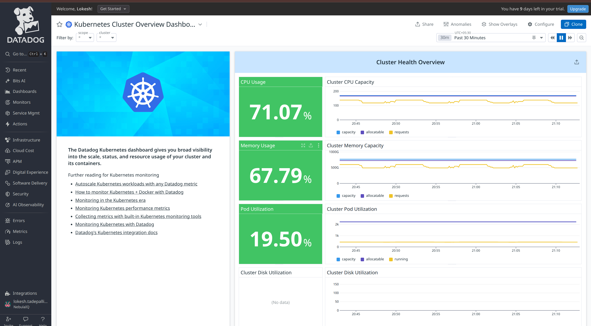

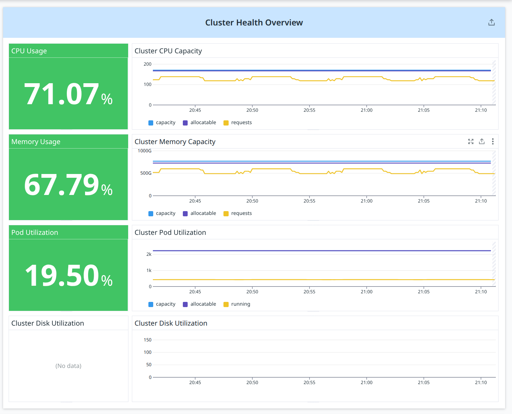

## **Overview**


### **CPU Usage**

**Metric(s):**

- Metrics used: `kubernetes.cpu.requests`

**query** :

```
(sum:kubernetes.cpu.requests{*} / sum:kubernetes_state.node.cpu_allocatable{*}) * 100
```

**Type** : Guage

**Unit** : Core

**Description:** The requested cpu cores

---

### **Memory Usage**

**Metric(s):**

- Metrics used: `kubernetes.memory.requests`

**query** :

```
(sum:kubernetes.memory.requests{*} / sum:kubernetes_state.node.memory_allocatable{*}) * 100
```

**Type** : Guage

**Unit** : byte

**Description:** The requested memory

---

### **Cluster Disk Utilization**

**Metric(s):**

- Metrics used: `kubernetes.filesystem.usage_pct`

**query** :

```
sum:kubernetes.filesystem.usage_pct{*} * 100
```

**Type** : Guage

**Unit** : fraction

**Description:** The percentage of disk used. Requires Docker container runtime.

---

### **Cluster CPU Capacity**

**Metric(s):**

- Metrics used: `kubernetes.cpu.requests`

**query** :

```
sum:kubernetes.cpu.requests{*}
```

**Type** : Guage

**Unit** : Core

**Description:** The requested cpu cores

---

### **Cluster Memory Capacity**

**Metric(s):**

- Metrics used: `kubernetes.memory.requests`

**query** :

```
sum:kubernetes.memory.requests{*}
```

**Type** : Guage

**Unit** : bytes

**Description:** The requested memory

---

### **Cluster Pod Utilization**

**Metric(s):**

- Metrics used: `kubernetes_state.node.pods_capacity`

**query** :

```
sum:kubernetes_state.node.pods_capacity{*}
```

**Type** : Guage

**Unit** : Core

**Description:** The pods capacity of a node. Tags:`node` `resource` `unit`

**Tags:**

---

### **Cluster Disk Utilization**

**Metric(s):**

- Metrics used: `kubernetes.filesystem.usage`

---

## Resource Overview

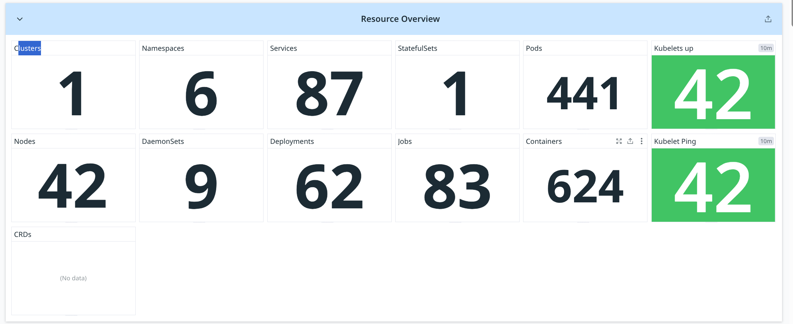

### cluster

A Kubernetes cluster is the highest-level logical unit that contains all nodes, pods, namespaces, workloads, and services. It represents one complete Kubernetes environment.
Tracking the number of clusters is important because each cluster is an independent deployment boundary, billing unit, and operational environment. Monitoring cluster count ensures that Datadog is receiving data from all active clusters and helps detect if any cluster has stopped reporting metrics.

**Metric(s):**

- Metris used: kubernetes.pods.running

**query** :
`count_nonzero(avg:kubernetes.pods.running{*})`

**Type** : Guage

**Unit** : Count (Number of running pods per entity)
Datadog Aggregation Logic

### Nodes

Nodes are the individual worker machines (VMs or EC2 instances) in a Kubernetes cluster where pods actually run. Monitoring node count ensures the cluster has enough capacity and helps detect scaling events, failures, or missing nodes.

**Metric(s):**

- Metrics used: `kubernetes_state.node.count`

- **Query:**

```
sum:kubernetes_state.node.count{*}
```

**Type:** Gauge

**Unit:** Count (number of nodes reporting )

**Tags**:`kernel_version` `os_./screenshots/cluster-overview/image` `container_runtime_version` `kubelet_version`.

**Description**: Number of nodes

### Namespaces

Namespaces logically group Kubernetes resources within a cluster. They help separate environments, teams, or applications. Tracking namespace count helps understand cluster segmentation and workload organization.

**Metric(s):**

- Metrics used: `kubernetes.pods.running`

**Query:**

```
count_nonzero(avg:kubernetes.pods.running{*})
```

**Type:** Gauge

**Unit:** Count (Number of namespaces)

**Description:** The number of running pods

---

### DaemonSets

A DaemonSet ensures a specific pod runs on **every node** (or a selected group of nodes). This is used for agents, log collectors, monitoring, and networking components. Knowing total DaemonSets helps understand cluster-wide infrastructure workloads.

**Metric(s):**

- Metrics used: `kubernetes_state.daemonset.desired`

**Query:**

```
count_nonzero(avg:kubernetes_state.daemonset.desired{*})
```

**Type:** Gauge

**Unit:** Count (Number of daemonsets)

**Description:**
The number of nodes that should be running the daemon pod.

**Tags:**`kube_daemon_set` `kube_namespace` (`env` `service` `version` from standard labels).

---

### Services

Services provide stable networking endpoints in Kubernetes and load-balance traffic to pods. Tracking service count helps understand how many applications are exposed inside or outside the cluster.

**Metric(s):**

- Metrics used: `kubernetes_state.service.count`

**Query:**

```
sum:kubernetes_state.service.count{*}
```

**Type:** Gauge

**Unit:** Count (Number of services)

**Description:**
Number of services.

**Tags:**`kube_namespace` `type`.

---

### Deployments

A Deployment manages replicas of stateless applications. It ensures rollout, rollback, and scaling. Monitoring deployment count indicates how many applications or microservices are active.

**Metric(s):**

- Metrics used: `kubernetes_state.deployment.replicas`

**Query:**

```
count_nonzero(avg:kubernetes_state.deployment.replicas{*})
```

**Type:** Gauge

**Unit:** Count (Number of deployments)

**Description:**
The number of replicas per deployment.

**Tags:**`kube_deployment` `kube_namespace` (`env` `service` `version` from standard labels).

---

### Pods

Pods are the smallest Kubernetes execution units containing one or more containers. Tracking pod count shows total workload running in the cluster and is essential for capacity, scaling, and troubleshooting.

**Metric(s):**

- Metrics used: `kubernetes_state.pod.running`

**Query:**

```
sum:kubernetes.pods.running{*}
```

**Type:** Gauge

**Unit:** Count (Total number of pods)

**Description:**
The number of running pods

---

### Containers

Containers represent actual application processes running inside pods. Container count gives a more detailed view of workload size and is used for resource tracking, billing, and capacity planning.

**Metric(s):**

- Metrics used: `kubernetes.containers.running`

**Query:**

```
sum:kubernetes.containers.running{*}
```

**Type:** Gauge

**Unit:** Count (Number of running containers)

**Description:**
The number of running containers

---

### Kubelets Up

Kubelet is the primary agent running on every node responsible for pod lifecycle management. A kubelet must be healthy for the node to function. This widget shows how many kubelets (nodes) are alive.

**Metric(s):**

- Metrics used: `kubernetes.kubelet.check`

**Query:**

```
count_nonzero(max:kubernetes.kubelet.check{status:ok})
```

**Type:** Gauge

**Unit:** Count (Number of healthy kubelets)

**Aggregation Logic:**

- `kubernetes.kubelet.check` reports health
- `status:ok` → kubelet is functioning
- `count_nonzero` counts all healthy kubelets
- Should match node count if all nodes are up

---

### Kubelet Ping

This represents connectivity/heartbeat checks between Datadog agent and kubelet. If kubelet ping fails, node metrics become unreliable. It is an uptime indicator for the node agent.

**Metric(s):**

- Metrics used: `kubernetes.kubelet.ping`

**Query:**

```
count_nonzero(max:kubernetes.kubelet.ping{*})
```

**Type:** Gauge

**Unit:** Count (Number of responding kubelets)

**Aggregation Logic:**

- Each kubelet returns a ping metric
- Non-zero = responsive
- Count shows number of kubelets reachable by Datadog

## Nodes

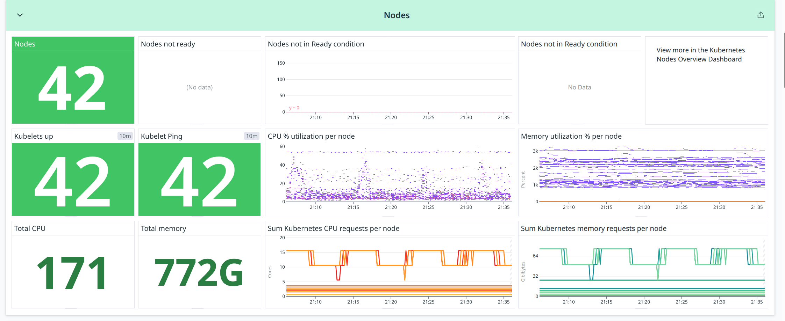

### **Number of nodes**

**Metric(s):**

- Metrics used: `kubernetes_state.node.count`

**query** :

```
sum:kubernetes_state.node.count{*}
```

**Type** : Gauge

**Unit** : Count (Number of Ready nodes)

**Description:** Number of nodes.

**Tags:** `kernel_version` `os_./screenshots/cluster-overview/image` `container_runtime_version` `kubelet_version`.

---

### **Total CPU**

**Metric(s):**

- Metrics used: `kubernetes_state.node.cpu_capacity`

**query** :

```
sum:kubernetes_state.node.cpu_capacity{*}
```

**Type** : Gauge

**Unit** : Cores (Total CPU capacity across all nodes)

**Description:** The CPU capacity of a node.

**Tags:**`node` `resource` `unit`.

---

### **Nodes not ready**

**Metric(s):**

- Metrics used: `kubernetes_state.node.by_condition`

**query** :

```
sum:kubernetes_state.node.by_condition
```

**Type** : Gauge

**Unit** : Count (Nodes in NotReady state)

**Description:** The condition of a cluster node.

**Tags:**`condition` `node` `status`.

---

### **Total memory**

**Metric(s):**

- Metrics used: `kubernetes_state.node.memory_capacity`

**query** :

```
sum:kubernetes_state.node.memory_capacity{*}
```

**Type** : Gauge

**Unit** : Gigabytes (GiB) of total cluster memory

**Description:** The memory capacity of a node.

**Tags:**`node` `resource` `unit`.

---

### **Nodes not in Ready condition**

**Metric(s):**

- Metrics used: `kubernetes_state.nodes.by_condition`

---

### **CPU % utilization per node**

**Metric(s):**

- Metrics used: `system.cpu.idle`

**query** :

```
100 - avg:system.cpu.idle{*}
```

**Type** : Guage

**Unit** : Percent

**Description:** Percent of time the CPU spent in an idle state

---

### **Percent of time the CPU spent in an idle state**

**Metric(s):**

- Metrics used: `kubernetes.cpu.requests`

**query** :

```
sum:kubernetes.cpu.requests{*}
```

**Type** : Guage

**Unit** : Core

**Description:** The requested cpu cores

---

### **Memory utilization % per node**

**Metric(s):**

- Metrics used: `kubernetes.memory.usage_pct`

**query** :

```
avg:kubernetes.memory.usage_pct{*}, avg:kubernetes.memory.usage_pct{*} * 100
```

**Type** : Guage

**Unit** : fraction

**Description:** The percentage of memory used per pod (memory limit must be set)

---

### **Sum Kubernetes memory requests per node**

**Metric(s):**

- Metrics used: `sum:kubernetes.memory.requests{*}`

**query** :

```
sum:kubernetes.memory.requests{*}
```

**Type** : Guage

**Unit** : byte

**Description:** The requested memory

---

## Deployments

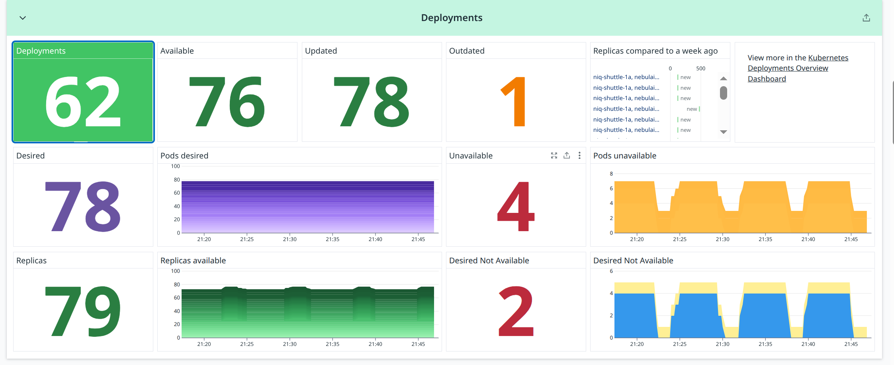

### **Deployments**

**Metric(s):**

- Metrics used: `kubernetes_state.deployment.replicas`

**query** :

```
count_nonzero(sum:kubernetes_state.deployment.replicas{*})
```

**Type** : Guage

**Unit** : Core

**Description:** The number of replicas per deployment

**Tags:** kube_deployment` `kube_namespace` (`env` `service` `version`.

---

### **Available**

**Metric(s):**

- Metrics used: `kubernetes_state.deployment.replicas_available`

**query** :

```
sum:kubernetes_state.deployment.replicas_available{*}
```

**Type** : Guage

**Description:** The number of available replicas per deployment

**Tags:** `kube_deployment` `kube_namespace` ( `env` `service` `version` from standard labels).

---

### **Updated**

**Metric(s):**

- Metrics used: `kubernetes_state.deployment.replicas_updated`

**query** :

```
sum:kubernetes_state.deployment.replicas_updated{*}
```

**Type** : Guage

**Unit** : Core

**Description:** The number of updated replicas per deployment

**Tags:** `kube_deployment` `kube_namespace` (`env` `service` `version` from standard labels).

---

### **Outdated**

**Metric(s):**

- Metrics used: `kubernetes_state.deployment.replicas`

**query** :

```
sum:kubernetes_state.deployment.replicas{*} - sum:kubernetes_state.deployment.replicas_updated{*}
```

**Type** : Guage

**Unit** : Core

**Description:** The number of replicas per deployment

**Tags:** : `kube_deployment` `kube_namespace` (`env` `service` `version` from standard labels).

---

### **Desired**

**Metric(s):**

- Metrics used: `kubernetes_state.deployment.replicas_desired`

**query** :

```
sum:kubernetes_state.deployment.replicas_desired{*}
```

**Type** : Guage

**Unit** : Core

**Description:** Number of desired pods for a deployment

**Tags:** `kube_deployment` `kube_namespace` (`env` `service` `version` from standard labels).

---

### **Pods desired**

**Metric(s):**

- Metrics used: `kubernetes_state.deployment.replicas_desired`

**query** :

```
sum:kubernetes_state.deployment.replicas_desired{*}
```

**Type** : Guage

**Unit** : Core

**Description:** Number of desired pods for a deployment

**Tags:** `kube_deployment` `kube_namespace` (`env` `service` `version` from standard labels).

---

### **Unavailable**

**Metric(s):**

- Metrics used: `kubernetes_state.deployment.replicas_unavailable`

**query** :

```
sum:kubernetes_state.deployment.replicas_unavailable{*}
```

**Type** : Guage

**Unit** : Core

**Description:** The number of unavailable replicas per deployment

**Tags:** `kube_deployment` `kube_namespace` (`env` `service` `version` from standard labels).

---

### **Replicas**

**Metric(s):**

- Metrics used: `kubernetes_state.deployment.replicas`

**query** :

```
sum:kubernetes_state.deployment.replicas{*}
```

**Type** : Guage

**Unit** : Core

**Description:** The number of replicas per deployment

**Tags:** : `kube_deployment` `kube_namespace` (`env` `service` `version` from standard labels).

---### **Replicas available**

**Metric(s):**

- Metrics used: `kubernetes_state.deployment.replicas_available`

**query** :

```
sum:kubernetes_state.deployment.replicas_available{*}
```

**Type** : Guage

**Unit** : Core

**Description:** The number of available replicas per deployment

**Tags:** `kube_deployment` `kube_namespace` (`env` `service` `version` from standard labels).

---

### **Desired Not Available**

**Metric(s):**

- Metrics used: `kubernetes_state.deployment.replicas_desired`

**query** :

```
sum:kubernetes_state.deployment.replicas_desired{*} - sum:kubernetes_state.deployment.replicas_available{*}
```

**Type** : Guage

**Description:** Number of desired pods for a deployment

**Tags:** `kube_deployment` `kube_namespace` (`env` `service` `version` from standard labels).

---

### **Replicas compared to a week ago**

**Metric(s):**

- Metrics used: `kubernetes_state.deployment.replicas`

**query** :

```
week_before(sum:kubernetes_state.deployment.replicas{*}), sum:kubernetes_state.deployment.replicas{*}
```

**Type** : Guage

**Unit** : Core

**Description:** The number of replicas per deployment

**Tags:** `kube_deployment` `kube_namespace` (`env` `service` `version` from standard labels).

---

### **Pods unavailable**

**Metric(s):**

- Metrics used: `kubernetes_state.deployment.replicas_unavailable`

**query** :

```
sum:kubernetes_state.deployment.replicas_unavailable{*}
```

**Type** : Guage

**Unit** : Core

**Description:** The number of unavailable replicas per deployment.

**Tags:** : kube_deployment` `kube_namespace` (`env` `service` `version` from standard labels).

---

### **Desired Not Available**

**Metric(s):**

- Metrics used: `kubernetes_state.deployment.replicas_desired`

**query** :

```
sum:kubernetes_state.deployment.replicas_desired{*} - sum:kubernetes_state.deployment.replicas_available{*}
```

**Type** : Guage

**Unit** : Core

**Description:** Number of desired pods for a deployment. Tags:`kube_deployment

**Tags:** `kube_deployment` `kube_namespace` (`env` `service` `version` from standard labels).

---

## DaemonSets

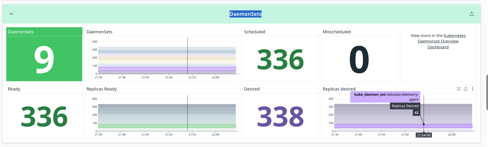

### **DaemonSets**

**Metric(s):**

- Metrics used: `kubernetes_state.daemonset.desired`

**query** :

```
count_nonzero(avg:kubernetes_state.daemonset.desired{*})
```

**Type** : Guage

**Unit** : Core

**Description:** The number of nodes that should be running the daemon pod

**Tags:** `kube_daemon_set` `kube_namespace` (`env` `service` `version` from standard labels).

---

### **Deamonsets- graph**

**Metric(s):**

- Metrics used: `kubernetes_state.daemonset.desired`

**query** :

```
avg:kubernetes_state.daemonset.desired{*}
```

**Type** : Guage

**Unit** : Core

**Description:**The number of nodes that should be running the daemon pod

**Tags:** `kube_daemon_set` `kube_namespace` (`env` `service` `version` from standard labels).

---

### **Scheduled**

**Metric(s):**

- Metrics used: `kubernetes_state.daemonset.scheduled`

**query** :

```
sum:kubernetes_state.daemonset.scheduled{*}
```

**Type** : Guage

**Unit** : Core

**Description:** The number of nodes running at least one daemon pod and are supposed to

**Tags:** `kube_daemon_set` `kube_namespace` (`env` `service` `version` from standard labels).

---

### **Desired**

**Metric(s):**

- Metrics used: `kubernetes_state.daemonset.desired`

**query** :

```
sum:kubernetes_state.daemonset.desired{*}
```

**Type** : Guage

**Description:** The number of nodes that should be running the daemon pod

**Tags:** `kube_daemon_set` `kube_namespace` (`env` `service` `version` from standard labels).

---

### **Misscheduled**

**Metric(s):**

- Metrics used: `kubernetes_state.daemonset.misscheduled`

**query** :

```
sum:kubernetes_state.daemonset.misscheduled{*}
```

**Type** : Guage

**Description:** TThe number of nodes running a daemon pod but are not supposed to.

**Tags:** `kube_daemon_set` `kube_namespace` (`env` `service` `version` from standard labels).

---

### **Replicas desired**

**Metric(s):**

- Metrics used: `kubernetes_state.daemonset.desired`

**query** :

```
sum:kubernetes_state.daemonset.desired{*}
```

**Type** : Guage

**Description:** The number of nodes that should be running the daemon pod

**Tags:** `kube_daemon_set` `kube_namespace` (`env` `service` `version` from standard labels).

---

## StatefulSets

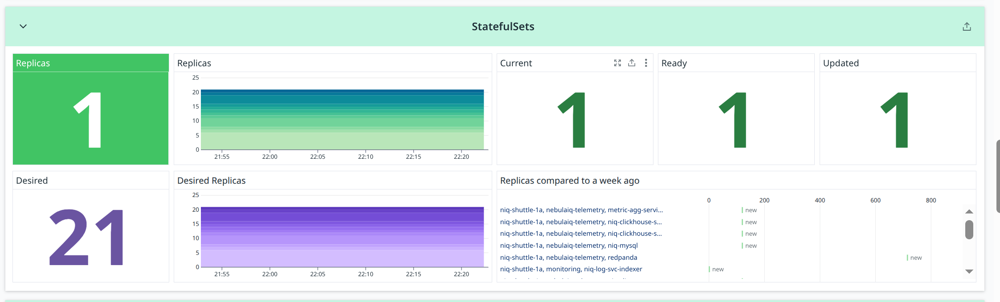

### **Replicas**

**Metric(s):**

- Metrics used: `kubernetes_state.statefulset.replicas`

**query** :

```
sum:kubernetes_state.statefulset.replicas{*}
```

**Type** : Guage

**Description:** The number of replicas per StatefulSet.

**Tags:** `kube_namespace` `kube_stateful_set` (`env` `service` `version` from standard labels).

---

### **Replicas -graph**

**Metric(s):**

- Metrics used: `kubernetes_state.statefulset.replicas`

**query** :

```
sum:kubernetes_state.statefulset.replicas{*}
```

**Type** : Guage

**Description:** The number of replicas per StatefulSet

**Tags:** `kube_namespace` `kube_stateful_set` (`env` `service` `version` from standard labels).

---

### **Current**

**Metric(s):**

- Metrics used: `kubernetes_state.statefulset.replicas_current`

**query** :

```
sum:kubernetes_state.statefulset.replicas_current{*}
```

**Type** : Guage

**Unit** : Core

**Description:** The number of current replicas per StatefulSet

**Tags:**: `kube_namespace` `kube_stateful_set` (`env` `service` `version` from standard labels).

---

### **Ready**

**Metric(s):**

- Metrics used: `kubernetes_state.statefulset.replicas_ready`

**query** :

```
sum:kubernetes_state.statefulset.replicas_ready{*}
```

**Type** : Guage

**Unit** : Core

**Description:** The number of ready replicas per StatefulSet.

**Tags:** :`kube_namespace` `kube_stateful_set` (`env` `service` `version` from standard labels).

---

### **Updated**

**Metric(s):**

- Metrics used: `kubernetes_state.statefulset.replicas_updated`

**query** :

```
sum:kubernetes_state.statefulset.replicas_updated{*}
```

**Type** : Guage

**Description:** The number of updated replicas per StatefulSet.

**Tags:**`kube_namespace` `kube_stateful_set` (`env` `service` `version` from standard labels).

---

### **Desired**

**Metric(s):**

- Metrics used: `kubernetes_state.statefulset.replicas_desired`

**query** :

```
sum:kubernetes_state.statefulset.replicas_desired{*}
```

**Type** : Guage

**Description:** Number of desired pods for a StatefulSet.

**Tags:**`kube_namespace` `kube_stateful_set` (`env` `service` `version` from standard labels).

---

### **Desired Replicas**

**Metric(s):**

- Metrics used: `kubernetes_state.statefulset.replicas_desired`

**query** :

```
sum:kubernetes_state.statefulset.replicas_desired{*}
```

**Type** : Guage

**Unit** : Core

**Description:** Number of desired pods for a StatefulSet

**Tags:** `kube_namespace` `kube_stateful_set` (`env` `service` `version` from standard labels).

---

### **Replicas compared to a week ago**

**Metric(s):**

- Metrics used: `kubernetes_state.statefulset.replicas`

**query** :

```
week_before(sum:kubernetes_state.statefulset.replicas{*}), sum:kubernetes_state.statefulset.replicas{*}
```

**Type** : Guage

**Unit** : Core

**Description:** The number of replicas per StatefulSet

**Tags:** `kube_namespace` `kube_stateful_set` (`env` `service` `version` from standard labels).

---

## Jobs

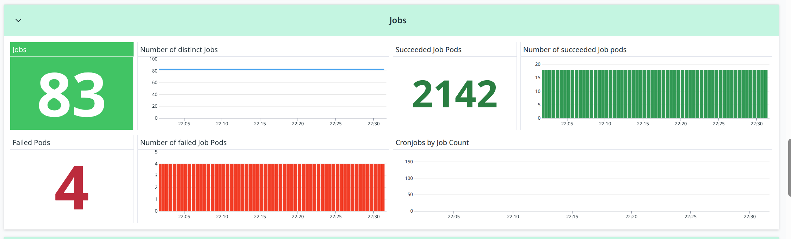

### **Job**

**Metric(s):**

- Metrics used: `kubernetes_state.job.count`

**query** :

```
sum:kubernetes_state.job.count{*}
```

**Type** : Guage

**Description:** Number of jobs

**Tags:** : `kube_namespace` `kube_cronjob`.

---

### **Number of distinct Jobs**

**Metric(s):**

- Metrics used: `kubernetes_state.job.count`

**query** :

```
sum:kubernetes_state.job.count{*}
```

**Type** : Guage

**Description:**Number of jobs

**Tags:** `kube_namespace` `kube_cronjob`.

---

### **Succeeded Job Pods**

**Metric(s):**

- Metrics used: `kubernetes_state.job.succeeded`

**query** :

```
sum:kubernetes_state.job.succeeded{*}.as_count()
```

**Type** : Guage

**Unit** : Core

**Description:** The number of pods which reached Phase Succeeded

**Tags:** `kube_job` or `kube_cronjob` `kube_namespace` (`env` `service` `version` from standard labels).

---

### **Number of succeeded Job pods**

**Metric(s):**

- Metrics used: `kubernetes_state.job.succeeded`

**query** :

```
sum:kubernetes_state.job.succeeded{*}.as_count()
```

**Type** : Guage

---

### **Failed Pods**

**Metric(s):**

- Metrics used: `kubernetes_state.job.failed`

**query** :

```
sum:kubernetes_state.job.failed{*}.as_count()
```

**Type** : Guage

**Unit** : Core

**Description:** The number of pods which reached Phase Failed

**Tags:**`kube_job` or `kube_cronjob` `kube_namespace` (`env` `service` `version` from standard labels).

---

### **Number of failed Job Pods**

**Metric(s):**

- Metrics used: `kubernetes_state.job.failed`

**query** :

```
sum:kubernetes_state.job.failed{*}.as_count()
```

**Type** : Guage

**Description:** The number of pods which reached Phase Failed.

**Tags:**`kube_job` or `kube_cronjob` `kube_namespace` (`env` `service` `version` from standard labels).

---

### **Cronjobs by Job Count**

**Metric(s):**

- Metrics used: `kubernetes_state.job.count`

---

## Replicasets

### **Active ReplicaSets**

**Metric(s):**

- Metrics used: `kubernetes_state.replicaset.replicas`

**query** :

```
count_nonzero(sum:kubernetes_state.replicaset.replicas{*})
```

**Type** : Guage

**Description:**The number of replicas per ReplicaSet

**Tags:** `kube_namespace` `kube_replica_set` (`env` `service` `version` from standard labels).

---

### **Replicas**

**Metric(s):**

- Metrics used: `kubernetes_state.replicaset.replicas`

**query** :

```
sum:kubernetes_state.replicaset.replicas{*}
```

**Type** : Guage

**Description:** The number of replicas per ReplicaSet.

**Tags:**`kube_namespace` `kube_replica_set` (`env` `service` `version` from standard labels).

---

### **Desired**

**Metric(s):**

- Metrics used: `kubernetes_state.replicaset.replicas_desired`

**query** :

```
sum:kubernetes_state.replicaset.replicas_desired{*}
```

**Type** : Guage

**Description:** Number of desired pods for a ReplicaSet

**Tags:** `kube_namespace` `kube_replica_set` (`env` `service` `version` from standard labels).

---

### **Inactive ReplicaSets**

**Metric(s):**

- Metrics used: `kubernetes_state.replicaset.replicas`

**query** :

```
count_not_null(avg:kubernetes_state.replicaset.replicas{*}) - count_nonzero(avg:kubernetes_state.replicaset.replicas{*})
```

**Type** : Guage

**Description:** The number of replicas per ReplicaSet.

**Tags:** `kube_namespace` `kube_replica_set` (`env` `service` `version` from standard labels).

---

### **Ready**

**Metric(s):**

- Metrics used: `kubernetes_state.replicaset.replicas_ready`

**query** :

```
sum:kubernetes_state.replicaset.replicas_ready{*}
```

**Type** : Guage

**Description:** the number of ready replicas per ReplicaSet

**Tags:** `kube_namespace` `kube_replica_set` (`env` `service` `version` from standard labels).

---

### **Replicas Not Ready**

**Metric(s):**

- Metrics used: `kubernetes_state.replicaset.replicas_desired`

**query** :

```
sum:kubernetes_state.replicaset.replicas_desired{*} - sum:kubernetes_state.replicaset.replicas_ready{*}
```

**Type** : Guage

**Description:** Number of desired pods for a ReplicaSet

**Tags:** `kube_namespace` `kube_replica_set` (`env` `service` `version` from standard labels).

---

## Pods

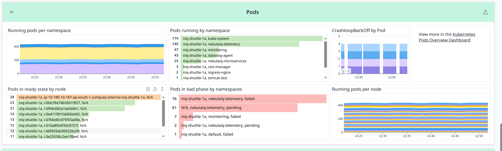

### **Running pods per namespace**

**Metric(s):**

- Metrics used: `kubernetes.pods.running`

**query** :

```
sum:kubernetes.pods.running{*}
```

**Type** : Guage

**Description:** The number of running pods

---

### **Pods running by namespace**

**Metric(s):**

- Metrics used: `kubernetes.pods.running`

**query** :

```
sum:kubernetes.pods.running{*}
```

**Type** : Guage

**Description:** The number of running pods

---

### **CrashloopBackOff by Pod**

**Metric(s):**

- Metrics used: `kubernetes_state.container.status_report.count.waiting`

**query** :

```
sum:kubernetes_state.container.status_report.count.waiting{reason:crashloopbackoff}
```

**Type** : Guage

**Unit** : Core

**Description:** Describes the reason the container is currently in waiting state

**Tags:**`kube_namespace` `pod_name` `kube_container_name` `reason` (`env` `service` `version` from standard labels).

---

### **Pods in ready state by node**

**Metric(s):**

- Metrics used: `kubernetes_state.pod.ready`

**query** :

```
sum:kubernetes_state.pod.ready{condition:true}
```

**Type** : Guage

**Unit** : Core

**Description:** Describes whether the pod is ready to serve requests

**Tags:**`node` `kube_namespace` `pod_name` `condition` (`env` `service` `version` from standard labels).

---

### **Pods in bad phase by namespaces**

**Metric(s):**

- Metrics used: `kubernetes.pods.running`

**query** :

```
sum:kubernetes_state.pod.status_phase{!pod_phase:running,!pod_phase:succeeded}
```

**Type** : Guage

**Unit** : Core

**Description:** The pods current phase

**Tags:** `node` `kube_namespace` `pod_name` `pod_phase` (`env` `service` `version` from standard labels).

---

## Services

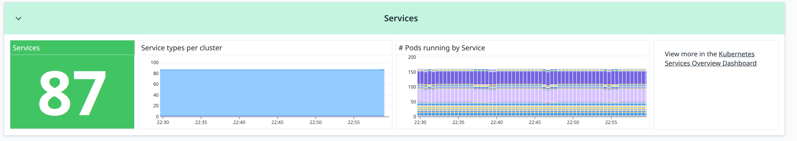

### **Services**

**Metric(s):**

- Metrics used: `kubernetes_state.service.count`

**query** :

```
sum:kubernetes_state.service.count{*}
```

**Type** : Guage

**Unit** : Core

**Description:** Number of services.

**Tags:**`kube_namespace` `type`.

---

### **Service types per cluster**

**Metric(s):**

- Metrics used: `kubernetes_state.service.count`

**query** :

```
sum:kubernetes_state.service.count{*}
```

**Type** : Guage

**Description:** Number of services.

**Tags:**`kube_namespace` `type`.

---

### **Pods running by Service**

**Metric(s):**

- Metrics used: `kubernetes.pods.running`

**query** :

```
exclude_null(sum:kubernetes.pods.running{*})
```

**Type** : Guage

**Description:** The number of running pods

---

## Containers

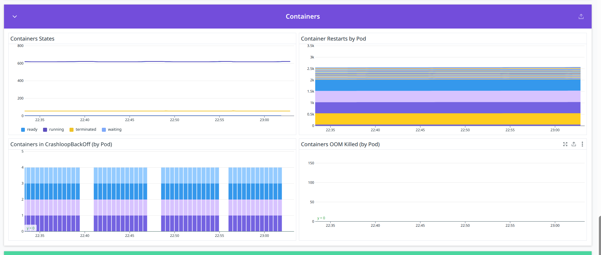

### **Containers States**

**Metric(s):**

- Metrics used: `kubernetes_state.container.ready`

**query** :

```
sum:kubernetes_state.container.ready{*}
```

**Type** : Guage

**Description:** Describes whether the containers readiness check succeeded.

**Tags:**`kube_namespace` `pod_name` `kube_container_name` (`env` `service` `version` from standard labels).

---

### **Container Restarts by Pod**

**Metric(s):**

- Metrics used: `kubernetes_state.container.restarts`

**query** :

```
sum:kubernetes_state.container.restarts{*}
```

**Type** : Guage

**Description:** The number of container restarts per container.

**Tags:**`kube_namespace` `pod_name` `kube_container_name` (`env` `service` `version` from standard labels).

---

### **Containers in CrashloopBackOff (by Pod)**

**Metric(s):**

- Metrics used: `kubernetes_state.container.status_report.count.waiting`

**query** :

```
sum:kubernetes_state.container.status_report.count.waiting{reason:crashloopbackoff}
```

**Type** : Guage

**Description:** Describes the reason the container is currently in waiting state.

**Tags:**`kube_namespace` `pod_name` `kube_container_name` `reason` (`env` `service` `version` from standard labels).

---

### **Containers OOM Killed (by Pod)**

**Metric(s):**

- Metrics used: `kubernetes.containers.state.terminated`

---

## Disk I/O & Network

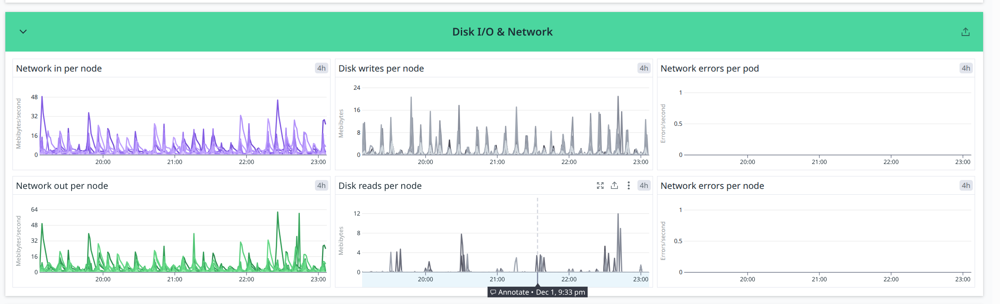

### **Network in per node**

**Metric(s):**

- Metrics used: `kubernetes.network.rx_bytes`

**query** :

```
sum:kubernetes.network.rx_bytes{*}
```

**Type** : Guage

**Unit** : byte per second

**Description:** The amount of bytes per second received

---

### **Disk writes per node**

**Metric(s):**

- Metrics used: `kubernetes.io.write_bytes`

**query** :

```
sum:kubernetes.io.write_bytes{*}
```

**Type** : Guage

**Unit** : byte

**Description:** The amount of bytes written to the disk

---

### **Network errors per pod**

**Metric(s):**

- Metrics used: `kubernetes.network.rx_errors`

---

### **Network out per node**

**Metric(s):**

- Metrics used: `kubernetes.network.tx_bytes`

**query** :

```
sum:kubernetes.network.tx_bytes{*}
```

**Type** : Guage

**Unit** : byte per second

**Description:** The amount of bytes per second transmitted

---

### **The amount of bytes per second transmitted**

**Metric(s):**

- Metrics used: `kubernetes.io.read_bytes`

**query** :

```
sum:kubernetes.io.read_bytes{*}
```

**Type** : Guage

**Unit** : Byte

**Description:** The amount of bytes read from the disk

---

### **Network errors per node**

**Metric(s):**

- Metrics used: `kubernetes.network.rx_errors`

---

## Events

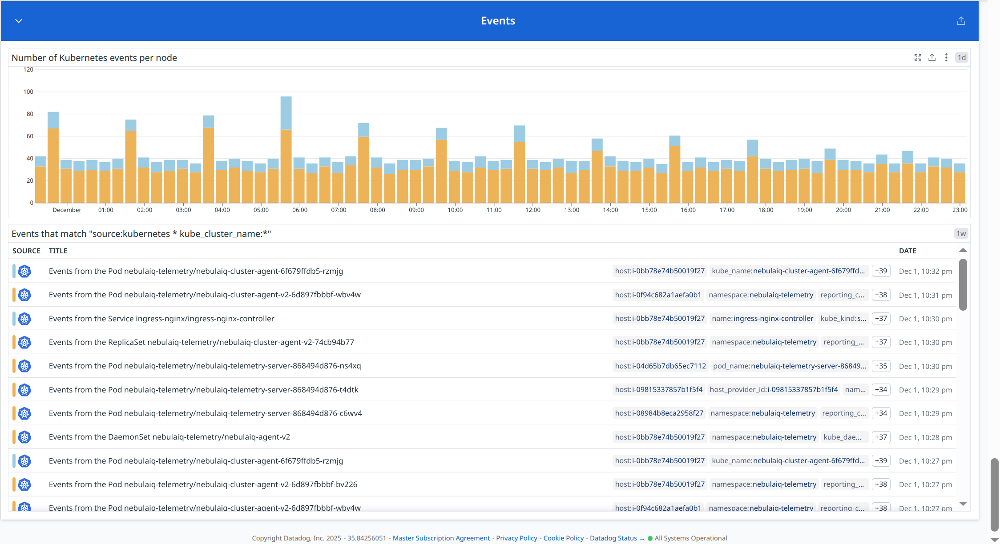
