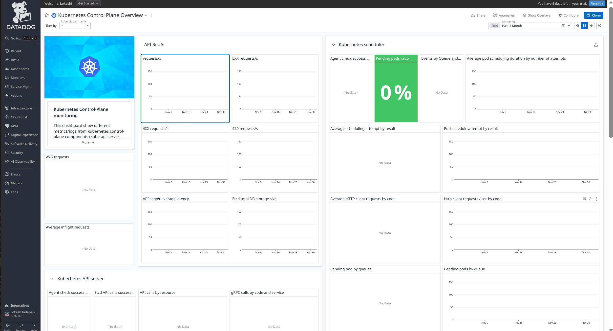
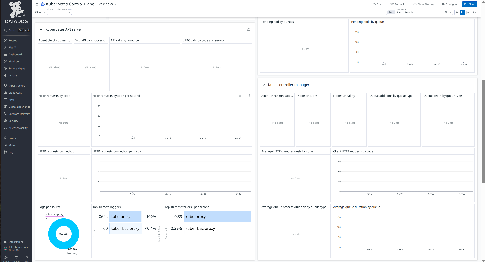
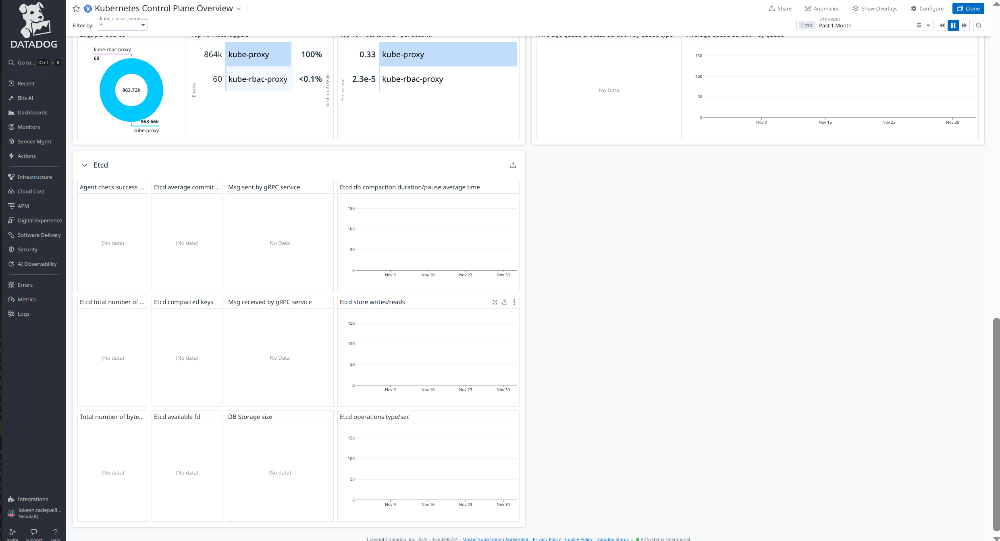
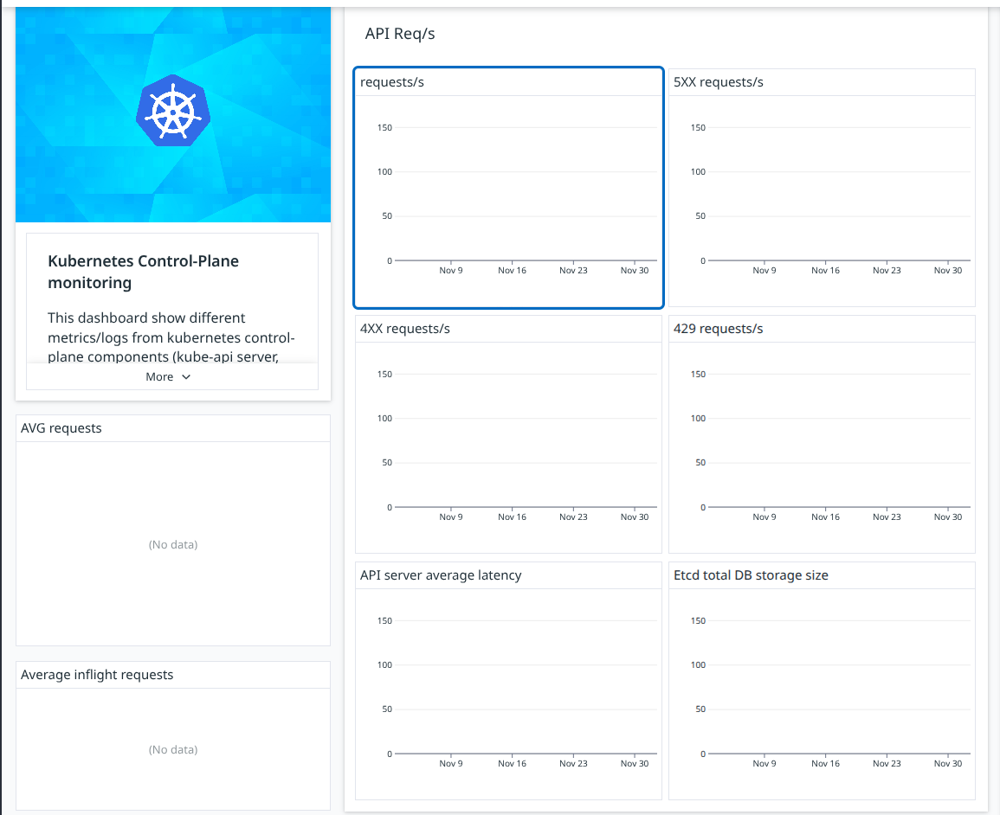
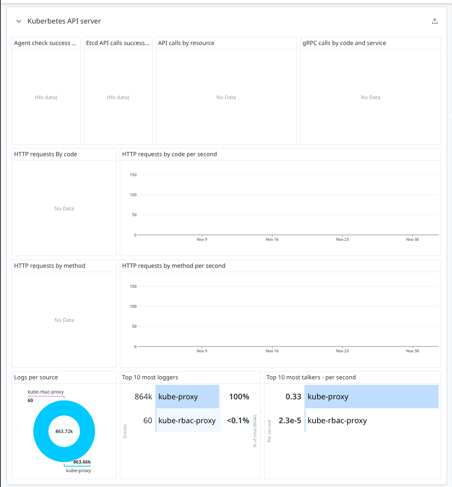
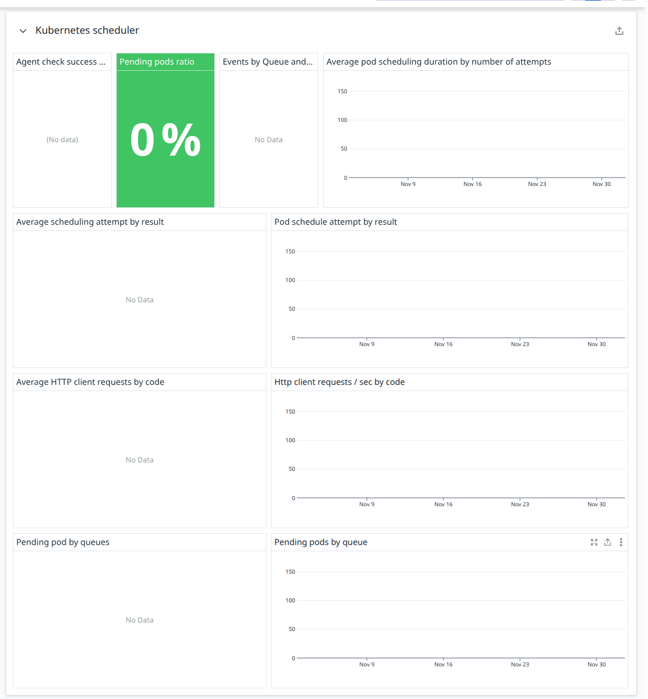
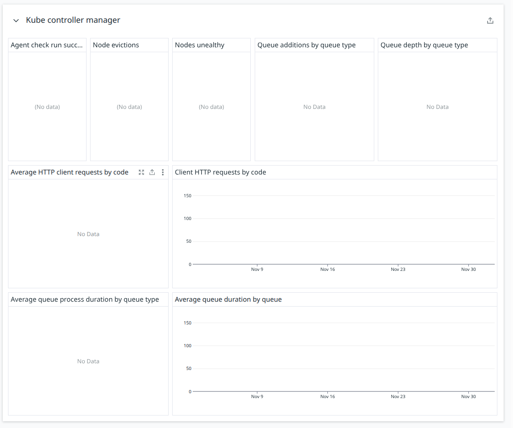
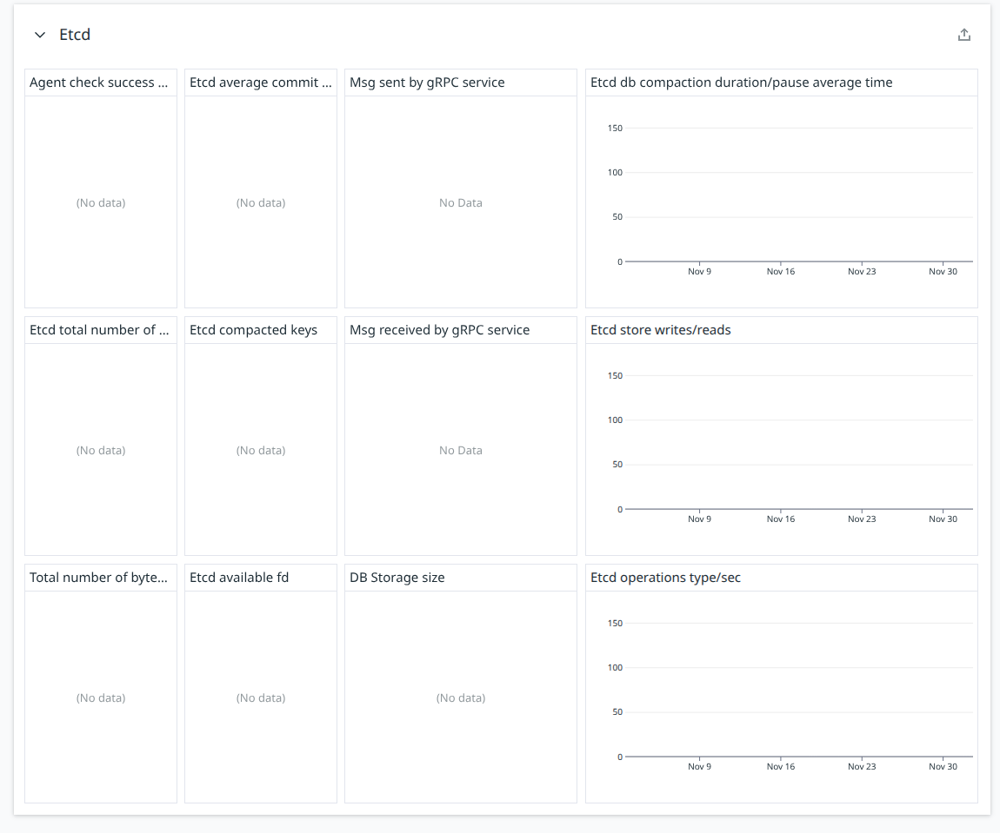

## ControlPlane Overview





## API Req/s



### **requests/s**

**Metric(s):**

- Metrics used: `kube_apiserver.apiserver_request_total.count`, `kube_apiserver.apiserver_request.count`

---

### **5XX requests/s**

**Metric(s):**

- Metrics used: `kube_apiserver.apiserver_request_total.count` , `kube_apiserver.apiserver_request.count`

---

### **4XX requests/s**

**Metric(s):**

- Metrics used: `kube_apiserver.apiserver_request_total.count`, `kube_apiserver.apiserver_request.count`

---

### **429 requests/s**

**Metric(s):**

- Metrics used: `kube_apiserver.apiserver_request_total.count` , `kube_apiserver.apiserver_request.count`

---

### **API server average latency**

**Metric(s):**

- Metrics used: `kube_apiserver.request_duration_seconds.sum` , `kube_apiserver.request_duration_seconds.count` , `kube_apiserver.apiserver_request_duration_seconds.sum` , `kube_apiserver.apiserver_request_duration_seconds.count`

---

### **Etcd total DB storage size**

**Metric(s):**

- Metrics used: `kube_apiserver.etcd.db.total_size`

---

## Kubernetes API Server



### **Agent check success**

**Metric(s):**

- Metrics used: `check_run.kube_apiserver_controlplane.up.ok`, `check_run.kube_apiserver_controlplane.up.critical`, `check_run.kube_apiserver_controlplane.up.unknown`

---

### **Etcd API calls success**

**Metric(s):**

- Metrics used: `kube_apiserver.etcd_requests_total` , `kube_apiserver.etcd_request_errors_total`

**query** :

```
(sum:kube_apiserver.etcd_requests_total{*}.as_count() / (sum:kube_apiserver.etcd_requests_total{*}.as_count() + sum:kube_apiserver.etcd_request_errors_total{*}.as_count())) * 100
```

**Type** : Gauge

**Unit** : percentage

**Description:** Percentage of successful etcd API calls issued by the API server.

**Tags:**

---

### **API calls by resource**

**Metric(s):**

- Metrics used: `kube_apiserver.apiserver_request_total`

---

### **gRPC calls by code and service**

**Metric(s):**

- Metrics used: `kube_apiserver.grpc_client_handled_total`

---

### **HTTP requests by code**

**Metric(s):**

- Metrics used: `kube_apiserver.apiserver_request_total.count`

---

### **HTTP requests by code per second**

**Metric(s):**

- Metrics used: `kube_apiserver.apiserver_request_total.count`

---

### **HTTP requests by method**

**Metric(s):**

- Metrics used: `kube_apiserver.rest_client_requests_total.count`

---

### **HTTP requests by method per second**

**Metric(s):**

- Metrics used: `kube_apiserver.rest_client_requests_total.count`

---

## Kubernetes Scheduler



### **Agent check success**

**Metric(s):**

- Metrics used: `check_run.kube_scheduler.up.ok`

**query** :

```
sum:check_run.kube_scheduler.up.ok{*}.as_count() / (sum:check_run.kube_scheduler.up.ok{*}.as_count() + sum:check_run.kube_scheduler.up.critical{*}.as_count()) * 100
```

---

### **Pending pods ratio**

**Metric(s):**

- Metrics used: `kube_scheduler.pending_pods`

**query** :

```
(sum:kube_scheduler.pending_pods{*} / (sum:kube_scheduler.pending_pods{*} + sum:kubernetes.pods.running{*})) * 100
```

**Type** : Gauge

**Unit** : -

**Description:** Number of pending pods, by the queue type (requires k8s v1.15+)

**Tags:**

---

### **Events by Queue and Result**

**Metric(s):**

- Metrics used: `kube_scheduler.queue.incoming_pods`

---

### **Average pod scheduling duration by number of attempts**

**Metric(s):**

- Metrics used: `kube_scheduler.scheduling.pod.scheduling_duration.sum` , `kube_scheduler.scheduling.pod.scheduling_duration.count`

---

### **Average scheduling attempt by result**

**Metric(s):**

- Metrics used: `kube_scheduler.schedule_attempts`

---

### **Pod schedule attempt by result**

**Metric(s):**

- Metrics used: `kube_scheduler.schedule_attempts`

---

### **Average HTTP client requests by code**

**Metric(s):**

- Metrics used: `kube_scheduler.client.http.requests`

---

### **HTTP client requests / sec by code**

**Metric(s):**

- Metrics used: `kube_scheduler.client.http.requests`

---

### **Pending pod by queues**

**Metric(s):**

- Metrics used: `kube_scheduler.pending_pods`

---

### **Pending pods by queue**

**Metric(s):**

- Metrics used: `kube_scheduler.pending_pods`

---

## Kube Controller Manager



### **Agent check run success**

**Metric(s):**

- Metrics used: `check_run.kube_controller_manager.up.ok`, `check_run.kube_controller_manager.up.critical`

---

### **Node evictions**

**Metric(s):**

- Metrics used: `kube_controller_manager.nodes.evictions`

---

### **Nodes unhealthy**

**Metric(s):**

- Metrics used: `kube_controller_manager.nodes.unhealthy`

---

### **Queue additions by queue type**

**Metric(s):**

- Metrics used: `kube_controller_manager.queue.adds`

---

### **Queue depth by queue type**

**Metric(s):**

- Metrics used: `kube_controller_manager.queue.depth`

---

### **Average HTTP client requests by code**

**Metric(s):**

- Metrics used: `kube_controller_manager.client.http.requests`

---

### **Client HTTP requests by code**

**Metric(s):**

- Metrics used: `kube_controller_manager.client.http.requests`

---

### **Average queue process duration by queue type**

**Metric(s):**

- Metrics used: `kube_controller_manager.queue.queue_duration.sum`, `kube_controller_manager.queue.queue_duration.count`

---

### **Average queue duration by queue**

**Metric(s):**

- Metrics used: `kube_controller_manager.queue.queue_duration.sum`, `kube_controller_manager.queue.queue_duration.count`

---

## Etcd



### **Agent check success**

**Metric(s):**

- Metrics used: `check_run.etcd.prometheus.health.ok` , `check_run.etcd.prometheus.health.critical`

---

### **Etcd average commit latency**

**Metric(s):**

- Metrics used: `etcd.disk.backend.commit.duration.seconds.sum`, `etcd.disk.backend.commit.duration.seconds.count`

---

### **Msg sent by gRPC service**

**Metric(s):**

- Metrics used: `etcd.grpc.server.msg.sent.total`

---

### **Etcd db compaction duration/pause average time**

**Metric(s):**

- Metrics used: `etcd.debugging.mvcc.db.compaction.total.duration.milliseconds.sum` ,
- Metrics used: `etcd.debugging.mvcc.db.compaction.total.duration.milliseconds.count`

---

### **Etcd total number of keys**

**Metric(s):**

- Metrics used: `etcd.debugging.mvcc.keys.total`

---

### **Etcd compacted keys**

**Metric(s):**

- Metrics used: `etcd.debugging.mvcc.db.compaction.keys.total`

---

### **Msg received by gRPC service**

**Metric(s):**

- Metrics used: `etcd.grpc.server.msg.received.total`

---

### **Etcd store writes/reads**

**Metric(s):**

- Metrics used: `etcd.debugging.store.writes.total`
- Metrics used: `etcd.debugging.store.reads.total`

---

### **Total number of bytes**

**Metric(s):**

- Metrics used: `etcd.disk.wal.write.bytes.total`

---

### **Etcd available fd**

**Metric(s):**

- Metrics used: `etcd.process.open.fds`
- Metrics used: `etcd.process.max.fds`

---

### **DB Storage size**

**Metric(s):**

- Metrics used: `kube_apiserver.etcd.db.total_size`

---

### **Etcd operations type/sec**

**Metric(s):**

- Metrics used: `etcd.debugging.mvcc.put.total` , `etcd.debugging.mvcc.range.total`, `etcd.debugging.mvcc.events.total`
