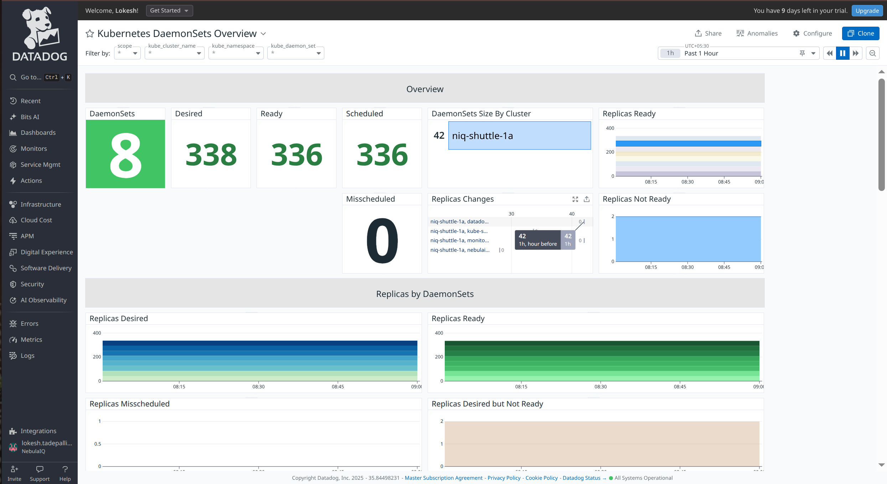
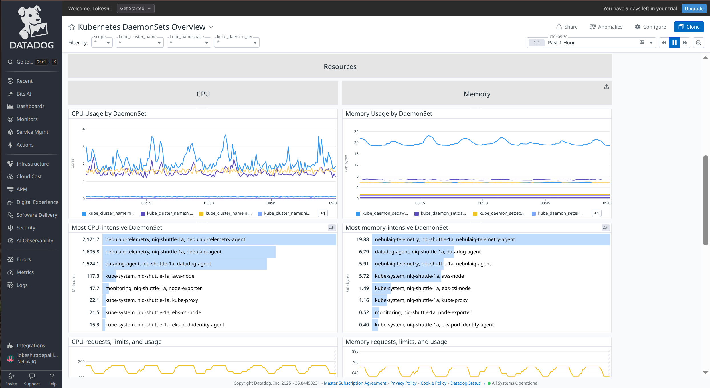
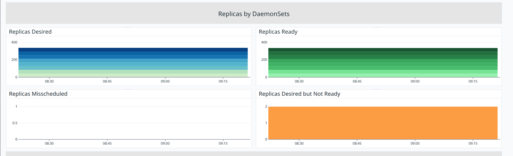
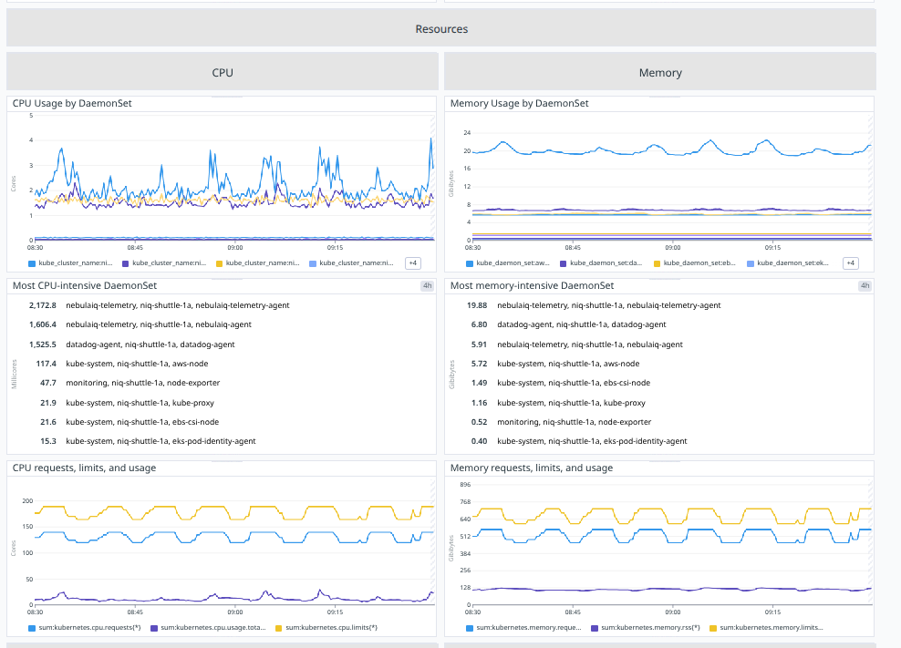
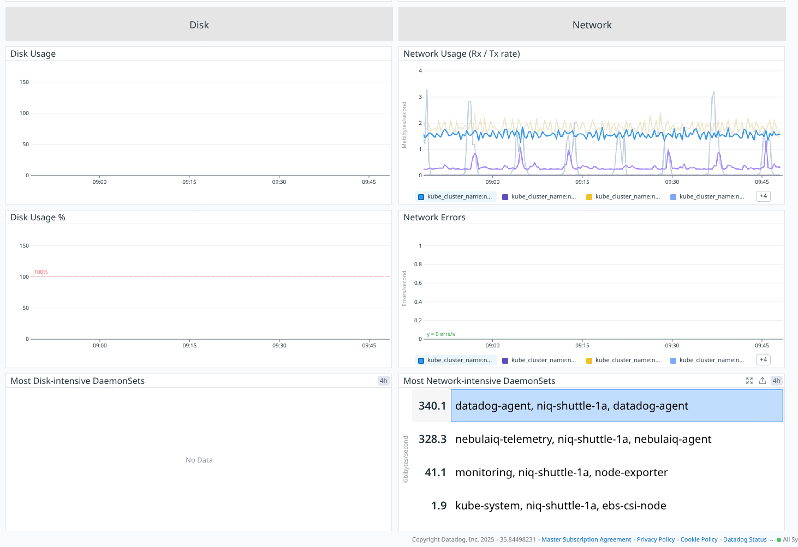

# Overview

### **DaemonSets**

**Metric(s):**

- Metrics used: `kubernetes_state.daemonset.ready`

**query** :

```
count_nonzero(sum:kubernetes_state.daemonset.ready{*})
```

**Type** : Guage

**Unit** : byte

**Description:** The number of nodes that should be running the daemon pod and have one or more of the daemon pod running and ready

**Tags:** `kube_daemon_set` `kube_namespace` (`env` `service` `version` from standard labels).

---

### **Desired**

**Metric(s):**

- Metrics used: `kubernetes_state.daemonset.desired`

**query** :

```
sum:kubernetes_state.daemonset.desired{*}
```

**Type** : Guage

**Unit** : byte

**Description:** The number of nodes that should be running the daemon pod.

**Tags:** `kube_daemon_set` `kube_namespace` (`env` `service` `version` from standard labels).

---

### **Ready**

**Metric(s):**

- Metrics used: `kubernetes_state.daemonset.ready`

**query** :

```
sum:kubernetes_state.daemonset.ready{*}
```

**Type** : Guage

**Unit** : byte

**Description:** The number of nodes that should be running the daemon pod and have one or more of the daemon pod running and ready

**Tags:** `kube_daemon_set` `kube_namespace` (`env` `service` `version` from standard labels).

---

### **Scheduled**

**Metric(s):**

- Metrics used: `kubernetes_state.daemonset.scheduled`

**query** :

```
sum:kubernetes_state.daemonset.scheduled{*}
```

**Type** : Guage

**Unit** : -

**Description:** The number of nodes running at least one daemon pod and are supposed to.

**Tags:**`kube_daemon_set` `kube_namespace` (`env` `service` `version` from standard labels).

---

### **Misscheduled**

**Metric(s):**

- Metrics used: `kubernetes_state.daemonset.misscheduled`

**query** :

```
sum:kubernetes_state.daemonset.misscheduled{*}
```

**Type** : Guage

**Unit** : byte

**Description:** The number of nodes running a daemon pod but are not supposed to.

**Tags:**`kube_daemon_set` `kube_namespace` (`env` `service` `version` from standard labels).

---

### **DaemonSets Size By Cluster**

**Metric(s):**

- Metrics used: `kubernetes_state.daemonset.desired`

**query** :

```
max:kubernetes_state.daemonset.desired{*}
```

**Type** : Guage

**Unit** : -

**Description:** The number of nodes that should be running the daemon pod.

**Tags:**`kube_daemon_set` `kube_namespace` (`env` `service` `version` from standard labels).

---

### **Replicas Ready**

**Metric(s):**

- Metrics used: `kubernetes_state.daemonset.ready`

**query** :

```
sum:kubernetes_state.daemonset.ready{*}
```

**Type** : Guage

**Unit** : -

**Description:**
The number of nodes that should be running the daemon pod and have one or more of the daemon pod running and ready.

**Tags:**`kube_daemon_set` `kube_namespace` (`env` `service` `version` from standard labels).

---

### **Replicas Changes**

**Metric(s):**

- Metrics used: `kubernetes_state.daemonset.ready`

**query** :

```
hour_before(avg:kubernetes_state.daemonset.ready{*}), avg:kubernetes_state.daemonset.ready{*}
```

**Type** : Guage

**Unit** : -

**Description:**
The number of nodes that should be running the daemon pod and have one or more of the daemon pod running and ready.

**Tags:**`kube_daemon_set` `kube_namespace` (`env` `service` `version` from standard labels).

---

### **Replicas Not Ready**

**Metric(s):**

- Metrics used: `kubernetes_state.daemonset.desired`

**query** :

```
sum:kubernetes_state.daemonset.desired{*} - sum:kubernetes_state.daemonset.ready{*}
```

**Type** : Guage

**Unit** : byte

**Description:** The number of nodes that should be running the daemon pod.

**Tags:**`kube_daemon_set` `kube_namespace` (`env` `service` `version` from standard labels).

---

## Replicas by DaemonSets



### **Replicas Desired**

**Metric(s):**

- Metrics used: `kubernetes_state.daemonset.desired`

**query** :

```
sum:kubernetes_state.daemonset.desired{*}
```

**Type** : Guage

**Unit** : core

**Description:** The number of nodes that should be running the daemon pod.

**Tags:**`kube_daemon_set` `kube_namespace` (`env` `service` `version` from standard labels).

---

## **Replicas Ready**

**Metric(s):**

- Metrics used: `kubernetes_state.daemonset.ready`

**query** :

```
sum:kubernetes_state.daemonset.ready{*}
```

**Type** : Guage

**Unit** : -

**Description:** The number of nodes that should be running the daemon pod and have one or more of the daemon pod running and ready.

**Tags:**`kube_daemon_set` `kube_namespace` (`env` `service` `version` from standard labels).

---

## **Replicas Misscheduled**

**Metric(s):**

- Metrics used: `kubernetes_state.daemonset.misscheduled`

**query** :

```
sum:kubernetes_state.daemonset.misscheduled{*}
```

**Type** : Guage

**Unit** : -

**Description:** The number of nodes running a daemon pod but are not supposed to.

**Tags:**`kube_daemon_set` `kube_namespace` (`env` `service` `version` from standard labels).

---

## **Replicas Desired but Not Ready**

**Metric(s):**

- Metrics used: `kubernetes_state.daemonset.desired`

**query** :

```
sum:kubernetes_state.daemonset.desired{*} - sum:kubernetes_state.daemonset.ready{*}
```

**Type** : Guage

**Unit** : byte

**Description:**The number of nodes that should be running the daemon pod.

**Tags:**`kube_daemon_set` `kube_namespace` (`env` `service` `version` from standard labels).

---

## Resources



## **CPU Usage by DaemonSet**

**Metric(s):**

- Metrics used: `kubernetes.cpu.usage.total`

**query** :

```
exclude_null(sum:kubernetes.cpu.usage.total{*})
```

**Type** : Guage

**Unit** : nanocore

**Description:** The number of cores used

**Tags:** -

---

## **Most CPU-intensive DaemonSet**

**Metric(s):**

- Metrics used: `kubernetes.cpu.usage.total`

**query** :

```
exclude_null(sum:kubernetes.cpu.usage.total{*})
```

**Type** : Guage

**Unit** : nanocore

**Description:** The number of cores used

---

## **CPU requests, limits, and usage**

**Metric(s):**

- Metrics used: `kubernetes.cpu.requests`

**query** :

```
sum:kubernetes.cpu.requests{*}
```

**Type** : Guage

**Unit** : core

**Description:** The requested cpu cores

**Tags:** -

---

## **Memory Usage by DaemonSet**

**Metric(s):**

- Metrics used: `kubernetes.memory.usage`

**query** :

```
exclude_null(sum:kubernetes.memory.usage{*})
```

**Type** : Guage

**Unit** : byte

**Description:** The amount of memory used

**Tags:** -

---

## **Most memory-intensive DaemonSet**

**Metric(s):**

- Metrics used: `kubernetes.memory.usage`

**query** :

```
exclude_null(sum:kubernetes.memory.usage{*})
```

**Type** : Guage

**Unit** : byte

**Description:** The amount of memory used

**Tags:** -

---

## **Memory requests, limits, and usage**

**Metric(s):**

- Metrics used: `kubernetes.memory.limits`

**query** :

```
sum:kubernetes.memory.limits{*}
```

**Type** : Guage

**Unit** : byte

**Description:** The limmit of memory set

**Tags:** -

---



## disk

## **Disk Usage**

**Metric(s):**

- Metrics used: `kubernetes.filesystem.usage`

---

## **Disk Usage %**

**Metric(s):**

- Metrics used: `kubernetes.filesystem.usage_pct`

---

## **Most Disk-intensive DaemonSets**

**Metric(s):**

- Metrics used: `kubernetes.filesystem.usage`

---

## Network

## **Network Usage (Rx / Tx rate)**

**Metric(s):**

- Metrics used: `kubernetes.network.rx_bytes`

**query** :

```
exclude_null(sum:kubernetes.network.rx_bytes{*})
```

**Type** : Guage

**Unit** : byte per second

**Description:** The amount of bytes per second received

**Tags:** -

---

## **Network Errors**

**Metric(s):**

- Metrics used: `kubernetes.network.rx_errors`

**query** :

```
exclude_null(sum:kubernetes.network.rx_errors{*})
```

**Type** : Guage

**Unit** : error per second

**Description:** The amount of rx errors per second

**Tags:** -

---

## **Most Network-intensive DaemonSets**

**Metric(s):**

- Metrics used: `kubernetes.network.tx_bytes`

**query** :

```
exclude_null(sum:kubernetes.network.tx_bytes{*})
```

**Type** : Guage

**Unit** : byte per second

**Description:** The amount of bytes per second transmitted

**Tags:** -

---
