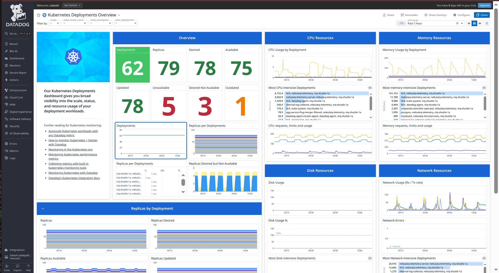
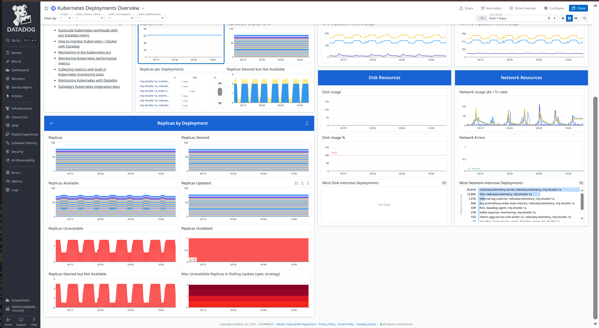
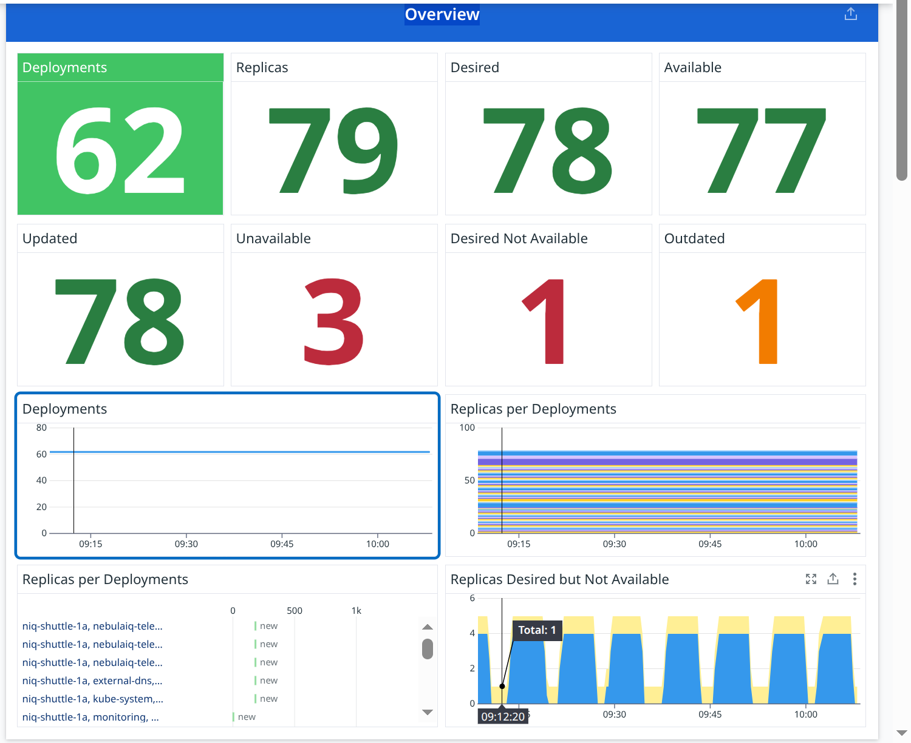
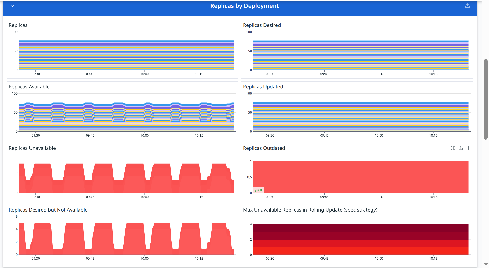
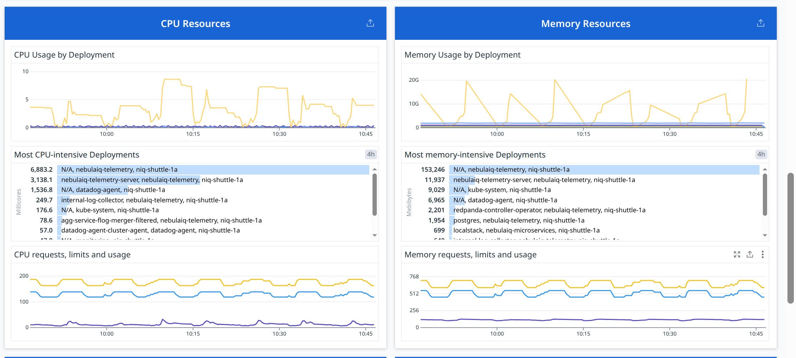
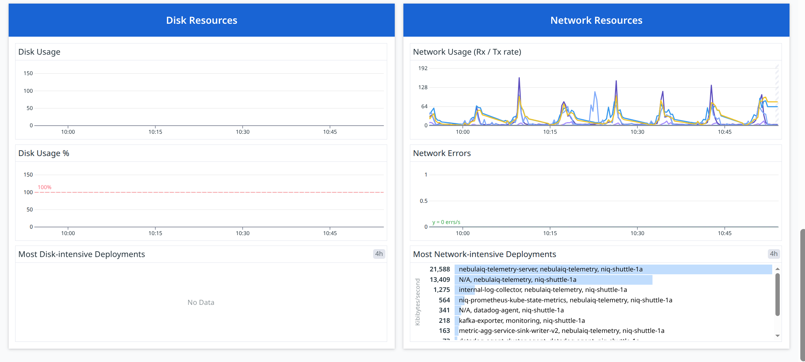

# Deployments




## Overview



#### **Deployments**

**Metric(s):**

- Metrics used: `kubernetes_state.deployment.replicas`

**query** :

```
count_nonzero(sum:kubernetes_state.deployment.replicas{*})
```

**Type** : Guage

**Unit** : Core

**Description:** The number of replicas per deployment

**Tags:** kube_deployment` `kube_namespace` (`env` `service` `version`.

---

#### **Available**

**Metric(s):**

- Metrics used: `kubernetes_state.deployment.replicas_available`

**query** :

```
sum:kubernetes_state.deployment.replicas_available{*}
```

**Type** : Guage

**Description:** The number of available replicas per deployment

**Tags:** `kube_deployment` `kube_namespace` ( `env` `service` `version` from standard labels).

---

#### **Updated**

**Metric(s):**

- Metrics used: `kubernetes_state.deployment.replicas_updated`

**query** :

```
sum:kubernetes_state.deployment.replicas_updated{*}
```

**Type** : Guage

**Unit** : Core

**Description:** The number of updated replicas per deployment

**Tags:** `kube_deployment` `kube_namespace` (`env` `service` `version` from standard labels).

---

#### **Outdated**

**Metric(s):**

- Metrics used: `kubernetes_state.deployment.replicas`

**query** :

```
sum:kubernetes_state.deployment.replicas{*} - sum:kubernetes_state.deployment.replicas_updated{*}
```

**Type** : Guage

**Unit** : Core

**Description:** The number of replicas per deployment

**Tags:** : `kube_deployment` `kube_namespace` (`env` `service` `version` from standard labels).

---

#### **Desired**

**Metric(s):**

- Metrics used: `kubernetes_state.deployment.replicas_desired`

**query** :

```
sum:kubernetes_state.deployment.replicas_desired{*}
```

**Type** : Guage

**Unit** : Core

**Description:** Number of desired pods for a deployment

**Tags:** `kube_deployment` `kube_namespace` (`env` `service` `version` from standard labels).

---

#### **Unavailable**

**Metric(s):**

- Metrics used: `kubernetes_state.deployment.replicas_unavailable`

**query** :

```
sum:kubernetes_state.deployment.replicas_unavailable{*}
```

**Type** : Guage

**Unit** : Core

**Description:** The number of unavailable replicas per deployment

**Tags:** `kube_deployment` `kube_namespace` (`env` `service` `version` from standard labels).

---

#### **Replicas**

**Metric(s):**

- Metrics used: `kubernetes_state.deployment.replicas`

**query** :

```
sum:kubernetes_state.deployment.replicas{*}
```

**Type** : Guage

**Unit** : Core

**Description:** The number of replicas per deployment

**Tags:** : `kube_deployment` `kube_namespace` (`env` `service` `version` from standard labels).

---#### **Replicas available**

**Metric(s):**

- Metrics used: `kubernetes_state.deployment.replicas_available`

**query** :

```
sum:kubernetes_state.deployment.replicas_available{*}
```

**Type** : Guage

**Unit** : Core

**Description:** The number of available replicas per deployment

**Tags:** `kube_deployment` `kube_namespace` (`env` `service` `version` from standard labels).

---

#### **Desired Not Available**

**Metric(s):**

- Metrics used: `kubernetes_state.deployment.replicas_desired`

**query** :

```
sum:kubernetes_state.deployment.replicas_desired{*} - sum:kubernetes_state.deployment.replicas_available{*}
```

**Type** : Guage

**Description:** Number of desired pods for a deployment

**Tags:** `kube_deployment` `kube_namespace` (`env` `service` `version` from standard labels).

---

### **Replicas per Deployments**

**Metric(s):**

- Metrics used: `sum:kubernetes_state.deployment.replicas{*}`

**query** :

```
sum:kubernetes_state.deployment.replicas{*}
```

**Type** : Guage

**Unit** : -

**Description:** The number of replicas per deployment.

**Tags:**`kube_deployment` `kube_namespace` (`env` `service` `version` from standard labels).

---

### **Replicas Desired but Not Available**

**Metric(s):**

- Metrics used: `kubernetes_state.deployment.replicas_desired`

**query** :

```
sum:kubernetes_state.deployment.replicas_desired{*} - sum:kubernetes_state.deployment.replicas_available{*}
```

**Type** : Guage

**Unit** : byte

**Description:** Number of desired pods for a deployment.

**Tags:**`kube_deployment` `kube_namespace` (`env` `service` `version` from standard labels).

---

## Replicas by Deployment



### **Replicas**

**Metric(s):**

- Metrics used: `kubernetes_state.deployment.replicas`

**query** :

```
sum:kubernetes_state.deployment.replicas{*}
```

**Type** : Guage

**Unit** : -

**Description:** The number of replicas per deployment.

**Tags:**`kube_deployment` `kube_namespace` (`env` `service` `version` from standard labels).

---

### **Replicas Desired**

**Metric(s):**

- Metrics used: `kubernetes_state.deployment.replicas_desired`

**query** :

```
sum:kubernetes_state.deployment.replicas_desired{*}
```

**Type** : Guage

**Unit** : byte

**Description:** Number of desired pods for a deployment.

**Tags:**`kube_deployment` `kube_namespace` (`env` `service` `version` from standard labels).

---

### **Replicas Available**

**Metric(s):**

- Metrics used: `kubernetes_state.deployment.replicas_available`

**query** :

```
sum:kubernetes_state.deployment.replicas_available{*}
```

**Type** : Guage

**Unit** : -

**Description:** The number of available replicas per deployment.

**Tags:**`kube_deployment` `kube_namespace` (`env` `service` `version` from standard labels).

---

### **Replicas Updated**

**Metric(s):**

- Metrics used: `kubernetes_state.deployment.replicas_updated`

**query** :

```
sum:kubernetes_state.deployment.replicas_updated{*}
```

**Type** : Guage

**Unit** : byte

**Description:** The number of updated replicas per deployment.

**Tags:**`kube_deployment` `kube_namespace` (`env` `service` `version` from standard labels).

---

### **Replicas Unavailable**

**Metric(s):**

- Metrics used: `kubernetes_state.deployment.replicas_unavailable`

**query** :

```
sum:kubernetes_state.deployment.replicas_unavailable{*}
```

**Type** : Guage

**Unit** : -

**Description:** The number of unavailable replicas per deployment.

**Tags:**`kube_deployment` `kube_namespace` (`env` `service` `version` from standard labels).

---

### **Replicas Outdated**

**Metric(s):**

- Metrics used: `kubernetes_state.deployment.replicas`

**query** :

```
sum:kubernetes_state.deployment.replicas{*} - sum:kubernetes_state.deployment.replicas_updated{*}
```

**Type** : Guage

**Unit** : byte

**Description:**
The number of replicas per deployment.

**Tags:**`kube_deployment` `kube_namespace` (`env` `service` `version` from standard labels).

---

### **Replicas Desired but Not Available**

**Metric(s):**

- Metrics used: `kubernetes_state.deployment.replicas_desired`

**query** :

```
sum:kubernetes_state.deployment.replicas_desired{*} - sum:kubernetes_state.deployment.replicas_available{*}
```

**Type** : Guage

**Unit** : -

**Description:** Number of desired pods for a deployment.

**Tags:**`kube_deployment` `kube_namespace` (`env` `service` `version` from standard labels).

---

### **Max Unavailable Replicas in Rolling Update (spec strategy)**

**Metric(s):**

- Metrics used: `kubernetes_state.deployment.rollingupdate.max_unavailable`

**query** :

```
sum:kubernetes_state.deployment.rollingupdate.max_unavailable{*}
```

**Type** : Guage

**Unit** : -

**Description:**Maximum number of unavailable replicas during a rolling update of a deployment.

**Tags:**`kube_deployment` `kube_namespace` (`env` `service` `version` from standard labels).

---

## CPU & Memory resources



### **CPU Usage by Deployment**

**Metric(s):**

- Metrics used: `kubernetes.cpu.usage.total`

**query** :

```
exclude_null(sum:kubernetes.cpu.usage.total{*})
```

**Type** : Guage

**Unit** : nanocore

**Description:** The number of cores used

**Tags:** -

---

### **Most CPU-intensive Deployments**

**Metric(s):**

- Metrics used: `kubernetes.cpu.usage.total`

**query** :

```
sum:kubernetes.cpu.usage.total{!pod_name:no_pod}
```

**Type** : Guage

**Unit** : nanocore

**Description:** The number of cores used

**Tags:** -

---

### **CPU requests, limits and usage**

**Metric(s):**

- Metrics used: `kubernetes.cpu.requests`

**query** :

```
sum:kubernetes.cpu.requests{*}
```

**Type** : Guage

**Unit** : core

**Description:** The requested cpu cores

**Tags:** -

---

### ** requested cpu cores**

**Metric(s):**

- Metrics used: `kubernetes.memory.usage`

**query** :

```
exclude_null(avg:kubernetes.memory.usage{*})
```

**Type** : Guage

**Unit** : byte

**Description:** The amount of memory used

**Tags:** -

---

### **Most memory-intensive Deployments**

**Metric(s):**

- Metrics used: `kubernetes.memory.usage`

**query** :

```
sum:kubernetes.memory.usage{!pod_name:no_pod}
```

**Type** : Guage

**Unit** : byte

**Description:** The amount of memory used

**Tags:** -

---

### **Memory requests, limits and usage**

**Metric(s):**

- Metrics used: ``

**query** :

```
sum:kubernetes.memory.requests{*}
```

**Type** : Guage

**Unit** : byte

**Description:** The requested memory

**Tags:** -

---

## Disk and Network Resources



### **Disk Usage**

**Metric(s):**

- Metrics used: `kubernetes.filesystem.usage`

---

### **Disk Usage %**

**Metric(s):**

- Metrics used: `kubernetes.filesystem.usage_pct`

---

### **Most Disk-intensive Deployments**

**Metric(s):**

- Metrics used: `kubernetes.filesystem.usage`

---

## Network

### **Network Usage (Rx / Tx rate)**

**Metric(s):**

- Metrics used: `kubernetes.network.rx_bytes`

**query** :

```
sum:kubernetes.network.rx_bytes{*}
```

**Type** : Guage

**Unit** : byte per second

**Description:** The amount of bytes per second received

**Tags:** -

---

### **Network Errors**

**Metric(s):**

- Metrics used: `kubernetes.network.rx_errors`

**query** :

```
sum:kubernetes.network.rx_errors{*}
```

**Type** : Guage

**Unit** : error per second

**Description:** The amount of rx errors per second

**Tags:** -

---

### **Most Network-intensive Deployments**

**Metric(s):**

- Metrics used: `kubernetes.network.tx_bytes`

**query** :

```
sum:kubernetes.network.tx_bytes{!pod_name:no_pod}
```

**Type** : Guage

**Unit** : byte per second

**Description:** The amount of bytes per second transmitted

**Tags:** -

---
