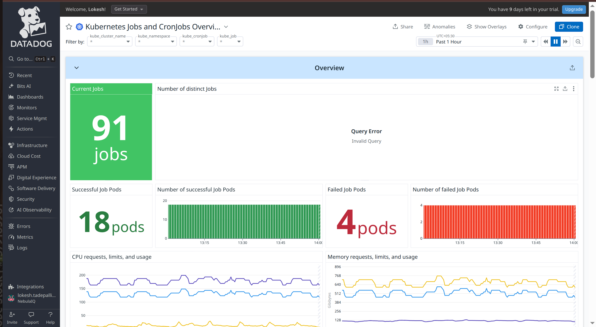
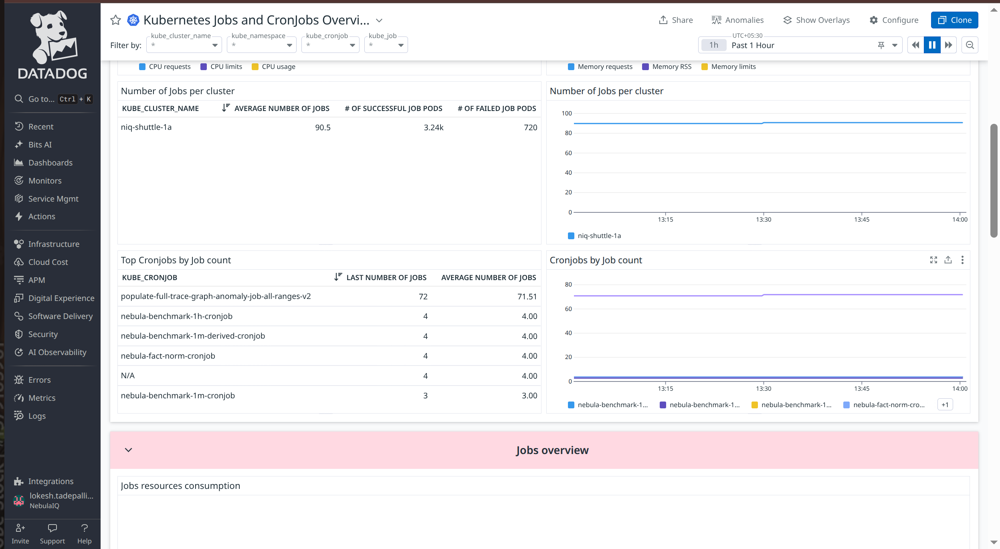
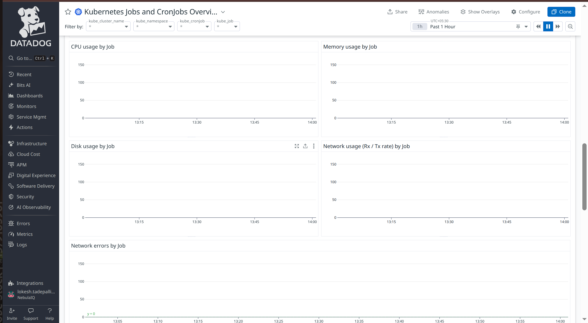
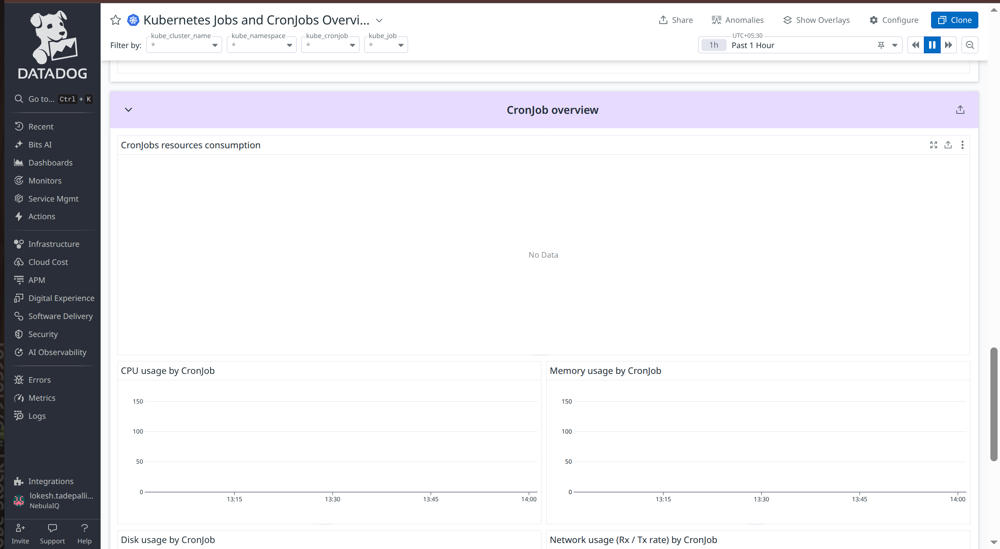
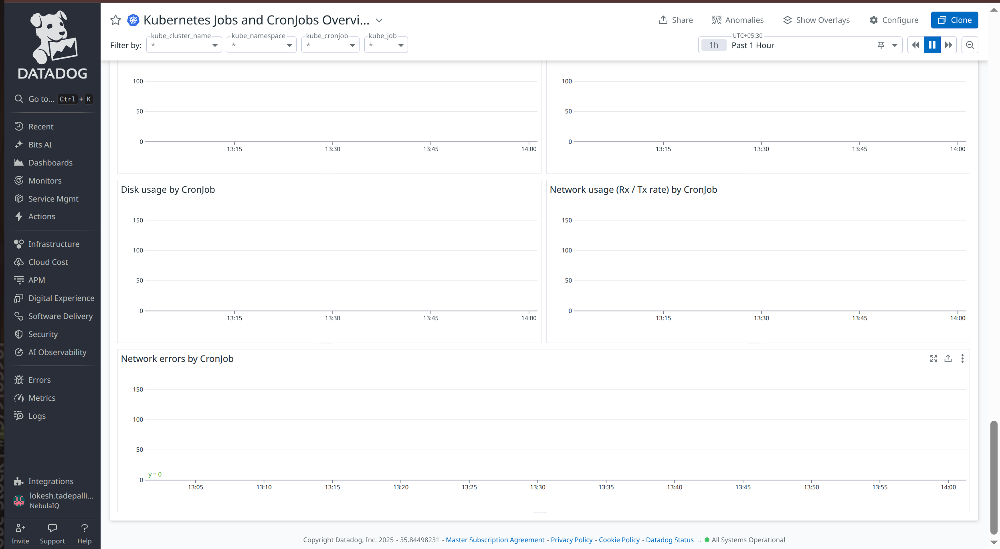
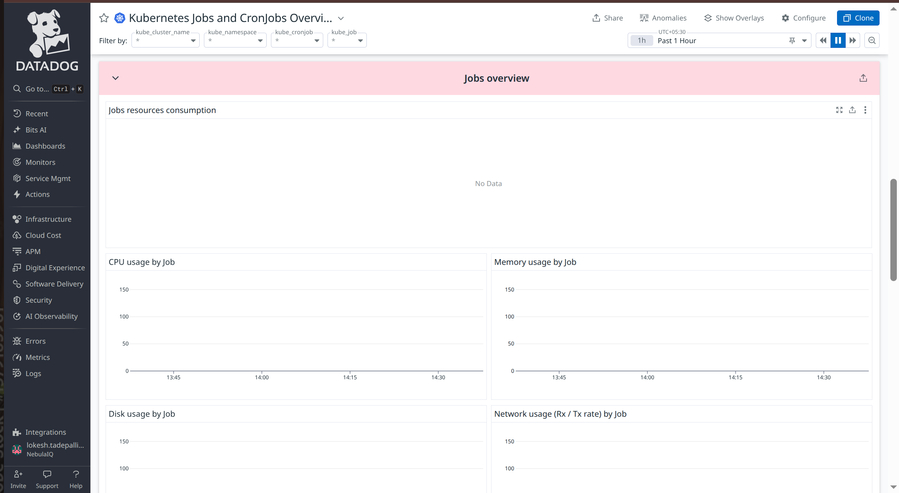

# Jobs and CronJobs







## Overview

### **Current Jobs**

**Metric(s):**

- Metrics used: `kubernetes_state.job.count`

**query** :

```
sum:kubernetes_state.job.count{*}
```

**Type** : Guage

**Unit** : -

**Description:** Number of jobs

**Tags:** `kube_namespace` `kube_cronjob`.

---

### **Number of distinct Jobs**

**Metric(s):**

- Metrics used: `kubernetes_state.job.count`

---

### **Successful Job Pods**

**Metric(s):**

- Metrics used: `kubernetes_state.job.succeeded`

**query** :

```
sum:kubernetes_state.job.succeeded{*}.as_count()
```

**Type** : Guage

**Unit** : -

**Description:** The number of pods which reached Phase Succeeded.

**Tags:**`kube_job` or `kube_cronjob` `kube_namespace` (`env` `service` `version` from standard labels).

---

### **Number of successful Job Pods**

**Metric(s):**

- Metrics used: `kubernetes_state.job.succeeded`

**query** :

```
sum:kubernetes_state.job.succeeded{*}.as_count()
```

**Type** : Guage

**Unit** : -

**Description:**
The number of pods which reached Phase Succeeded.

**Tags:**`kube_job` or `kube_cronjob` `kube_namespace` (`env` `service` `version` from standard labels).

---

### **Failed Job Pods**

**Metric(s):**

- Metrics used: `kubernetes_state.job.failed`

**query** :

```
sum:kubernetes_state.job.failed{*}.as_count()
```

**Type** : Guage

**Unit** : core

**Description:** The number of pods which reached Phase Failed.

**Tags:**`kube_job` or `kube_cronjob` `kube_namespace` (`env` `service` `version` from standard labels).

---

### **Number of failed Job Pods**

**Metric(s):**

- Metrics used: `kubernetes.memory.limits`

**query** :

```
sum:kubernetes.memory.limits{*}
```

**Type** : Guage

**Unit** : byte

**Description:** The limit of memory set

**Tags:**

---

### **CPU requests, limits, and usage**

**Metric(s):**

- Metrics used: `kubernetes.cpu.limits`

**query** :

```
sum:kubernetes.cpu.limits{*}
```

**Type** : Guage

**Unit** : core

**Description:** The limit of cpu cores set

**Tags:**

---

### **Memory requests, limits, and usage**

**Metric(s):**

- Metrics used: `kubernetes.memory.requests`

**query** :

```
sum:kubernetes.memory.requests{*}
```

**Type** : Guage

**Unit** : byte

**Description:** The requested memory

**Tags:**

---

### **Number of Jobs per cluster**

**Metric(s):**

- Metrics used: `kubernetes`

**query** :

```
sum:kubernetes_state.job.succeeded{*}.as_count()
```

**Type** : Guage

**Unit** : core

**Description:**The number of pods which reached Phase Succeeded.

**Tags:**`kube_job` or `kube_cronjob` `kube_namespace` (`env` `service` `version` from standard labels).

---

### **Number of Jobs per cluster**

**Metric(s):**

- Metrics used: `kubernetes`

**query** :

```
exclude_null(sum:kubernetes_state.job.count{*})
```

**Type** : Guage

**Unit** : -

**Description:** Number of jobs.

**Tags:**`kube_namespace` `kube_cronjob`

---

### **Top Cronjobs by Job count**

**Metric(s):**

- Metrics used: `kubernetes`

**query** :

```
sum:kubernetes_state.job.count{*}, sum:kubernetes_state.job.count{*}
```

**Type** : Guage

**Unit** : -

**Description:**Number of jobs.

**Tags:**`kube_namespace` `kube_cronjob`

---

### **Cronjobs by Job count**

**Metric(s):**

- Metrics used: `kubernetes_state.job.count`

**query** :

```
exclude_null(sum:kubernetes_state.job.count{*})
```

**Type** : Guage

**Unit** : -

**Description:** Number of jobs.

**Tags:**`kube_namespace` `kube_cronjob`.

---

## Jobs Overview



### **Jobs resources consumption**

**Metric(s):**

- Metrics used: `kubernetes.cpu.usage.total` , `kubernetes.memory.usage`, `kubernetes.network.rx_bytes`
  kubernetes.network.rx_bytes

---

### **CPU usage by Job**

**Metric(s):**

- Metrics used: `kubernetes.cpu.usage.total`

---

### **Memory usage by Job**

**Metric(s):**

- Metrics used: `kubernetes.memory.usage`

---

### **kubernetes.memory.usage**

**Metric(s):**

- Metrics used: `kubernetes.io.read_bytes` , `kubernetes.io.write_bytes`

---

### **kubernetes.io.write_bytes**

**Metric(s):**

- Metrics used: `kubernetes.network.rx_bytes`, `kubernetes.network.tx_bytes`

---

### **Network errors by Job**

**Metric(s):**

- Metrics used: `kubernetes.network.rx_errors` , `kubernetes.network.tx_errors`

---

## CronJob overview

### **CronJob overview**

**Metric(s):**

- Metrics used: `kubernetes.cpu.usage.total`, `kubernetes.memory.usage` , `kubernetes.network.rx_bytes`

---

### **CPU usage by CronJob**

**Metric(s):**

- Metrics used: `kubernetes.cpu.usage.total`

---

### **kubernetes.cpu.usage.total**

**Metric(s):**

- Metrics used: `kubernetes.memory.usage`

---

### **Disk usage by CronJob**

**Metric(s):**

- Metrics used: `kubernetes.io.read_bytes` , `kubernetes.io.write_bytes`

---

### **Network usage (Rx / Tx rate) by CronJob**

**Metric(s):**

- Metrics used: `kubernetes.network.rx_bytes`, `kubernetes.network.tx_bytes`

---

### **kubernetes.network.rx_bytes**

**Metric(s):**

- Metrics used: `kubernetes.network.rx_errors` , `kubernetes.network.tx_errors`

---

### **Most**

**Metric(s):**

- Metrics used: `kubernetes`

**query** :

```
cc
```

**Type** : Guage

**Unit** : -

**Description:** -

**Tags:**

---

### **Most**

**Metric(s):**

- Metrics used: `kubernetes`

**query** :

```
cc
```

**Type** : Guage

**Unit** : -

**Description:** -

**Tags:**

---

### **Most**

**Metric(s):**

- Metrics used: `kubernetes`

**query** :

```
cc
```

**Type** : Guage

**Unit** : -

**Description:** -

**Tags:**

---

### **Most**

**Metric(s):**

- Metrics used: `kubernetes`

**query** :

```
cc
```

**Type** : Guage

**Unit** : -

**Description:** -

**Tags:**

---
