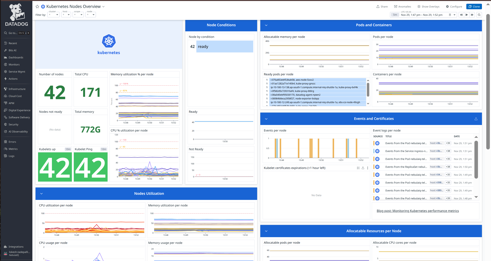
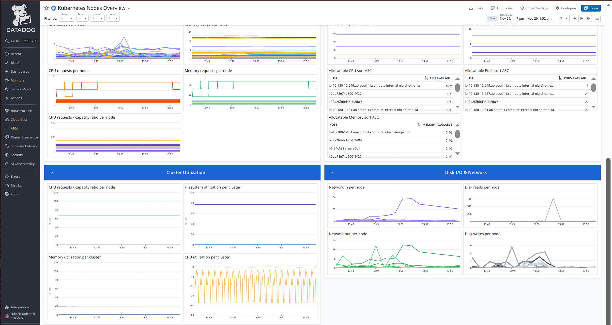
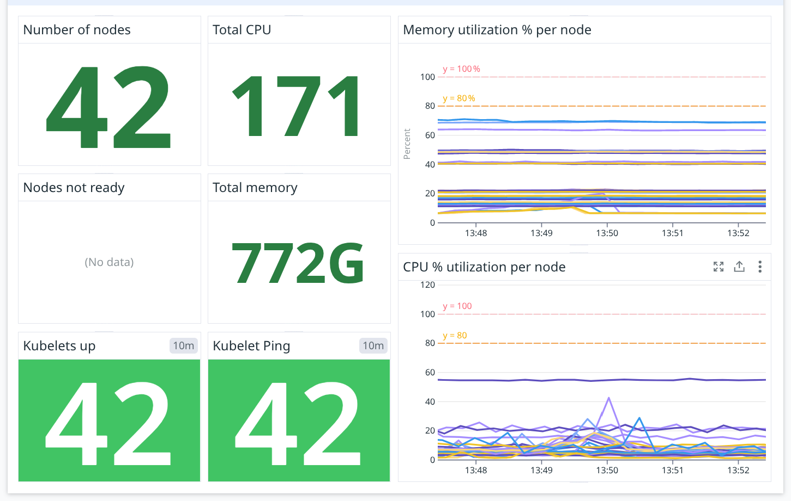
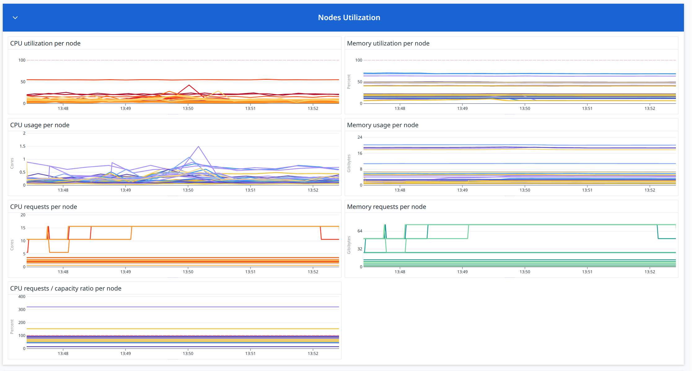
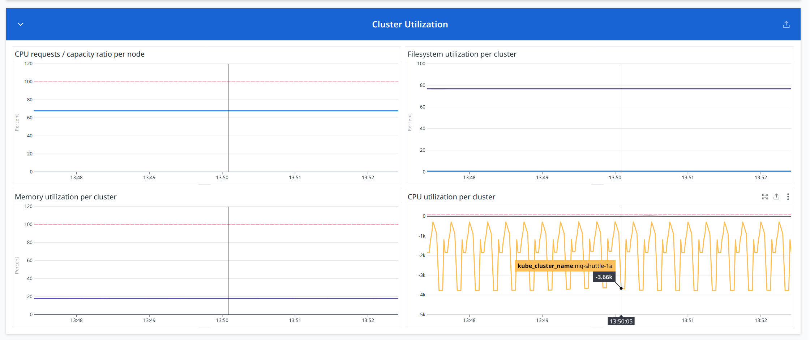
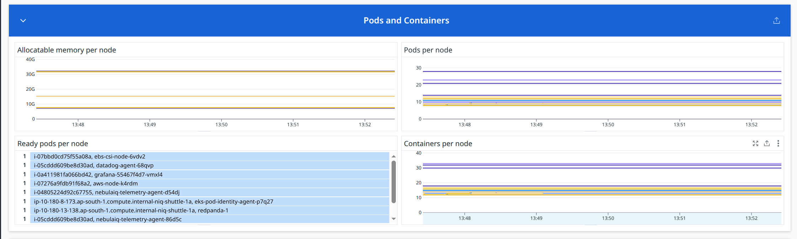
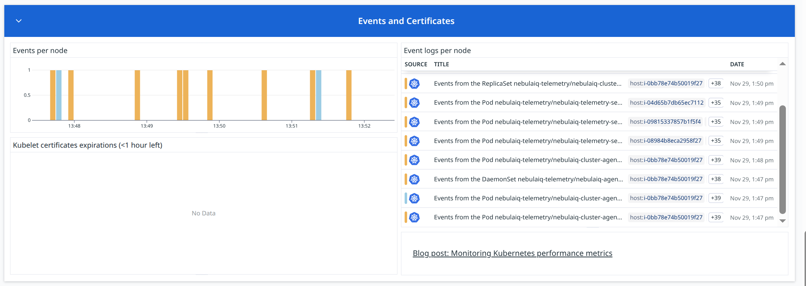
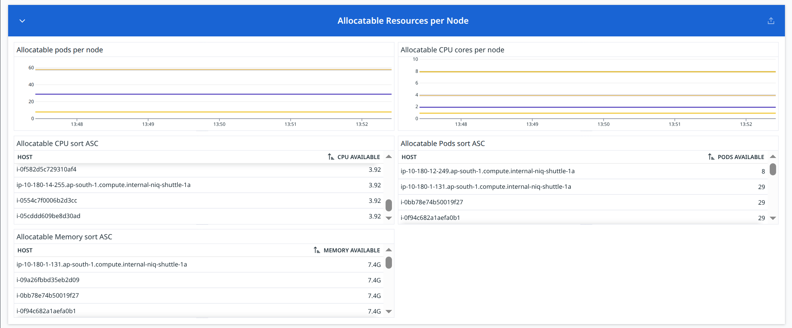
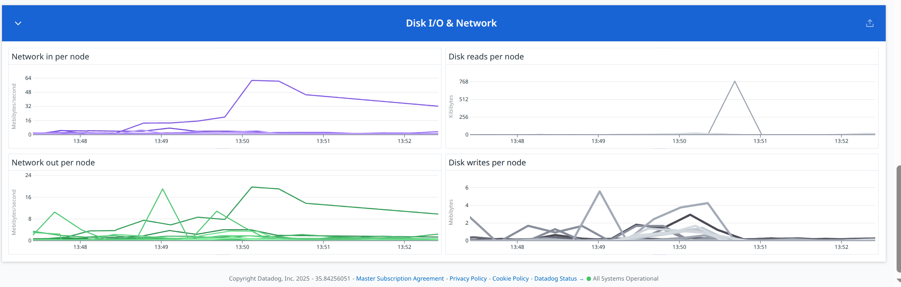

# Nodes

https://us5.datadoghq.com/dash/integration/200/kubernetes-nodes-overview?fromUser=false&refresh_mode=paused&from_ts=1764404245694&to_ts=1764404545694&live=false



## Overview



Below is the **Nodes Overview** documentation written in the **exact same style and formatting** you’ve been using.

You can paste this directly into your analysis document.

---

### **Number of nodes**

**Metric(s):**

- Metrics used: `kubernetes_state.node.count`

**query** :

```
sum:kubernetes_state.node.count{*}
```

**Type** : Gauge

**Unit** : Count (Number of Ready nodes)

**Description:** Number of nodes.

**Tags:** `kernel_version` `os_image` `container_runtime_version` `kubelet_version`.

---

### **Total CPU**

**Metric(s):**

- Metrics used: `kubernetes_state.node.cpu_capacity`

**query** :

```
sum:kubernetes_state.node.cpu_capacity{*}
```

**Type** : Gauge

**Unit** : Cores (Total CPU capacity across all nodes)

**Description:** The CPU capacity of a node.

**Tags:**`node` `resource` `unit`.

---

### **Nodes not ready**

**Metric(s):**

- Metrics used: `kubernetes_state.node.by_condition`

**query** :

```
sum:kubernetes_state.node.by_condition
```

**Type** : Gauge

**Unit** : Count (Nodes in NotReady state)

**Description:** The condition of a cluster node.

**Tags:**`condition` `node` `status`.

---

### **Total memory**

**Metric(s):**

- Metrics used: `kubernetes_state.node.memory_capacity`

**query** :

```
sum:kubernetes_state.node.memory_capacity{*}
```

**Type** : Gauge

**Unit** : Gigabytes (GiB) of total cluster memory

**Description:** The memory capacity of a node.

**Tags:**`node` `resource` `unit`.

---

### **Memory utilization % per node**

**Metric(s):**

- Metrics used: `system.mem.pct_usable`

Datadog computes memory % internally.

**query** :

```
1 - avg:system.mem.pct_usable{*}
```

**Type** : Gauge (time series)

**Unit** : Percentage (% memory utilization per node)

**Description:** The amount of usable physical RAM as a fraction of the total.

---

### **CPU % utilization per node**

**Metric(s):**

- Metrics used:

  - `system.cpu.user`
  - `system.cpu.system`
  - `system.cpu.idle`

Datadog computes CPU % internally.

**query** :

```
100 - avg:system.cpu.idle{*}
```

**Type** : Gauge (time series)

**Unit** : Percentage (% CPU usage per node)

**Description:** Percent of time the CPU spent in an idle state.

---

### **Kubelets up**

**Metric(s):**

- Metrics used: `kubernetes.kubelet.check{status:ok}`

**query** :

```
count_nonzero(max:kubernetes.kubelet.check{status:ok})
```

**Type** : Gauge

**Unit** : Count (Number of healthy kubelets)

---

### **Kubelet Ping**

**Metric(s):**

- Metrics used: `kubernetes.kubelet.ping`

**query** :

```
count_nonzero(max:kubernetes.kubelet.ping{*})
```

**Type** : Gauge

**Unit** : Count (Number of nodes responding to ping)

---

## Node Condition


### **Node by condition**

**Metric(s):**

- Metrics used: `kubernetes_state.node.by_condition`

**query** :

```
sum:kubernetes_state.node.by_condition{status:true}
```

**Type** : Gauge

**Unit** : Count (Number of nodes matching the condition)

**Description:** The condition of a cluster node.

**Tags:**`condition` `node` `status`.

---

### **Ready**

**Metric(s):**

- Metrics used: `kubernetes_state.node.by_condition`

**query** :

```
sum:kubernetes_state.node.by_condition{condition:ready,status:true}
```

**Type** : Gauge (time series)

**Unit** : Count (Nodes in Ready state)

**Datadog Aggregation Logic:**

**Description:** The condition of a cluster node.

**Tags:**`condition` `node` `status`.

---

### **Not Ready**

**Metric(s):**

- Metrics used: `kubernetes_state.node.status{status:not_ready}`

**query** :

```
sum:kubernetes_state.node.by_condition{condition:not-ready,status:true}
```

**Type** : Gauge (time series)

**Unit** : Count (Nodes not Ready)

---

## Node Utilization



### **CPU utilization per node**

**Metric(s):**

- Metrics used:

  - `system.cpu.user`
  - `system.cpu.system`
  - `system.cpu.idle`
    (Datadog internally computes CPU utilization %)

**query** :

```
100 - avg:system.cpu.idle{*}
```

**Type** : Gauge (time series)

**Unit** : Percentage (% CPU utilization per node)

**Description:** Percent of time the CPU spent in an idle state.

---

### **Memory utilization % per node**

**Metric(s):**

- Metrics used: `system.mem.pct_usable`

**query** :

```
1 - avg:system.mem.pct_usable{*}
```

**Type** : Gauge (time series)

**Unit** : fraction

**Description:** The amount of usable physical RAM as a fraction of the total.

---

### **CPU usage per node**

**Metric(s):**

- Metrics used: `kubernetes.cpu.usage.total`

**query** :

```
sum:kubernetes.cpu.usage.total{*}
```

**Type** : Gauge (time series)

**Unit** : nanocore

**Description:** The number of cores used

---

### **Memory usage per node**

**Metric(s):**

- Metrics used: `kubernetes.memory.usage`

**query** :

```
sum:kubernetes.memory.usage{*}
```

**Type** : Gauge (time series)

**Unit** : byte

**Description:** The amount of memory used

---

### **CPU requests per node**

**Metric(s):**

- Metrics used: `kubernetes.cpu.requests`

**query** :

```
sum:kubernetes.cpu.requests{*}
```

**Type** : Gauge (time series)

**Unit** : core

**Description:** The requested cpu cores

---

### **Memory requests per node**

**Metric(s):**

- Metrics used: `kubernetes.memory.requests`

**query** :

```
sum:kubernetes.memory.requests{*}
```

**Type** : Gauge (time series)

**Unit** : byte

**Description:** The requested memory

---

### **CPU requests / capacity ratio per node**

**Metric(s):**

- Metrics used: `kubernetes_state.container.cpu_requested`

**query** :

```
(sum:kubernetes_state.container.cpu_requested{*} / sum:kubernetes_state.node.cpu_capacity{*}) * 100
```

**Type** : Gauge (time series)

**Unit** : Percentage (% of CPU requests vs node capacity)

**Description:** The value of CPU requested by a container.

**Tags:**`kube_namespace` `pod_name` `kube_container_name` `node` `resource` `unit` (`env` `service` `version` from standard labels).

---

## CLuster utilization



### **CPU requests / capacity ratio per node**

**Metric(s):**

- Metrics used:

  - `kubernetes.cpu.requests`
  - `kubernetes.cpu.capacity`

**query** :

```
sum:kubernetes_state.container.cpu_requested{*} / sum:kubernetes_state.node.cpu_capacity{*} * 100
```

**Type** : Gauge (time series)

**Unit** : Percentage (% CPU requests compared to node CPU capacity)

**Description:** The value of CPU requested by a container.

**Tags:** `kube_namespace` `pod_name` `kube_container_name` `node` `resource` `unit` (`env` `service` `version` from standard labels)

---

### **Filesystem utilization per cluster**

**Metric(s):**

- Metrics used:

  - `system.fs.used`
  - `system.fs.total`

**query** :

```
avg:kubernetes.node.filesystem.usage_pct{*} * 100
```

**Type** : Gauge (time series)

**Unit** : fraction

**Description:** The percentage of disk space used at node level

---

### **Memory utilization per cluster**

**Metric(s):**

- Metrics used:

  - `system.mem.used`
  - `system.mem.total`

**query** :

```
avg:kubernetes.memory.usage_pct{*} * 100
```

**Type** : Gauge (time series)

**Unit** : fraction

**Description:** The percentage of memory used per pod (memory limit must be set)

---

### **CPU utilization per cluster**

**Metric(s):**

- Metrics used:

  - `system.cpu.user`
  - `system.cpu.system`
  - `system.cpu.idle`

Datadog internally calculates CPU utilization.

**query** :

```
100 - avg:system.cpu.idle{*}
```

**Type** : Gauge (time series)

**Unit** : Percentage (% CPU usage across the entire cluster)

**Description:** Percent of time the CPU spent in an idle state.

## Pod and Containers



### **Allocatable memory per node**

**Metric(s):**

- Metrics used: `kubernetes_state.node.memory_allocatable`

**query** :

```
avg:kubernetes_state.node.memory_allocatable{*}
```

**Type** : Gauge (time series)

**Unit** : GiB (Allocatable memory per node)

**Description:** The allocatable memory of a node that is available for scheduling.

**Tags:**`node` `resource` `unit`.

---

### **Pods per node**

**Metric(s):**

- Metrics used: `kubernetes.pods.running`

**query** :

```
top(sum:kubernetes.pods.running{*}, 50, 'mean', 'desc')
```

**Type** : Gauge (time series)

**Unit** : Count (Number of pods running on each node)

**Description:** The number of running pods

---

### **Ready pods per node**

**Metric(s):**

- Metrics used: `kubernetes_state.pod.ready`

**query** :

```
sum:kubernetes_state.pod.ready{condition:true}
```

**Type** : Gauge

**Unit** : Count (Pods in Ready state per node)

**Description:** Describes whether the pod is ready to serve requests.

**Tags:** `node` `kube_namespace` `pod_name` `condition` (`env` `service` `version` from standard labels).

---

### **Containers per node**

**Metric(s):**

- Metrics used: `kubernetes.containers.running`

**query** :

```
sum:kubernetes.containers.running{*}
```

**Type** : Gauge (time series)

**Unit** : Count (Running containers per node)

**Description:** The number of running containers

## Events and Certificates



### **Events per node**

**Metric(s):**

- Metrics used: `kubernetes_state.event.count`

**query** :

```
count
```

**Type** : Gauge (time series)

**Unit** : Count (Number of Kubernetes events per node)

---

### **Event logs per node**

**Metric(s):**

- Event table is not based on a single metric; it is pulled from:

  - `kubernetes_state.event.*`
  - Datadog Kubernetes Integration event stream
  - Sources: Pods, DaemonSets, ReplicaSets, Deployments, Nodes, etc.

**query** :

```
kubernetes_state.event.* (Event Stream)
```

**Type** : Log/Event Stream Table

**Unit** : N/A (Events are textual records)

**Datadog Aggregation Logic:**

- Datadog collects Kubernetes events from the API server
- Groups them by **source**, **object**, **node**, and **timestamp**
- Displays events such as:

  - Pod scheduling errors
  - CrashLoopBackOff events
  - ReplicaSet scale events
  - Node pressure warnings
  - Certificate issues

- Helps debug cluster issues in real-time

---

### **Kubelet certificates expirations (<1 hour left)**

**Metric(s):**

- Metrics used: `kubernetes.kubelet.certificate.expiration`

**query** :

```
min:kubernetes.kubelet.certificate.expiration{*} by {node}
```

**Type** : Gauge (alert table)

**Unit** : Seconds or Timestamp (time until certificate expires)

---

## Allocatable Resources per Node



---

### **Allocatable Pods per Node**

**Metric(s):**

- Metrics used:

  - `kubernetes_state.node.pods_allocatable`

**Query:**

```
avg:kubernetes_state.node.pods_allocatable{*}
```

**Type:** Gauge (time series)

**Unit:** Count (Maximum number of pods that can be scheduled on each node)

**Description:** The allocatable memory of a node that is available for scheduling.

**Tags:**`node` `resource` `unit`.

---

### **Allocatable CPU Cores per Node**

**Metric(s):**

- Metrics used:

  - `kubernetes_state.node.cpu_allocatable`

**Query:**

```
avg:kubernetes_state.node.cpu_allocatable{*}
```

**Type:** Gauge (time series)

**Unit:** Cores (CPU allocatable capacity per node)

**Description:** The allocatable CPU of a node that is available for scheduling.

**Tags:** `node` `resource` `unit`.

### **Allocatable CPU sort ASC**

**Metric(s):**

- Metrics used:

  - `kubernetes_state.node.cpu_allocatable`

**Query:**

```
avg:kubernetes_state.node.cpu_allocatable{*}
```

**Type:** Top List (sorted in ascending order)

**Unit:** Cores

**Description:** The allocatable CPU of a node that is available for scheduling.

**Tags:**`node` `resource` `unit`.

---

## **Allocatable Pods sort ASC**

**Metric(s):**

- Metrics used:

  - `kubernetes_state.node.pods_allocatable`

**Query:**

```
avg:kubernetes_state.node.pods_allocatable{*}
```

**Type:** Top List (sorted ascending)

**Unit:** Count (Pods allocatable per node)

**Description:** The allocatable memory of a node that is available for scheduling.

**Tags:**`node` `resource` `unit`.

---

### **Allocatable Memory sort ASC**

**Metric(s):**

- Metrics used:

  - `kubernetes_state.node.memory_allocatable`

**Query:**

```
avg:kubernetes_state.node.memory_allocatable{*}
```

**Type:** Top List (sorted ascending)

**Unit:** GiB (Allocatable memory)

**Description:** The allocatable memory of a node that is available for scheduling.

**Tags:** `node` `resource` `unit`.

---

## Disk I/O & Network



### **Network in per node**

**Metric(s):**

- Metrics used:

  - `system.net.bytes_rcvd`

**query** :

```
avg:system.net.bytes_rcvd{*} by {host}
```

**Type** : Gauge (time series)

**Unit** : Megabytes/second (Datadog converts bytes → MB/s)

**Datadog Aggregation Logic:**

- **avg**: averages inbound network traffic per node
- Measures how much data each node is receiving
- Useful for identifying nodes handling heavy ingress traffic
- Helps detect overloaded network interfaces or hotspots

---

### **Network out per node**

**Metric(s):**

- Metrics used:

  - `kubernetes.network.rx_bytes`

**query** :

```
sum:kubernetes.network.rx_bytes{*}
```

**Type** : Gauge (time series)

**Unit** : byte/second

**Description:** The amount of bytes per second received

---

### **Disk reads per node**

**Metric(s):**

- Metrics used:

  - `kubernetes.io.read_bytes`

**query** :

```
sum:kubernetes.io.read_bytes{*}
```

**Type** : Gauge (time series)

**Unit** : bytes

**Description:** The amount of bytes read from the disk

---

### **Disk writes per node**

**Metric(s):**

- Metrics used: `kubernetes.io.write_bytes`

**query** :

```
sum:kubernetes.io.write_bytes{*}
```

**Type** : Gauge (time series)

**Unit** : byte

**Description:** The amount of bytes written to the disk

---
