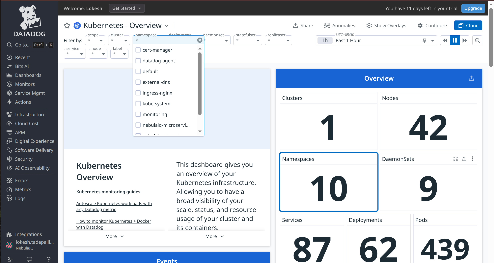
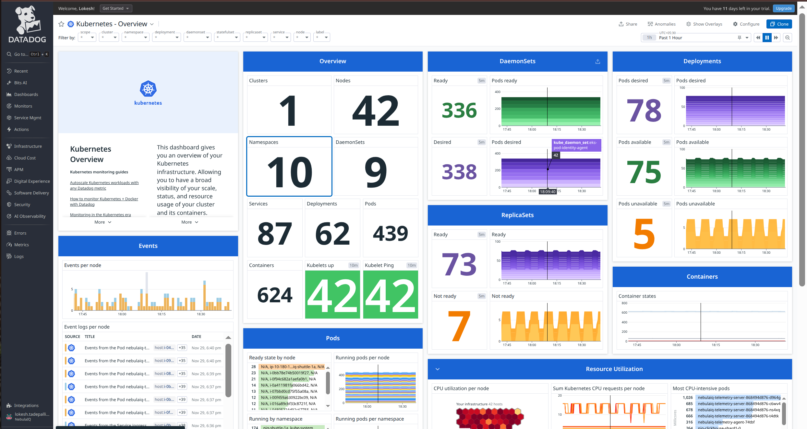
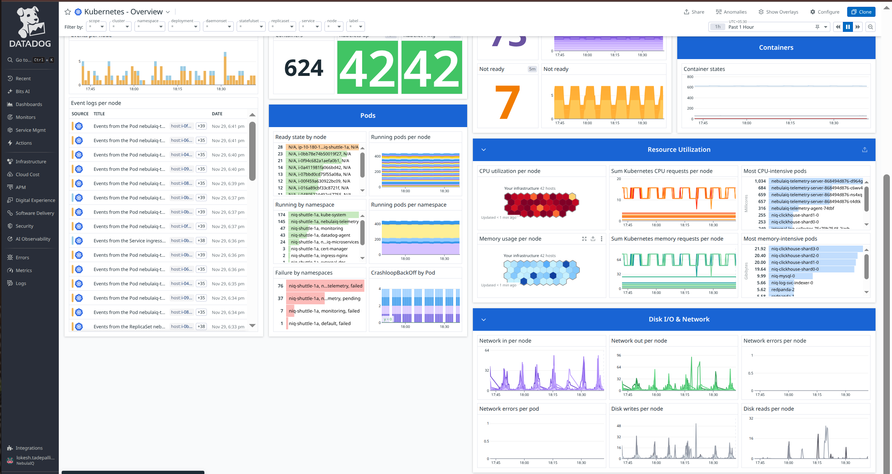
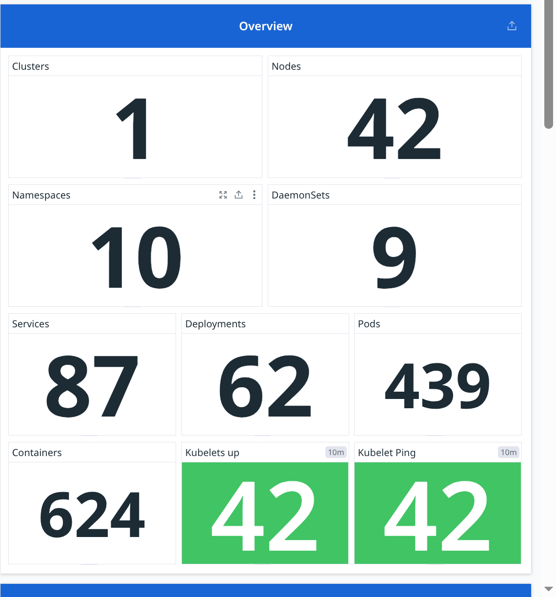
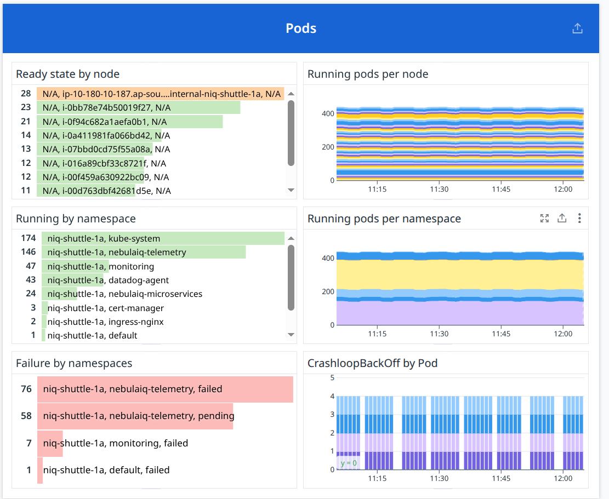
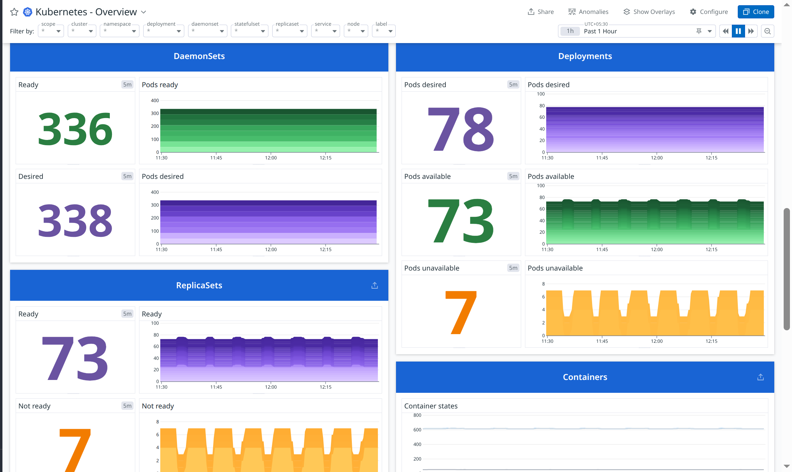
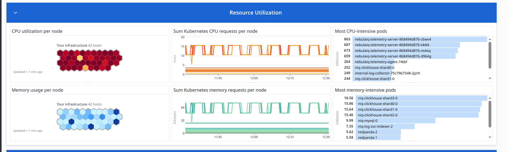
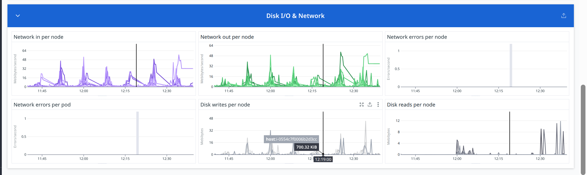

# Data analysis

# Kubernetes overview

https://us5.datadoghq.com/dash/integration/kubernetes?fromUser=false&refresh_mode=sliding&from_ts=1764411786950&to_ts=1764415386950&live=true







### cluster

A Kubernetes cluster is the highest-level logical unit that contains all nodes, pods, namespaces, workloads, and services. It represents one complete Kubernetes environment.
Tracking the number of clusters is important because each cluster is an independent deployment boundary, billing unit, and operational environment. Monitoring cluster count ensures that Datadog is receiving data from all active clusters and helps detect if any cluster has stopped reporting metrics.

**Metric(s):**

- Metris used: kubernetes.pods.running

**query** :
`count_nonzero(avg:kubernetes.pods.running{*})`

**Type** : Guage

**Unit** : Count (Number of running pods per entity)
Datadog Aggregation Logic

### Nodes

Nodes are the individual worker machines (VMs or EC2 instances) in a Kubernetes cluster where pods actually run. Monitoring node count ensures the cluster has enough capacity and helps detect scaling events, failures, or missing nodes.

**Metric(s):**

- Metrics used: `kubernetes_state.node.count`

- **Query:**

```
sum:kubernetes_state.node.count{*}
```

**Type:** Gauge

**Unit:** Count (number of nodes reporting )

**Tags**:`kernel_version` `os_image` `container_runtime_version` `kubelet_version`.

**Description**: Number of nodes

### Namespaces

Namespaces logically group Kubernetes resources within a cluster. They help separate environments, teams, or applications. Tracking namespace count helps understand cluster segmentation and workload organization.

**Metric(s):**

- Metrics used: `kubernetes.pods.running`

**Query:**

```
count_nonzero(avg:kubernetes.pods.running{*})
```

**Type:** Gauge

**Unit:** Count (Number of namespaces)

**Description:** The number of running pods

---

### DaemonSets

A DaemonSet ensures a specific pod runs on **every node** (or a selected group of nodes). This is used for agents, log collectors, monitoring, and networking components. Knowing total DaemonSets helps understand cluster-wide infrastructure workloads.

**Metric(s):**

- Metrics used: `kubernetes_state.daemonset.desired`

**Query:**

```
count_nonzero(avg:kubernetes_state.daemonset.desired{*})
```

**Type:** Gauge

**Unit:** Count (Number of daemonsets)

**Description:**
The number of nodes that should be running the daemon pod.

**Tags:**`kube_daemon_set` `kube_namespace` (`env` `service` `version` from standard labels).

---

### Services

Services provide stable networking endpoints in Kubernetes and load-balance traffic to pods. Tracking service count helps understand how many applications are exposed inside or outside the cluster.

**Metric(s):**

- Metrics used: `kubernetes_state.service.count`

**Query:**

```
sum:kubernetes_state.service.count{*}
```

**Type:** Gauge

**Unit:** Count (Number of services)

**Description:**
Number of services.

**Tags:**`kube_namespace` `type`.

---

### Deployments

A Deployment manages replicas of stateless applications. It ensures rollout, rollback, and scaling. Monitoring deployment count indicates how many applications or microservices are active.

**Metric(s):**

- Metrics used: `kubernetes_state.deployment.replicas`

**Query:**

```
count_nonzero(avg:kubernetes_state.deployment.replicas{*})
```

**Type:** Gauge

**Unit:** Count (Number of deployments)

**Description:**
The number of replicas per deployment.

**Tags:**`kube_deployment` `kube_namespace` (`env` `service` `version` from standard labels).

---

### Pods

Pods are the smallest Kubernetes execution units containing one or more containers. Tracking pod count shows total workload running in the cluster and is essential for capacity, scaling, and troubleshooting.

**Metric(s):**

- Metrics used: `kubernetes_state.pod.running`

**Query:**

```
sum:kubernetes.pods.running{*}
```

**Type:** Gauge

**Unit:** Count (Total number of pods)

**Description:**
The number of running pods

---

### Containers

Containers represent actual application processes running inside pods. Container count gives a more detailed view of workload size and is used for resource tracking, billing, and capacity planning.

**Metric(s):**

- Metrics used: `kubernetes.containers.running`

**Query:**

```
sum:kubernetes.containers.running{*}
```

**Type:** Gauge

**Unit:** Count (Number of running containers)

**Description:**
The number of running containers

---

### Kubelets Up

Kubelet is the primary agent running on every node responsible for pod lifecycle management. A kubelet must be healthy for the node to function. This widget shows how many kubelets (nodes) are alive.

**Metric(s):**

- Metrics used: `kubernetes.kubelet.check`

**Query:**

```
count_nonzero(max:kubernetes.kubelet.check{status:ok})
```

**Type:** Gauge

**Unit:** Count (Number of healthy kubelets)

**Aggregation Logic:**

- `kubernetes.kubelet.check` reports health
- `status:ok` → kubelet is functioning
- `count_nonzero` counts all healthy kubelets
- Should match node count if all nodes are up

---

### Kubelet Ping

This represents connectivity/heartbeat checks between Datadog agent and kubelet. If kubelet ping fails, node metrics become unreliable. It is an uptime indicator for the node agent.

**Metric(s):**

- Metrics used: `kubernetes.kubelet.ping`

**Query:**

```
count_nonzero(max:kubernetes.kubelet.ping{*})
```

**Type:** Gauge

**Unit:** Count (Number of responding kubelets)

**Aggregation Logic:**

- Each kubelet returns a ping metric
- Non-zero = responsive
- Count shows number of kubelets reachable by Datadog



### **Ready state by node**

**Metric(s):**

- Metrics used: `kubernetes_state.pod.ready`

**query** :

```
sum:kubernetes_state.pod.ready{*} by {node}
```

**Type** : Gauge

**Unit** : Count (Number of ready pods per node)

**Description:** Describes whether the pod is ready to serve requests.

**Tags:**`node` `kube_namespace` `pod_name` `condition` (`env` `service` `version` from standard labels

---

### **Running pods per node**

**Metric(s):**

- Metrics used: `sum:kubernetes.pods.running`

**query** :

```
sum:kubernetes.pods.running{*}
```

**Type** : Gauge

**Unit** : Count (Number of running pods per node)

**Description:** The number of running pods

---

### **Running by namespace**

**Metric(s):**

- Metrics used: `kubernetes_state.pod.running`

**query** :

```
sum:kubernetes.pods.running{*}
```

**Type** : Gauge

**Unit** : Count (Number of running pods per namespace)

**Description:** The number of running pods

---

### **Running pods per namespace (time series)**

**Metric(s):**

- Metrics used: `kubernetes.pod.running`

**query** :

```
sum:kubernetes.pods.running{*}
```

**Type** : Gauge

**Unit** : Count (Running pods over time per namespace)

**Description:** The number of running pods

---

### **Failure by namespaces**

**Metric(s):**

- Metrics used:

  - `kubernetes_state.pod.status_phase`

**query** :
(Example used by Datadog)

Failed pods:

```
sum:kubernetes_state.pod.status_phase{!pod_phase:running,!pod_phase:succeeded}
```

**Type** : Gauge

**Unit** : Count (Pods in failed or pending states per namespace)

**Description:**
The pods current phase.

**Tags:**`node` `kube_namespace` `pod_name` `pod_phase` (`env` `service` `version` from standard labels).

---

### **CrashLoopBackOff by Pod**

**Metric(s):**

- Metrics used: `kubernetes_state.container.status_report.count.waiting`

**query** :

```
sum:kubernetes_state.container.status_report.count.waiting{reason:crashloopbackoff}
```

**Type** : Gauge

**Unit** : Count (Number of containers in CrashLoopBackOff per pod)

**Description:**
Describes the reason the container is currently in waiting state.

**Tags:** `kube_namespace` `pod_name` `kube_container_name` `reason` (`env` `service` `version` from standard labels).



## **DaemonSets**

### **DaemonSets – Ready**

**Metric(s):**

- Metrics used: `kubernetes_state.daemonset.ready`

**query** :

```
sum:kubernetes_state.daemonset.ready{*}
```

**Type** : Gauge

**Unit** : Count (Number of ready DaemonSet pods)

**Description:**
The number of nodes that should be running the daemon pod and have one or more of the daemon pod running and ready.

**Tags:** `kube_daemon_set` `kube_namespace` (`env` `service` `version` from standard labels).

**Datadog Aggregation Logic:**

- **sum**: adds all DaemonSet pods that are in _Ready_ state
- Shows how many DaemonSet-managed pods are currently available
- Used to verify cluster-wide DaemonSet health (e.g., agents, CNI pods)

---

### **DaemonSets – Desired**

**Metric(s):**

- Metrics used: `kubernetes_state.daemonset.desired`

**query** :

```
sum:kubernetes_state.daemonset.desired{*}
```

**Type** : Gauge

**Unit** : Count (Desired number of DaemonSet pods)

**Description:** The number of nodes that should be running the daemon pod.

**Tags:**`kube_daemon_set` `kube_namespace` (`env` `service` `version` from standard labels)

**Datadog Aggregation Logic:**

- **sum**: adds desired pod count for each DaemonSet
- Desired = number of nodes that _should_ be running the pod
- Difference between desired vs ready indicates rollout or failure

## Deployments

### **Deployments – Pods desired**

**Metric(s):**

- Metrics used: `kubernetes_state.deployment.replicas_desired`

**query** :

```
sum:kubernetes_state.deployment.replicas_desired{*}
```

**Type** : Gauge

**Unit** : Count (Desired replicas for deployments)

**Description:** Number of desired pods for a deployment.

**Tags:**`kube_deployment` `kube_namespace` (`env` `service` `version` from standard labels).

### **Deployments – Pods available**

**Metric(s):**

- Metrics used: `kubernetes_state.deployment.replicas_available`

**query** :

```
sum:kubernetes_state.deployment.replicas_available{*}
```

**Type** : Gauge

**Unit** : Count (Available replicas)

**Description:** The number of available replicas per deployment.

**Tags:**`kube_deployment` `kube_namespace` (`env` `service` `version` from standard labels).

### **Deployments – Pods unavailable**

**Metric(s):**

- Metrics used: `kubernetes_state.deployment.replicas_unavailable`

**query** :

```
sum:kubernetes_state.deployment.replicas_unavailable{*}
```

**Type** : Gauge

**Unit** : Count (Unavailable replicas)

**Description:** The number of unavailable replicas per deployment.

**Tags:**`kube_deployment` `kube_namespace` (`env` `service` `version` from standard labels).

## ReplicaSets

### **ReplicaSets – Ready**

**Metric(s):**

- Metrics used: `kubernetes_state.replicaset.replicas_ready`

**query** :

```
sum:kubernetes_state.replicaset.replicas_ready{*}
```

**Type** : Gauge

**Unit** : Count (Number of ready ReplicaSet pods)

**Description:** The number of ready replicas per ReplicaSet.

**Tags:** `kube_namespace` `kube_replica_set` (`env` `service` `version` from standard labels).

---

### **ReplicaSets – Not Ready**

**Metric(s):**

- Metrics used: `kubernetes_state.replicaset.replicas_desired`

**query** :

```
sum:kubernetes_state.replicaset.replicas_desired{*} - sum:kubernetes_state.replicaset.replicas_ready{*}
```

**Type** : Gauge

**Unit** : Count (Pods not ready in ReplicaSets)

**Description:** Number of desired pods for a ReplicaSet.

**Tags:**`kube_namespace` `kube_replica_set` (`env` `service` `version` from standard labels).

## Containers

### **Containers – Container States**

**Metric(s):**

- Metrics used: `kubsum:kubernetes_state.container.running`
  (plus internal Datadog container-status metrics depending on version)

**query** :

```
sum:kubernetes_state.container.running{*}
```

**Type** : Gauge

**Unit** : Count (Number of running containers)

**Description:** Describes whether the container is currently in running state.

**Tags:**`kube_namespace` `pod_name` `kube_container_name` (`env` `service` `version` from standard labels).

## Resource utilization



### **CPU utilization per node**

**Metric(s):**

- Metrics used: `kubernetes.cpu.usage.total`

**query** :

```
kubernetes.cpu.usage.total
```

(Displayed via Datadog’s infrastructure map visualization)

**Type** : Gauge

**Unit** : nanocore

**Description:** The number of cores used

---

### **Sum Kubernetes CPU requests per node**

**Metric(s):**

- Metrics used: `kubernetes.cpu.requests`

**query** :

```
sum:kubernetes.cpu.requests{*}
```

**Type** : Gauge

**Unit** : Cores (CPU requests in cores)

**Description:** The requested cpu cores

---

### **Most CPU-intensive pods**

**Metric(s):**

- Metrics used: `kubernetes.cpu.usage.total`

**query** :

```
sum:kubernetes.cpu.usage.total{!pod_name:no_pod}
```

(Exact query may vary but Datadog uses a **top list** function)

**Type** : Gauge

**Unit** : nanocore

**Description:** The number of cores used

---

### **Memory usage per node**

**Metric(s):**

- Metrics used: `system.mem.used`, `system.mem.total` (Datadog computes % or bytes)

**query** :

```
sum:kubernetes.memory.usage{*} by {host}
```

(Display is a node-map heat visualization)

**Type** : Gauge

**Unit** : Bytes (or % depending on UI)

**Datadog Aggregation Logic:**

---

### **Sum Kubernetes memory requests per node**

**Metric(s):**

- Metrics used: `kubernetes.memory.requests`

**query** :

```
sum:kubernetes.memory.requests{*}
```

**Type** : Gauge

**Unit** : byte (Gigabytes of memory requested)

**Description:** The requested memory

---

### **Most memory-intensive pods**

**Metric(s):**

- Metrics used: `kubernetes.memory.usage`

**query** :

```
sum:kubernetes.memory.usage{!pod_name:no_pod}
```

**Type** : Gauge

**Unit** : Byte (Memory usage per pod)

**Description:** The amount of memory used

## Disk I/O & Network



### **Network in per node**

**Metric(s):**

- Metrics used: `kubernetes.network.rx_bytes`

**query** :

```
sum:kubernetes.network.rx_bytes{*}
```

**Type** : Gauge (time series)

**Unit** : byte per second

**Description:** The amount of bytes per second received

### **Network out per node**

**Metric(s):**

- Metrics used: `kubernetes.network.tx_bytes`

**query** :

```
sum:kubernetes.network.tx_bytes{*}
```

**Type** : Gauge (time series)

**Unit** : byte per second

**Description:** The amount of bytes per second transmitted

### **Network errors per node**

**Metric(s):**

- Metrics used: `system.net.errors`

**query** :

```
sum:system.net.errors{*} by {host}
```

**Type** : Gauge

**Unit** : Errors/second

---

### **Network errors per pod**

**Metric(s):**

- Metrics used: `kubernetes.network.rx_errors` and `kubernetes.network.tx_errors`

**query** :

```
sum:kubernetes.network.errors{*} by {pod_name}
```

**Type** : Gauge

**Unit** : Errors/second

---

### **Disk writes per node**

**Metric(s):**

- Metrics used: `kubernetes.io.write_bytes`

**query** :

```
sum:kubernetes.io.write_bytes{*}
```

**Type** : byte (time series)

**Unit** : Megabytes/second

**Description:** The amount of bytes written to the disk

---

### **Disk reads per node**

**Metric(s):**

- Metrics used: `kubernetes.io.read_bytes`

**query** :

```
sum:kubernetes.io.read_bytes{*}
```

**Type** : byte (time series)

**Unit** : Megabytes/second

**Description:** The amount of bytes read from the disk
