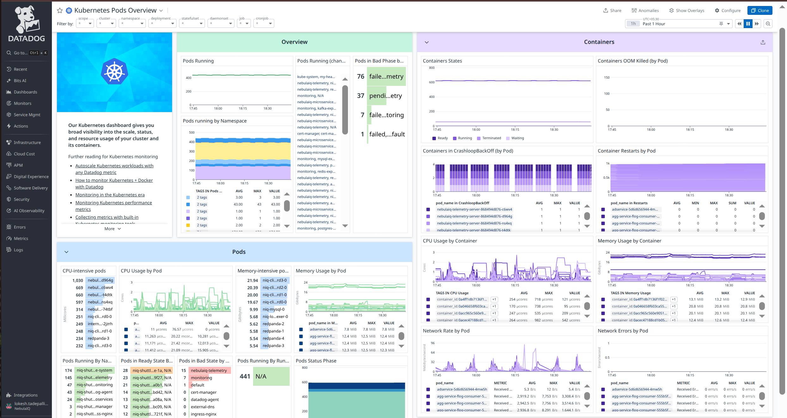
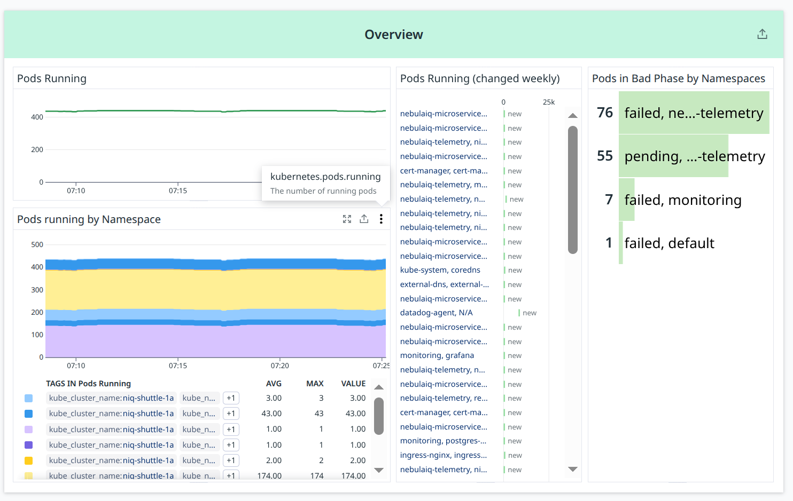
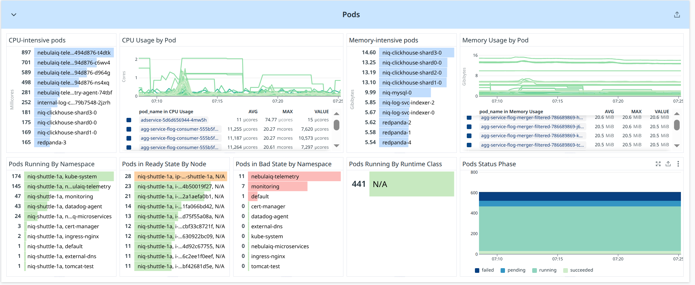
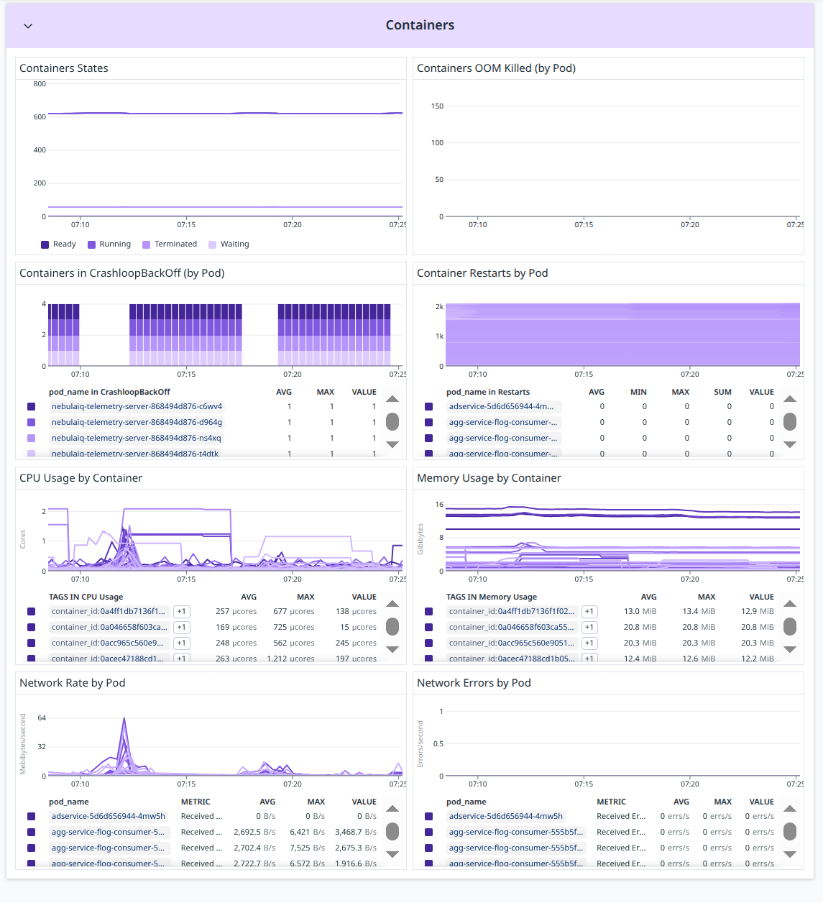

# Pods

Pods are the smallest Kubernetes execution units containing one or more containers. Tracking pod count shows total workload running in the cluster and is essential for capacity, scaling, and troubleshooting.

https://us5.datadoghq.com/dash/integration/180/kubernetes-pods-overview?fromUser=false&refresh_mode=sliding&from_ts=1764418467937&to_ts=1764422067937&live=true


## Overview



### **Pods Running**

**Metric(s):**

- Metrics used: `kubernetes.pods.running`

**query** :

```
avg:kubernetes.pods.running{*}
```

**Type** : Gauge (time series)

**Unit** : Count (Number of running pods)

**Datadog Aggregation Logic:**

- **avg**: averages the number of running pods across all nodes/namespaces
- Shows total running pods over time
- Helps track workload stability and detect sudden drops/increases

---

### **Pods Running (changed weekly)**

**Metric(s):**

- Metrics used: `kubernetes.pods.running`

**query** :

```
change(avg:kubernetes.pods.running{*}), week
```

(Note: Datadog uses an internal _change over time_ function)

**Type** : Gauge / Change indicator

**Unit** : Count difference over 1 week

**Datadog Aggregation Logic:**

- **avg**: computes running pods baseline
- **change()**: calculates difference compared to the same time last week
- Shows which workloads gained or lost pods across the last week
- Useful for trend analysis and scaling pattern visibility

---

### **Pods in Bad Phase by Namespaces**

**Metric(s):**

- Metrics used:

  - `kubernetes_state.pod.status_phase{phase:failed}`
  - `kubernetes_state.pod.status_phase{phase:pending}`
  - `kubernetes_state.pod.status_phase{phase:unknown}` (sometimes)

**query** :
Failed:

```
sum:kubernetes_state.pod.status_phase{phase:failed} by {kube_namespace}
```

Pending:

```
sum:kubernetes_state.pod.status_phase{phase:pending} by {kube_namespace}
```

**Type** : Gauge

**Unit** : Count (Number of bad-phase pods per namespace)

**Datadog Aggregation Logic:**

- **sum**: counts pods in failure or pending phases
- Grouped by namespace
- Helps identify problematic namespaces
- Used for debugging deployment failures, resource shortage, or container errors

---

### **Pods running by Namespace**

**Metric(s):**

- Metrics used: `kubernetes_state.pod.running`

**query** :

```
avg:kubernetes_state.pod.running{*} by {kube_namespace}
```

**Type** : Gauge (time series)

**Unit** : Count (Running pods per namespace)

**Datadog Aggregation Logic:**

- **avg**: smooths the time series across the cluster
- Grouping by **{kube_namespace}** shows how many pods each namespace is running
- Useful for workload segmentation and capacity analysis
- Helps visualize namespace-level scaling behavior

## Pods



### **CPU-intensive pods**

**Metric(s):**

- Metrics used: `container.cpu.usage`

**query** :

```
top(container.cpu.usage{*} by {pod_name}, 10)
```

**Type** : Gauge

**Unit** : Millicores (mCores)

**Datadog Aggregation Logic:**

- **top()**: selects highest CPU-consuming pods
- **container.cpu.usage** reflects actual CPU used by containers
- Helps identify CPU-heavy pods or noisy neighbors

---

### **CPU Usage by Pod**

**Metric(s):**

- Metrics used: `container.cpu.usage`

**query** :

```
avg:container.cpu.usage{*} by {pod_name}
```

**Type** : Gauge (time series)

**Unit** : Cores / mCores

**Datadog Aggregation Logic:**

- **avg**: averages CPU usage per pod over time
- Shows CPU consumption trend for each pod
- Useful for identifying pods with spikes or sustained high CPU load

---

### **Memory-intensive pods**

**Metric(s):**

- Metrics used: `container.memory.usage`

**query** :

```
top(container.memory.usage{*} by {pod_name}, 10)
```

**Type** : Gauge

**Unit** : GiB (Gigabytes)

**Datadog Aggregation Logic:**

- **top()**: lists pods with highest memory usage
- Useful to detect pods consuming excessive memory or leaking

---

### **Memory Usage by Pod**

**Metric(s):**

- Metrics used: `container.memory.usage`

**query** :

```
avg:container.memory.usage{*} by {pod_name}
```

**Type** : Gauge (time series)

**Unit** : GiB / MiB

**Datadog Aggregation Logic:**

- **avg**: averages pod memory usage across the time window
- Helps identify pods with high memory footprint
- Useful for detecting memory leaks

---

### **Pods Running By Namespace**

**Metric(s):**

- Metrics used: `kubernetes_state.pod.running`

**query** :

```
sum:kubernetes_state.pod.running{*} by {kube_namespace}
```

**Type** : Gauge

**Unit** : Count (Pods running per namespace)

**Datadog Aggregation Logic:**

- **sum**: counts all running pods per namespace
- Helps visualize distribution of workloads by namespace

---

### **Pods in Ready State By Node**

**Metric(s):**

- Metrics used: `kubernetes_state.pod.ready`

**query** :

```
sum:kubernetes_state.pod.ready{*} by {node}
```

**Type** : Gauge

**Unit** : Count

**Datadog Aggregation Logic:**

- **sum**: counts pods in Ready state for each node
- Helps identify node-level readiness or imbalance issues

---

### **Pods in Bad State by Namespace**

**Metric(s):**

- Metrics used:

  - `kubernetes_state.pod.status_phase{phase:failed}`
  - `kubernetes_state.pod.status_phase{phase:pending}`

**query** :

Failed:

```
sum:kubernetes_state.pod.status_phase{phase:failed} by {kube_namespace}
```

Pending:

```
sum:kubernetes_state.pod.status_phase{phase:pending} by {kube_namespace}
```

**Type** : Gauge

**Unit** : Count (Failed/pending pods per namespace)

**Datadog Aggregation Logic:**

- **sum**: counts pods in undesirable phases
- Quickly identifies namespaces experiencing failures or restarts

---

### **Pods Running By Runtime Class**

**Metric(s):**

- Metrics used: `kubernetes_state.pod.running`

**query** :

```
sum:kubernetes_state.pod.running{*} by {runtime_class}
```

**Type** : Gauge

**Unit** : Count

**Datadog Aggregation Logic:**

- **sum**: counts running pods grouped by runtime class
- If runtime class is not defined → all pods show under “N/A”
- Helps identify which container runtime classes are used (e.g., runc, gvisor)

---

### **Pods Status Phase**

**Metric(s):**

- Metrics used: `kubernetes_state.pod.status_phase`

**query** :

```
sum:kubernetes_state.pod.status_phase{*} by {phase}
```

**Type** : Gauge (stacked bar chart)

**Unit** : Count (Pods per phase)

**Datadog Aggregation Logic:**

- **sum**: counts pods in each lifecycle phase:

  - running
  - pending
  - succeeded
  - failed
  - unknown

- Helps understand overall pod lifecycle health in the cluster

## Container



### **Containers States**

**Metric(s):**

- Metrics used: `kubernetes_state.container.status_report.count`

**query** :

```
sum:kubernetes_state.container.status_report.count{*} by {state}
```

**Type** : Gauge (stacked time series)

**Unit** : Count (Containers by lifecycle state)

**Datadog Aggregation Logic:**

- **sum**: counts containers in each state
- States include: `running`, `waiting`, `terminated`, `ready`
- Shows overall container lifecycle distribution in the cluster

---

### **Containers OOM Killed (by Pod)**

**Metric(s):**

- Metrics used: `kubernetes_state.container.last_terminated_reason{reason:OOMKilled}`

**query** :

```
sum:kubernetes_state.container.last_terminated_reason{reason:OOMKilled} by {pod_name}
```

**Type** : Gauge

**Unit** : Count (Number of OOMKilled containers per pod)

**Datadog Aggregation Logic:**

- **sum**: counts containers killed by Out-Of-Memory
- Helps identify pods with memory leaks or insufficient memory requests

---

### **Containers in CrashLoopBackOff (by Pod)**

**Metric(s):**

- Metrics used:
  `kubernetes_state.pod.container.waiting{reason:CrashLoopBackOff}`

**query** :

```
sum:kubernetes_state.pod.container.waiting{reason:CrashLoopBackOff} by {pod_name}
```

**Type** : Gauge (time series)

**Unit** : Count (Containers stuck in CrashLoopBackOff)

**Datadog Aggregation Logic:**

- **sum**: counts containers whose `waiting.reason = CrashLoopBackOff`
- Shows pods repeatedly restarting because of startup failures

---

### **Container Restarts by Pod**

**Metric(s):**

- Metrics used: `kubernetes.containers.restarts`

**query** :

```
sum:kubernetes.containers.restarts{*} by {pod_name}
```

**Type** : Gauge

**Unit** : Count (Total number of container restarts)

**Datadog Aggregation Logic:**

- **sum**: adds restart count per pod
- Useful for detecting unstable workloads
- Helps identify pods failing frequently over time

---

### **CPU Usage by Container**

**Metric(s):**

- Metrics used: `container.cpu.usage`

**query** :

```
avg:container.cpu.usage{*} by {container_id}
```

**Type** : Gauge (time series)

**Unit** : Cores / Millicores

**Datadog Aggregation Logic:**

- **avg**: computes average CPU consumption per container
- Helps identify containers using excessive CPU
- Highlights noisy neighbors or misconfigured limits

---

### **Memory Usage by Container**

**Metric(s):**

- Metrics used: `container.memory.usage`

**query** :

```
avg:container.memory.usage{*} by {container_id}
```

**Type** : Gauge (time series)

**Unit** : MiB / GiB

**Datadog Aggregation Logic:**

- **avg**: averages container memory usage
- Helps detect memory leaks or containers consistently exceeding requests

---

### **Network Rate by Pod**

**Metric(s):**

- Metrics used:

  - `container.net.bytes_rcvd`
  - `container.net.bytes_sent`

**query** :

Received:

```
avg:container.net.bytes_rcvd{*} by {pod_name}
```

Sent:

```
avg:container.net.bytes_sent{*} by {pod_name}
```

**Type** : Gauge (time series)

**Unit** : Bytes/second

**Datadog Aggregation Logic:**

- **avg**: averages network throughput per pod
- Shows network activity for each workload
- Useful for identifying chatty or bandwidth-heavy pods

---

### **Network Errors by Pod**

**Metric(s):**

- Metrics used: `container.net.errors`

**query** :

```
sum:container.net.errors{*} by {pod_name}
```

**Type** : Gauge

**Unit** : Errors/second

**Datadog Aggregation Logic:**

- **sum**: counts network-level errors coming from container network interfaces
- Helps detect failing CNI plugins or network connectivity issues
