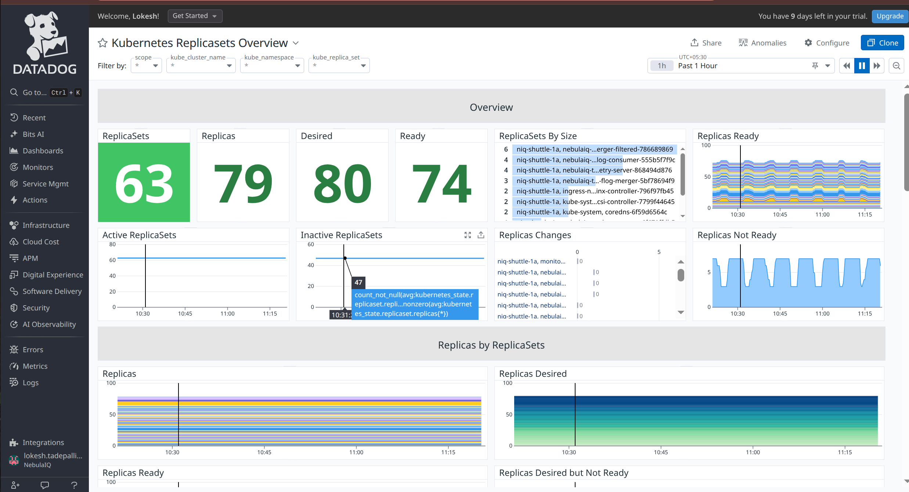
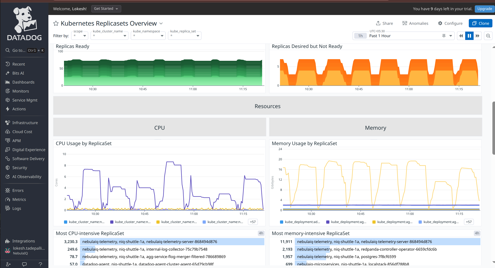
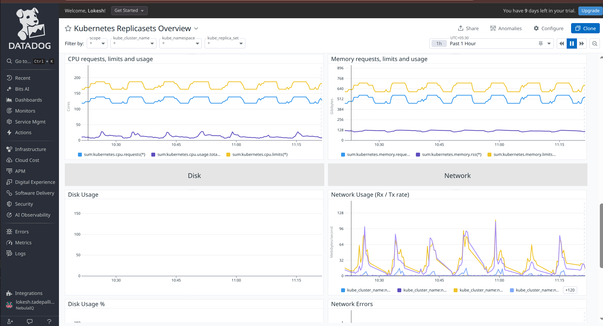
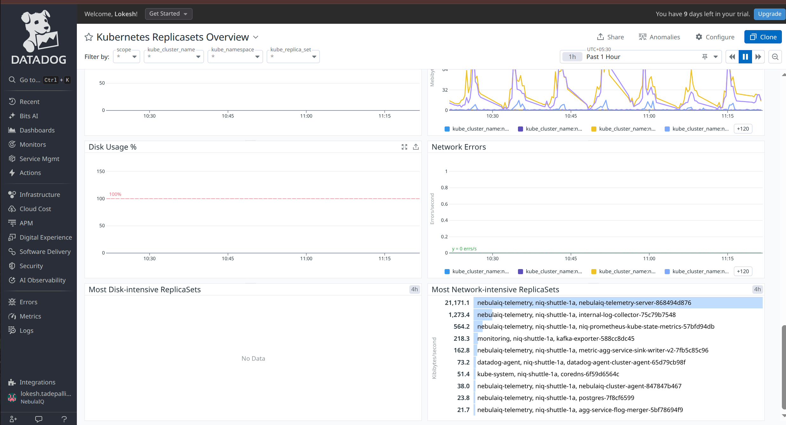
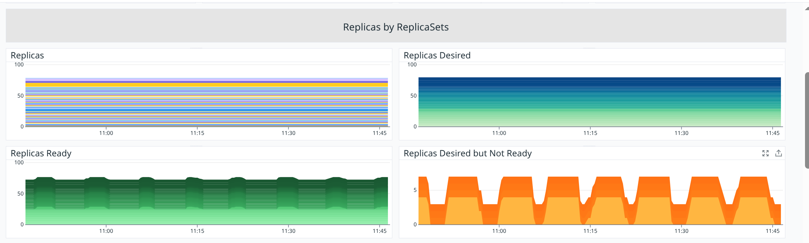
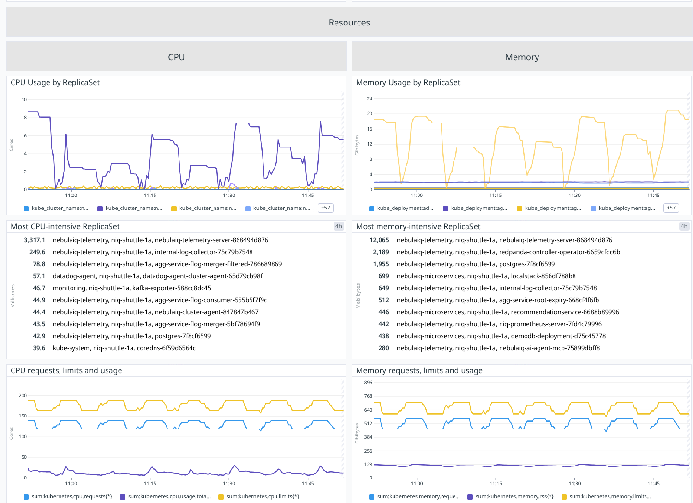
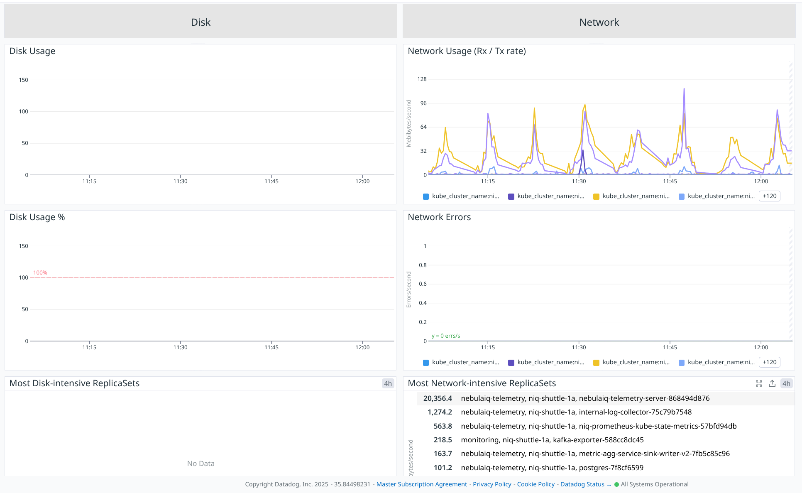

# replicasets






## Overview

### **ReplicaSets**

**Metric(s):**

- Metrics used: `kubernetes_state.replicaset.replicas`

**query** :

```
count_nonzero(sum:kubernetes_state.replicaset.replicas{*})
```

**Type** : Guage

**Unit** : -

**Description:** The number of replicas per ReplicaSet.

**Tags:**`kube_namespace` `kube_replica_set` (`env` `service` `version` from standard labels).

---

### **Replicas**

**Metric(s):**

- Metrics used: `kubernetes_state.replicaset.replicas`

**query** :

```
sum:kubernetes_state.replicaset.replicas{*}
```

**Type** : Guage

**Unit** : -

**Description:** The number of replicas per ReplicaSet.

**Tags:**`kube_namespace` `kube_replica_set` (`env` `service` `version` from standard labels).

---

### **Desired**

**Metric(s):**

- Metrics used: `sum:kubernetes_state.replicaset.replicas_desired{*}`

**query** :

```
sum:kubernetes_state.replicaset.replicas_desired{*}
```

**Type** : Guage

**Unit** : byte

**Description:** Number of desired pods for a ReplicaSet.

**Tags:**`kube_namespace` `kube_replica_set` (`env` `service` `version` from standard labels).

---

### **Ready**

**Metric(s):**

- Metrics used: `kubernetes_state.replicaset.replicas_ready`

**query** :

```
sum:kubernetes_state.replicaset.replicas_ready{*}
```

**Type** : Guage

**Unit** : -

**Description:** The number of ready replicas per ReplicaSet.

**Tags:**`kube_namespace` `kube_replica_set` (`env` `service` `version` from standard labels).

---

### **ReplicaSets By Size**

**Metric(s):**

- Metrics used: `kubernetes_state.replicaset.replicas`

**query** :

```
avg:kubernetes_state.replicaset.replicas{*}
```

**Type** : Guage

**Unit** : -

**Description:** The number of replicas per ReplicaSet.

**Tags:**`kube_namespace` `kube_replica_set` (`env` `service` `version` from standard labels).

---

### **Replicas Ready**

**Metric(s):**

- Metrics used: `kubernetes_state.replicaset.replicas_ready`

**query** :

```
sum:kubernetes_state.replicaset.replicas_ready{*}
```

**Type** : Guage

**Unit** : -

**Description:** The number of ready replicas per ReplicaSet.

**Tags:**`kube_namespace` `kube_replica_set` (`env` `service` `version` from standard labels).

---

### **Active ReplicaSets**

**Metric(s):**

- Metrics used: `kubernetes_state.replicaset.replicas`

**query** :

```
count_nonzero(avg:kubernetes_state.replicaset.replicas{*})
```

**Type** : Guage

**Unit** : -

**Description:** The number of replicas per ReplicaSet.

**Tags:**`kube_namespace` `kube_replica_set` (`env` `service` `version` from standard labels).

---

### **Inactive ReplicaSets**

**Metric(s):**

- Metrics used: `kubernetes_state.replicaset.replicas`

**query** :

```
count_not_null(avg:kubernetes_state.replicaset.replicas{*}) - count_nonzero(avg:kubernetes_state.replicaset.replicas{*})
```

**Type** : Guage

**Unit** : -

**Description:**The number of replicas per ReplicaSet.

**Tags:**`kube_namespace` `kube_replica_set` (`env` `service` `version` from standard labels).

---

### **Replicas Changes**

**Metric(s):**

- Metrics used: `kubernetes_state.replicaset.replicas`

**query** :

```
hour_before(avg:kubernetes_state.replicaset.replicas{*}), avg:kubernetes_state.replicaset.replicas{*}
```

**Type** : Guage

**Unit** : -

**Description:** The number of replicas per ReplicaSet.

**Tags:**`kube_namespace` `kube_replica_set` (`env` `service` `version` from standard labels)

---

### **Replicas Not Ready**

**Metric(s):**

- Metrics used: `kubernetes_state.replicaset.replicas_desired`

**query** :

```
sum:kubernetes_state.replicaset.replicas_desired{*} - sum:kubernetes_state.replicaset.replicas_ready{*}
```

**Type** : Guage

**Unit** : -

**Description:** Number of desired pods for a ReplicaSet.

**Tags:**`kube_namespace` `kube_replica_set` (`env` `service` `version` from standard labels).

---

## Replicas by ReplicaSets



### **Replicas**

**Metric(s):**

- Metrics used: `kubernetes_state.replicaset.replicas`

**query** :

```
sum:kubernetes_state.replicaset.replicas{*}
```

**Type** : Guage

**Unit** : byte

**Description:** The number of replicas per ReplicaSet.

**Tags:**`kube_namespace` `kube_replica_set` (`env` `service` `version` from standard labels).

---

### **Replicas Ready**

**Metric(s):**

- Metrics used: `kubernetes_state.replicaset.replicas_ready`

**query** :

```
sum:kubernetes_state.replicaset.replicas_ready{*}
```

**Type** : Guage

**Unit** : -

**Description:**The number of ready replicas per ReplicaSet.

**Tags:**`kube_namespace` `kube_replica_set` (`env` `service` `version` from standard labels).

---

### **Replicas Desired but Not Ready**

**Metric(s):**

- Metrics used: ``

**query** :

```
sum:kubernetes_state.replicaset.replicas_desired{*} - sum:kubernetes_state.replicaset.replicas_ready{*}
```

**Type** : Guage

**Unit** : -

**Description:** Number of desired pods for a ReplicaSet.

**Tags:**`kube_namespace` `kube_replica_set` (`env` `service` `version` from standard labels)

---

### **Replicas Desired**

**Metric(s):**

- Metrics used: `kubernetes_state.replicaset.replicas_desired`

**query** :

```
sum:kubernetes_state.replicaset.replicas_desired{*}
```

**Type** : Guage

**Unit** : byte

**Description:** Number of desired pods for a ReplicaSet.

**Tags:**`kube_namespace` `kube_replica_set` (`env` `service` `version` from standard labels).

---

## Resources



## CPU

### **CPU Usage by ReplicaSet**

**Metric(s):**

- Metrics used: `kubernetes.cpu.usage.total`

**query** :

```
exclude_null(sum:kubernetes.cpu.usage.total{*})
```

**Type** : Guage

**Unit** : nanocore

**Description:** The number of cores used

**Tags:**

---

### **Most CPU-intensive ReplicaSet**

**Metric(s):**

- Metrics used: `kubernetes.cpu.usage.total`

**query** :

```
exclude_null(sum:kubernetes.cpu.usage.total{!pod_name:no_pod})
```

**Type** : Guage

**Unit** : nanocore

**Description:** The number of cores used

**Tags:**

---

### **CPU requests, limits and usage**

**Metric(s):**

- Metrics used: `kubernetes.cpu.usage.total`

**query** :

```
sum:kubernetes.cpu.usage.total{*}
```

**Type** : Guage

**Unit** : nanocore

**Description:** The number of cores used

**Tags:**

---

## Memory

### **Memory Usage by ReplicaSet**

**Metric(s):**

- Metrics used: `kubernetes.memory.usage`

**query** :

```
exclude_null(sum:kubernetes.memory.usage{*})
```

**Type** : Guage

**Unit** : byte

**Description:** The amount of memory used

**Tags:**

---

### **Most memory-intensive ReplicaSet**

**Metric(s):**

- Metrics used: `kubernetes.memory.usage`

**query** :

```
exclude_null(sum:kubernetes.memory.usage{!pod_name:no_pod})
```

**Type** : Guage

**Unit** : byte

**Description:** - The amount of memory used

**Tags:**

---

### **Memory requests, limits and usage**

**Metric(s):**

- Metrics used: `kubernetes.memory.limits`

**query** :

```
sum:kubernetes.memory.limits{*}
```

**Type** : Guage

**Unit** : byte

**Description:** The limit of memory set

**Tags:**

---



## Disk

### **Disk Usage**

**Metric(s):**

- Metrics used: `kubernetes.filesystem.usage`

---

### **Disk Usage %**

**Metric(s):**

- Metrics used: `kubernetes.filesystem.usage_pct`

---

### **Most Disk-intensive ReplicaSets**

**Metric(s):**

- Metrics used: `kubernetes.filesystem.usage`

---

## Network

### **Network Usage (Rx / Tx rate)**

**Metric(s):**

- Metrics used: `kubernetes.network.rx_bytes`

**query** :

```
exclude_null(sum:kubernetes.network.rx_bytes{*})
```

**Type** : Guage

**Unit** : byte per second

**Description:** The amount of bytes per second received

**Tags:**

---

### **Network Errors**

**Metric(s):**

- Metrics used: `kubernetes.network.rx_errors`

**query** :

```
exclude_null(sum:kubernetes.network.rx_errors{*})
```

**Type** : Guage

**Unit** : error per second

**Description:** The amount of rx errors per second

**Tags:**

---

### **Most Network-intensive ReplicaSets**

**Metric(s):**

- Metrics used: `kubernetes.network.tx_bytes`

**query** :

```
exclude_null(sum:kubernetes.network.tx_bytes{!pod_name:no_pod})
```

**Type** : Guage

**Unit** : byte per second

**Description:** The amount of bytes per second transmitted

**Tags:**

---
