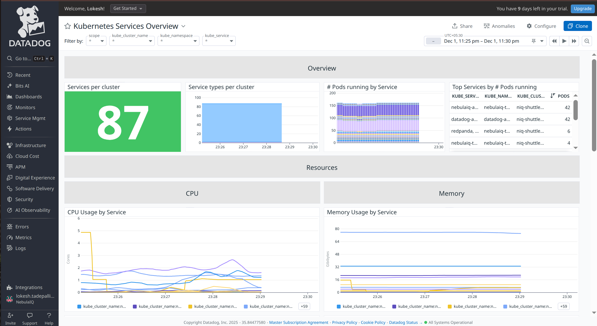
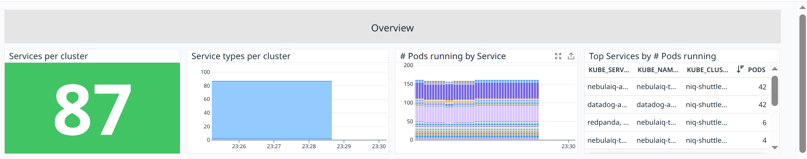
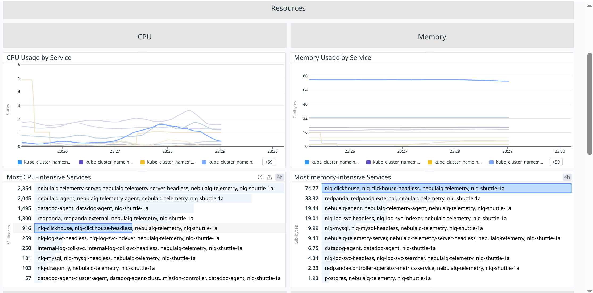
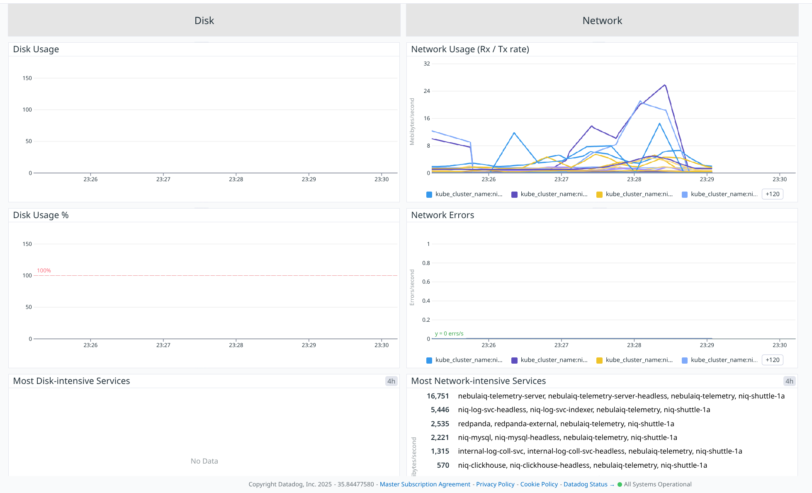

# Services



## Overview



### **Services per cluster**

**Metric(s):**

- Metrics used: `kubernetes_state.service.count`

**query** :

```
sum:kubernetes_state.service.count{*}
```

**Type** : Guage

**Description:** Number of services.
**Tags:**`kube_namespace` `type`.

---

### **Service types per cluster**

**Metric(s):**

- Metrics used: `kubernetes_state.service.count`

**query** :

```
sum:kubernetes_state.service.count{*}
```

**Type** : Guage

**Unit** : Byte

**Description:** Number of services.

**Tags:**`kube_namespace` `type

---

### **Pods running by Service**

**Metric(s):**

- Metrics used: `kubernetes.pods.running`

**query** :

```
exclude_null(sum:kubernetes.pods.running{*})
```

**Type** : Guage

**Description:** The number of running pods

---

### **Top Services by # Pods running**

**Metric(s):**

- Metrics used: `kubernetes.pods.running`

**query** :

```
exclude_null(sum:kubernetes.pods.running{*})
```

**Type** : Guage

**Description:** The number of running pods

---

## CPU & Memory



### **CPU Usage by Service**

**Metric(s):**

- Metrics used: `kubernetes.cpu.usage.total`

**query** :

```
exclude_null(sum:kubernetes.cpu.usage.total{*})
```

**Type** : Guage

**Unit** : nanocore

**Description:** The number of cores used

---

### **Most CPU-intensive Services**

**Metric(s):**

- Metrics used: `kubernetes.cpu.usage.total`

**query** :

```
exclude_null(sum:kubernetes.cpu.usage.total{!pod_name:no_pod})
```

**Type** : Guage

**Unit** : nanocore

**Description:** The number of cores used

---

### **Memory Usage by Service**

**Metric(s):**

- Metrics used: `kubernetes.memory.usage`

**query** :

```
exclude_null(sum:kubernetes.memory.usage{*})
```

**Type** : Guage

**Unit** : byte

**Description:** The amount of memory used

---

### **Most memory-intensive Services**

**Metric(s):**

- Metrics used: `kubernetes.memory.usage`

**query** :

```
exclude_null(sum:kubernetes.memory.usage{!pod_name:no_pod})
```

**Type** : Guage

**Unit** : byte

**Description:** The amount of memory used

---

## Disk & Network



### **Disk Usage**

**Metric(s):**

- Metrics used: `kubernetes.filesystem.usage`

---

### **Disk Usage %**

**Metric(s):**

- Metrics used: `kubernetes.filesystem.usage_pct`

---

### **Most Disk-intensive Services**

**Metric(s):**

- Metrics used: `kubernetes.filesystem.usage`

---

### **Network Usage (Rx / Tx rate)**

**Metric(s):**

- Metrics used: `kubernetes.network.tx_bytes`

**query** :

```
exclude_null(sum:kubernetes.network.tx_bytes{*})
```

**Type** : Guage

**Unit:**byte per second

**Description:** The amount of bytes per second transmitted

---

### **Network Errors**

**Metric(s):**

- Metrics used: `kubernetes.network.rx_errors`

**query** :

```
exclude_null(sum:kubernetes.network.rx_errors{*})
```

**Type** : Guage

**Unit** : error/second

**Description:** The amount of rx errors per second

---

### **Most Network-intensive Services**

**Metric(s):**

- Metrics used: `kubernetes.network.tx_bytes`

**query** :

```
exclude_null(sum:kubernetes.network.tx_bytes{!pod_name:no_pod})
```

**Type** : Guage

**Unit** : byte/second

**Description:** The amount of bytes per second transmitted

---
