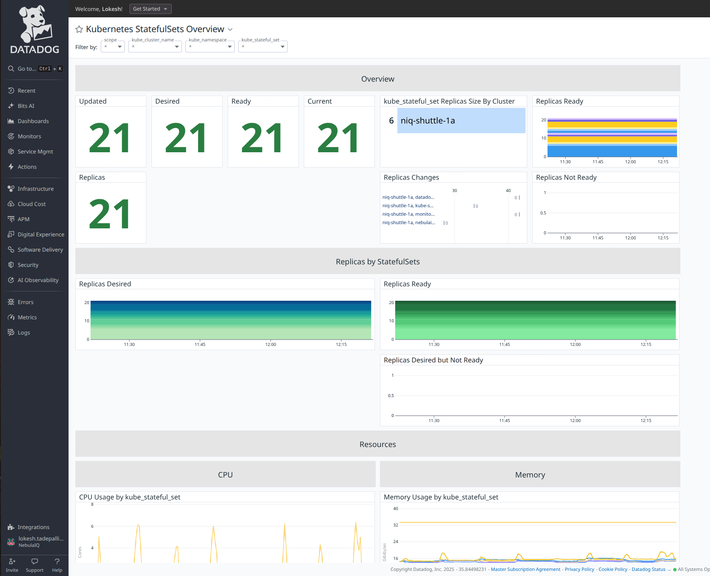
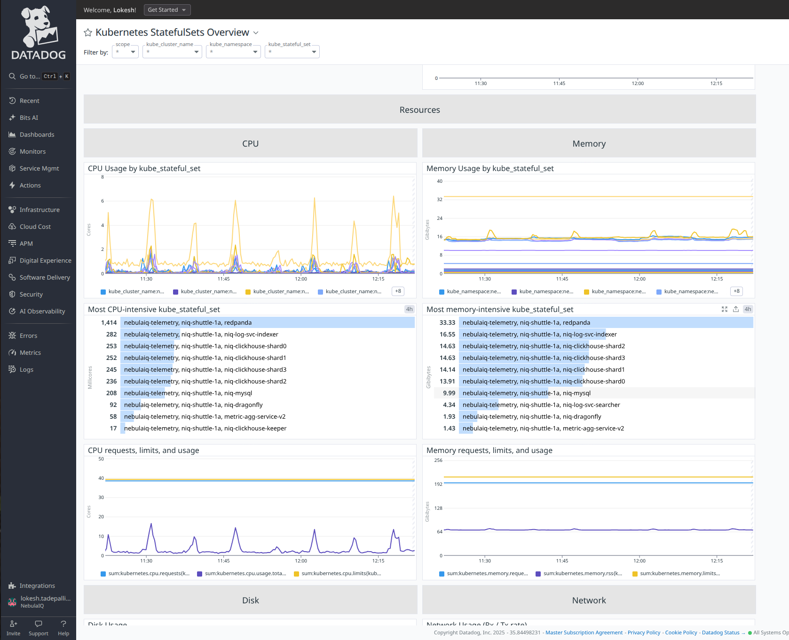
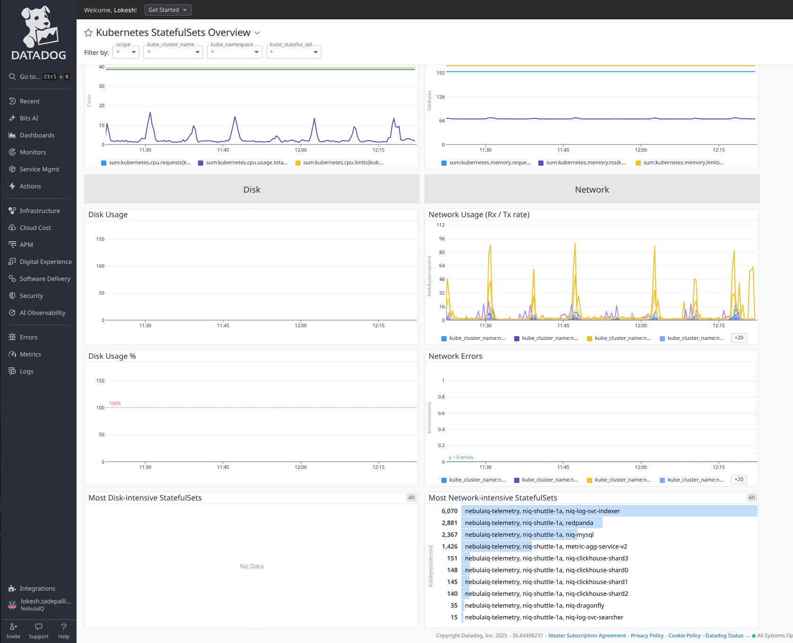
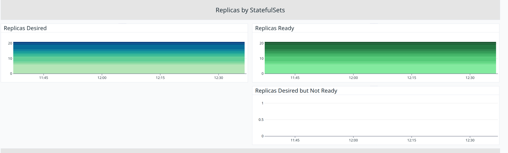
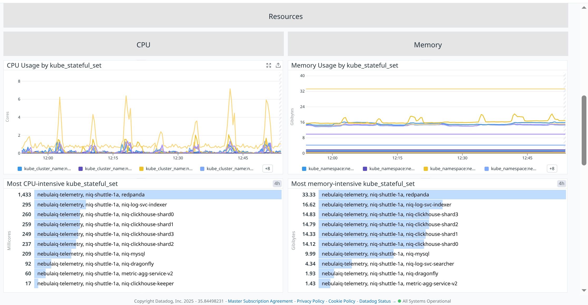
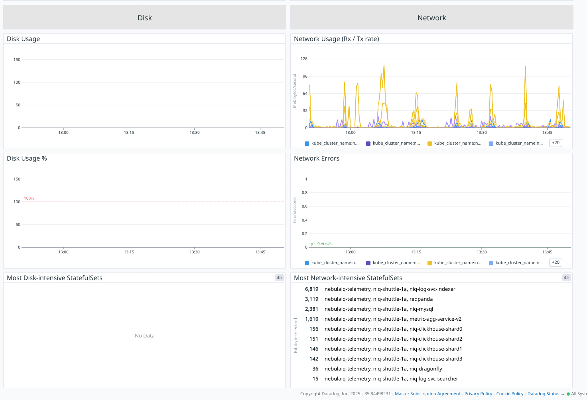

# Statefulsets





# Overview


### **Updated**

**Metric(s):**

- Metrics used: `kubernetes_state.statefulset.replicas_updated`

**query** :

```
sum:kubernetes_state.statefulset.replicas_updated{*}
```

**Type** : Guage

**Unit** : -

**Description:** The number of updated replicas per StatefulSet.

**Tags:**`kube_namespace` `kube_stateful_set` (`env` `service` `version` from standard labels).

---

### **Desired**

**Metric(s):**

- Metrics used: `kubernetes_state.statefulset.replicas_desired`

**query** :

```
sum:kubernetes_state.statefulset.replicas_desired{*}
```

**Type** : Guage

**Unit** : -

**Description:** Number of desired pods for a StatefulSet.

**Tags:**`kube_namespace` `kube_stateful_set` (`env` `service` `version` from standard labels).

---

### **Ready**

**Metric(s):**

- Metrics used: `kubernetes_state.statefulset.replicas_ready`

**query** :

```
sum:kubernetes_state.statefulset.replicas_ready{*}
```

**Type** : Guage

**Unit** : -

**Description:** The number of ready replicas per StatefulSet.

**Tags:**`kube_namespace` `kube_stateful_set` (`env` `service` `version` from standard labels).

---

### **Current**

**Metric(s):**

- Metrics used: `kubernetes_state.statefulset.replicas_current`

**query** :

```
sum:kubernetes_state.statefulset.replicas_current{*}
```

**Type** : Guage

**Unit** : -

**Description:** The number of current replicas per StatefulSet.

**Tags:**`kube_namespace` `kube_stateful_set` (`env` `service` `version` from standard labels).

---

### **Replicas**

**Metric(s):**

- Metrics used: `kubernetes_state.statefulset.replicas`

**query** :

```
sum:kubernetes_state.statefulset.replicas{*}
```

**Type** : Guage

**Unit** : -

**Description:** The number of replicas per StatefulSet.

**Tags:**`kube_namespace` `kube_stateful_set` (`env` `service` `version` from standard labels).

**Tags:**

---

### **kube_stateful_set Replicas Size By Cluster**

**Metric(s):**

- Metrics used: `kubernetes_state.statefulset.replicas`

**query** :

```
max:kubernetes_state.statefulset.replicas{*}
```

**Type** : Guage

**Unit** : -

**Description:** The number of replicas per StatefulSet.

**Tags:**`kube_namespace` `kube_stateful_set` (`env` `service` `version` from standard labels).

---

### **Replicas Ready**

**Metric(s):**

- Metrics used: `kubernetes_state.statefulset.replicas_ready`

**query** :

```
sum:kubernetes_state.statefulset.replicas_ready{*}
```

**Type** : Guage

**Unit** : -

**Description:** The number of ready replicas per StatefulSet.

**Tags:**`kube_namespace` `kube_stateful_set` (`env` `service` `version` from standard labels).

---

### **Replicas Changes**

**Metric(s):**

- Metrics used: `kubernetes_state.daemonset.ready`

**query** :

```
hour_before(avg:kubernetes_state.daemonset.ready{*}), avg:kubernetes_state.daemonset.ready{*}
```

**Type** : Guage

**Unit** : -

**Description:** The number of nodes that should be running the daemon pod and have one or more of the daemon pod running and ready.

**Tags:**`kube_daemon_set` `kube_namespace` (`env` `service` `version` from standard labels).

---

### **Replicas Not Ready**

**Metric(s):**

- Metrics used: `kubernetes_state.statefulset.replicas_desired`

**query** :

```
sum:kubernetes_state.statefulset.replicas_desired{*} - sum:kubernetes_state.statefulset.replicas_ready{*}
```

**Type** : Guage

**Unit** : -

**Description:** Number of desired pods for a StatefulSet.

**Tags:**`kube_namespace` `kube_stateful_set` (`env` `service` `version` from standard labels)

---

# Replicas by StatefulSets



### **Replicas Desired**

**Metric(s):**

- Metrics used: `kubernetes_state.statefulset.replicas_desired`

**query** :

```
sum:kubernetes_state.statefulset.replicas_desired{*}
```

**Type** : Guage

**Unit** : -

**Description:** Number of desired pods for a StatefulSet. Tags:`kube_namespace` `kube_stateful_set` (`env` `service` `version` from standard labels).

---

### **Replicas Ready**

**Metric(s):**

- Metrics used: `kubernetes_state.statefulset.replicas_ready`

**query** :

```
sum:kubernetes_state.statefulset.replicas_ready{*}
```

**Type** : Guage

**Unit** : -

**Description:** The number of ready replicas per StatefulSet.

**Tags:**`kube_namespace` `kube_stateful_set` (`env` `service` `version` from standard labels).

---

### **Replicas Desired but Not Ready**

**Metric(s):**

- Metrics used: `kubernetes_state.statefulset.replicas_desired`

**query** :

```
sum:kubernetes_state.statefulset.replicas_desired{*} - sum:kubernetes_state.statefulset.replicas_ready{*}
```

**Type** : Guage

**Unit** : -

**Description:** Number of desired pods for a StatefulSet.

**Tags:**`kube_namespace` `kube_stateful_set` (`env` `service` `version` from standard labels).

---

## Resources



## CPU

### **CPU Usage by kube_stateful_set**

**Metric(s):**

- Metrics used: `kubernetes_state`

**query** :

```
exclude_null(sum:kubernetes.cpu.usage.total{kube_stateful_set:*})
```

**Type** : Guage

**Unit** : nanocore

**Description:** the number of cores used

**Tags:** -

### **Most CPU-intensive kube_stateful_set**

**Metric(s):**

- Metrics used: `kubernetes.cpu.usage.total`

**query** :

```
exclude_null(sum:kubernetes.cpu.usage.total{kube_stateful_set:*})
```

**Type** : Guage

**Unit** : nanocore

**Description:** The number of cores used

**Tags:** -

### **CPU requests, limits, and usage**

**Metric(s):**

- Metrics used: `kubernetes.cpu.usage.total`

**query** :

```
sum:kubernetes.cpu.usage.total{kube_stateful_set:*}
```

**Type** : Guage

**Unit** : nanocore

**Description:** The number of cores used

**Tags:** -

## Memory

### **Memory Usage by kube_stateful_set**

**Metric(s):**

- Metrics used: `kubernetes.memory.usage`

**query** :

```
exclude_null(sum:kubernetes.memory.usage{kube_stateful_set:*})
```

**Type** : Guage

**Unit** : byte

**Description:** The amount of memory used

**Tags:** -

---

### **Most memory-intensive kube_stateful_set**

**Metric(s):**

- Metrics used: `kubernetes.memory.usage`

**query** :

```
exclude_null(sum:kubernetes.memory.usage{kube_stateful_set:*})
```

**Type** : Guage

**Unit** : byte

**Description:** The amount of memory used

**Tags:** -

### **Memory requests, limits, and usage**

**Metric(s):**

- Metrics used: `kubernetes.memory.rss`

**query** :

```
sum:kubernetes.memory.rss{kube_stateful_set:*}
```

**Type** : Guage

**Unit** : bytes

**Description:** Size of RSS in bytes

**Tags:** -

---



## Disk

### **Disk Usage**

**Metric(s):**

- Metrics used: `kubernetes.filesystem.usage`

---

### **Disk Usage %**

**Metric(s):**

- Metrics used: `kubernetes.filesystem.usage_pct`

---

### **Most Disk-intensive ReplicaSets**

**Metric(s):**

- Metrics used: `kubernetes.filesystem.usage`

---

## Network

### **Network Usage (Rx / Tx rate)**

**Metric(s):**

- Metrics used: `kubernetes.network.tx_bytes`

**query** :

```
exclude_null(sum:kubernetes.network.tx_bytes{kube_stateful_set:*})
```

**Type** : Guage

**Unit** : byte per second

**Description:** The amount of bytes per second received

**Tags:**

---

### **Network Errors**

**Metric(s):**

- Metrics used: `kubernetes.network.rx_errors`

**query** :

```
exclude_null(sum:kubernetes.network.rx_errors{kube_stateful_set:*})
```

**Type** : Guage

**Unit** : error per second

**Description:** The amount of rx errors per second

**Tags:**

---

### **Most Network-intensive ReplicaSets**

**Metric(s):**

- Metrics used: `kubernetes.network.tx_bytes`

**query** :

```
exclude_null(sum:kubernetes.network.tx_bytes{kube_stateful_set:*})
```

**Type** : Guage

**Unit** : byte per second

**Description:** The amount of bytes per second transmitted

**Tags:**

---
