# Headlamp

### **_Headlamp is just a UI for the K8s API, not a monitoring or metric-collection system_**

### Steps to start the headlamp

## 1. Set AWS profile

```
export AWS_PROFILE=shuttle-access
```

You are telling your terminal to use the AWS credentials stored under the profile named **shuttle-access**. This ensures all AWS CLI commands run under that account.

## 2. Connect kubectl to your EKS cluster

```
aws eks --region ap-south-1 update-kubeconfig --name niq-shuttle-1a
```

This command fetches the cluster access details from AWS and updates your local kubeconfig.
After this, `kubectl` knows which EKS cluster to talk to.

## 3. Check EKS cluster nodes

```
kubectl get nodes
```

Verifies that your local kubectl connection is working by listing all worker nodes in the cluster.

## 4. Get Headlamp pod name

```
export POD_NAME=$(kubectl get pods -n kube-system -l "app.kubernetes.io/name=headlamp,app.kubernetes.io/instance=my-headlamp" -o jsonpath="{.items[0].metadata.name}")
```

This finds the **Headlamp UI pod** running in the kube-system namespace and stores its pod name in the environment variable `POD_NAME`.

## 5. Get container port inside the pod

```
export CONTAINER_PORT=$(kubectl get pod -n kube-system $POD_NAME -o jsonpath="{.spec.containers[0].ports[0].containerPort}")
```

This finds the port on which the Headlamp container is listening and stores it in `CONTAINER_PORT`.

## 6. Port-forward the Headlamp UI to your laptop

```
kubectl -n kube-system port-forward $POD_NAME 8080:$CONTAINER_PORT
```

This forwards the pod’s UI port to your local machine’s port 8080.
After running it, you can open Headlamp locally.

## 7. Open Headlamp UI in browser

```
http://127.0.0.1:8080
```

You can now view the Kubernetes UI (Headlamp) in your browser.

## 8. Generate an authentication token

```
kubectl create token my-headlamp -n kube-system
```

This creates a login token for accessing the Headlamp UI.

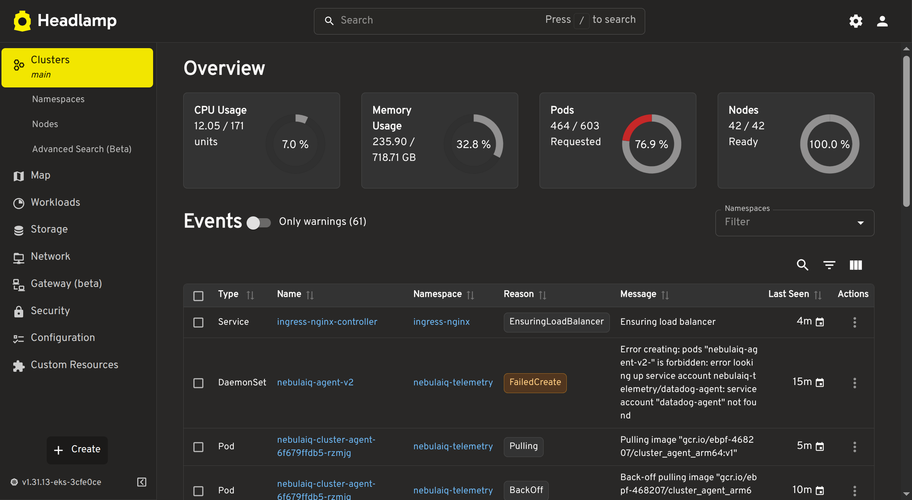

## Cluster

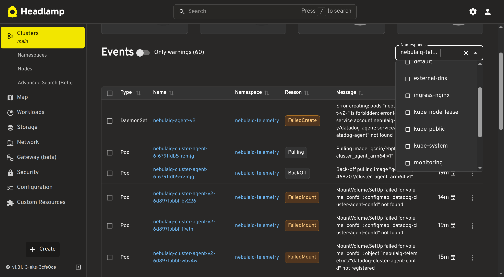

There is cpu data showing
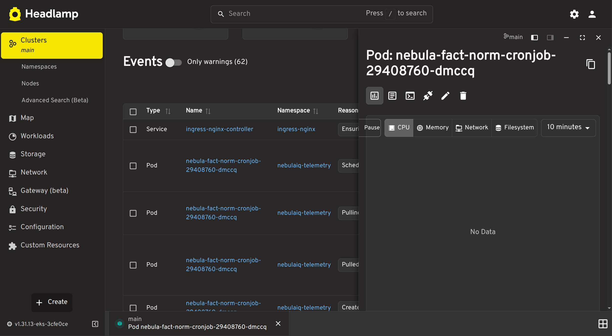

#### logs

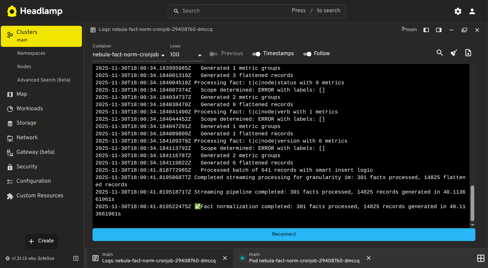

#### Edit Yaml

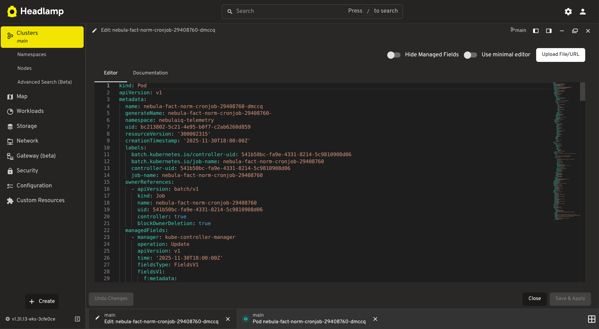

#### Namespace overview

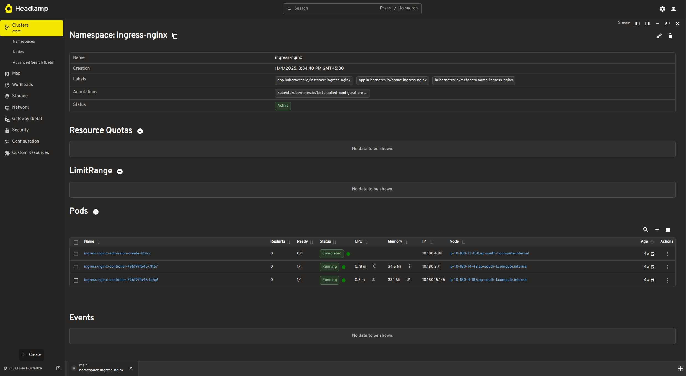

## Namspaces

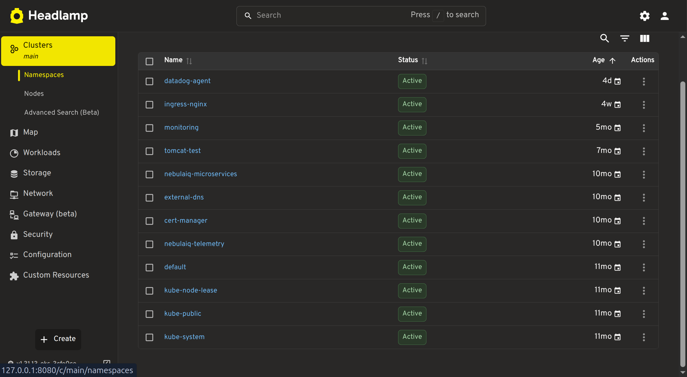

## Nodes

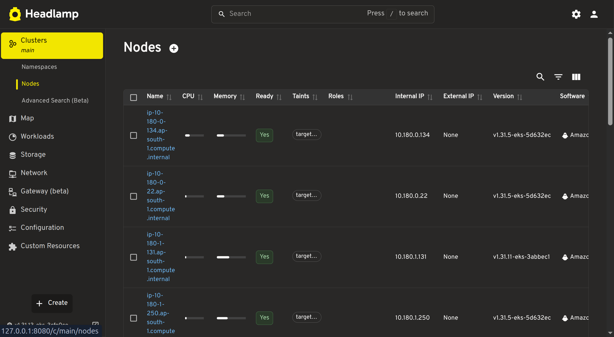

## Maps

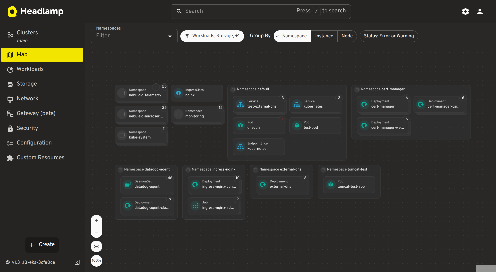
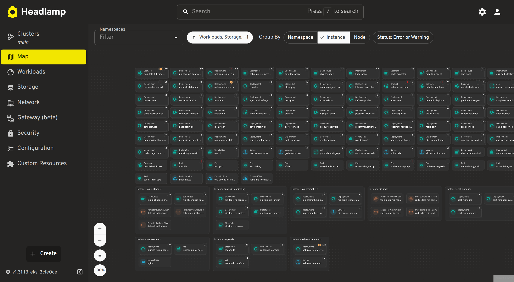
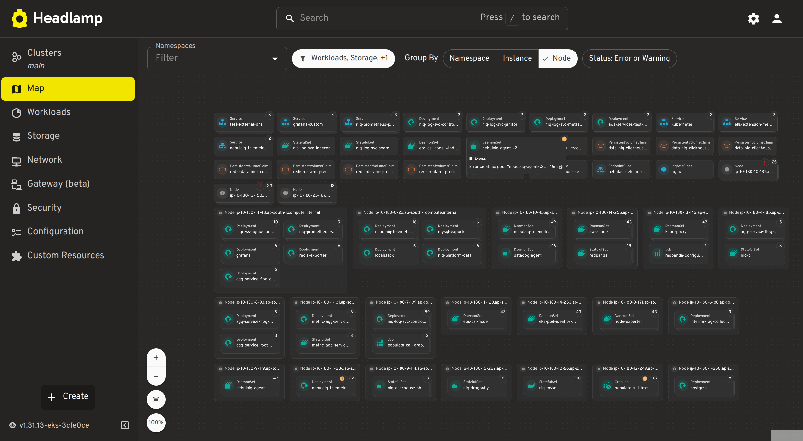

## Deplayment

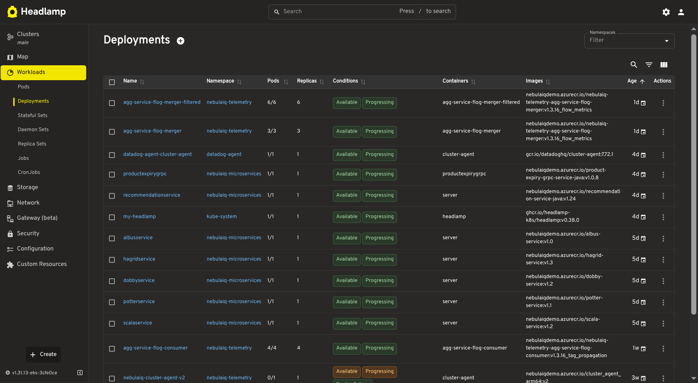

# Data Analysis

Headlamp gets Kubernetes data **directly from the Kubernetes API Server**.
It does **not require an operator** and **does not run agents or collectors** like Datadog.

Headlamp uses:

- **Front-end (React/JS)** to call **A backend proxy (Node/Go)** which communicates with **Kubernetes API Server** using Your kubeconfig + RBAC permissions

# How Headlamp Gets Data

## Step 1 — User logs in using kubeconfig

Headlamp reads your `kubeconfig` file (same file kubectl uses).
This file contains:

- Cluster API endpoint
- Certificates
- Tokens
- User credentials

With this, Headlamp knows **how to connect** to the cluster.

---

## Step 2 — Headlamp backend starts a **Kubernetes API Proxy**

Headlamp starts a lightweight backend server.

The backend connects the UI → API server through a secure proxy(Electron).

### Why proxy?

- Avoid CORS issues
- Allow plugins to make K8s API requests

## Step 3 — Headlamp sends REST calls to Kubernetes API Server

Every piece of info you see in the UI is a **direct Kubernetes API call**.

Data Collection Path:

How Kubernetes data is fetched in headlamp is using
=> kubectl proxy => enter this command in the CLI “kubectl proxy” => it will give us a API

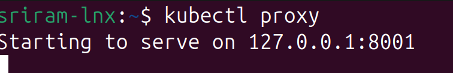
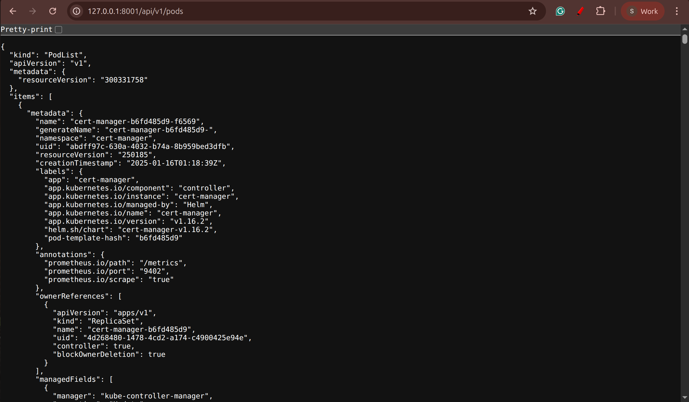
You can use http://localhost:8001/api/v1/pods


Examples:

### Nodes

```
GET /api/v1/nodes
```

### Pods

```
GET /api/v1/namespaces/nebulaiq-telemetry/pods
```

### Deployments

```
GET /apis/apps/v1/namespaces/nebulaiq-telemetry/deployments
```

### Events

```
GET /api/v1/events
```

### Logs

```
GET /api/v1/namespaces/nebulaiq-telemetry/pods/{pod}/log
```

---

## Step 4 — RBAC controls what Headlamp can see

Headlamp does not bypass permissions.

It shows:

- Only the resources your kubeconfig user can access
- Only the namespaces permitted in your Role/ClusterRole
- Only the verbs allowed (get/list/watch)

This is why Headlamp behaves like a **kubectl UI**.

---

# 3. What Data Sources Headlamp Uses

Headlamp only uses these two sources:

## A. **Kubernetes API** (main data source)

Everything resource-related (Pods, Nodes, CRDs, Services, Namespaces, etc.)

# 4. How Headlamp Gets “Real-Time” Updates

Headlamp uses:

### A. **Kubernetes Watch API**

Instead of polling, Headlamp uses:

```
?watch=true
```

Example:

```
GET /api/v1/pods?watch=true
```

This gives a **stream of events**, so the UI updates instantly.

### B. **WebSockets**

The backend converts watch streams into WebSocket messages → front-end updates in real time.

---

# 5. Internal Flow (Step-by-Step)

#### (1) React UI

Button click → “Get pods”

#### (2) UI sends request to Backend

`/api/k8s/pods?namespace=default`

#### (3) Backend authenticates using your kubeconfig

#### (4) Backend calls Kubernetes API

`GET https://<cluster>/api/v1/namespaces/default/pods`

#### (5) Kubernetes sends JSON

Backend forwards it to UI

#### (6) React renders results

# 6. Why Headlamp Does Not Show Metrics Like Datadog

Because:

- Headlamp does not collect metrics
- It does not scrape data every second
- It does not store data
- It only shows current point-in-time metrics from Metrics Server
- It has no observability engine

Datadog → collector agent (DaemonSet) → time-series storage → dashboards
Headlamp → UI → Kubernetes API → current state only
