Dashboard comparison of Headlamp and Datadog (Kubernetss)

Headlamp overview
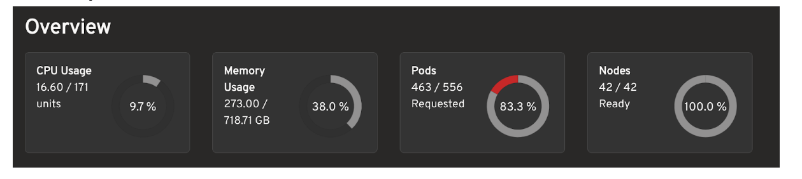

Here we are able to see everything and we expand the tab for more insights but we are not able to know how much resource we are out of which is showing in the headlamp

We can redirect to the detailed page when we click on any cool element
The concept is well-appreciated, as it clearly displays the number of nodes **(463 out of 536)** with pods running under 'clearview,' and this page effectively highlights the locations of warnings and errors.

## Datadog Overview:

While this view comprehensively displays information and allows for expansion into more detailed insights, it does not currently provide the resource utilization metrics in the context of the total available resources, which is a feature present in Headlamp.

Clicking on an interactive element allows for redirection to a detailed page.
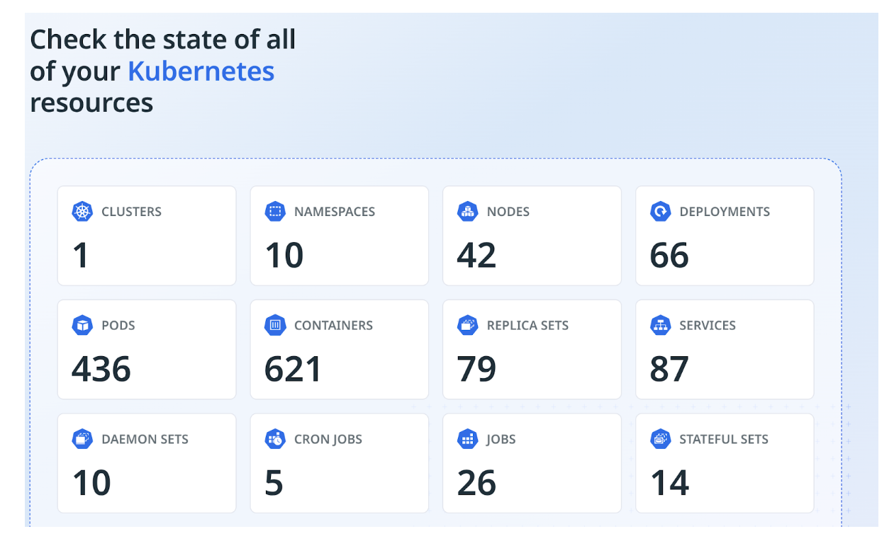
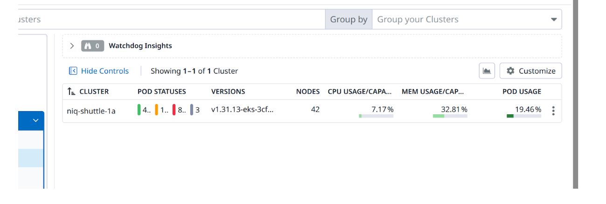

## Nodes

### Headlamp

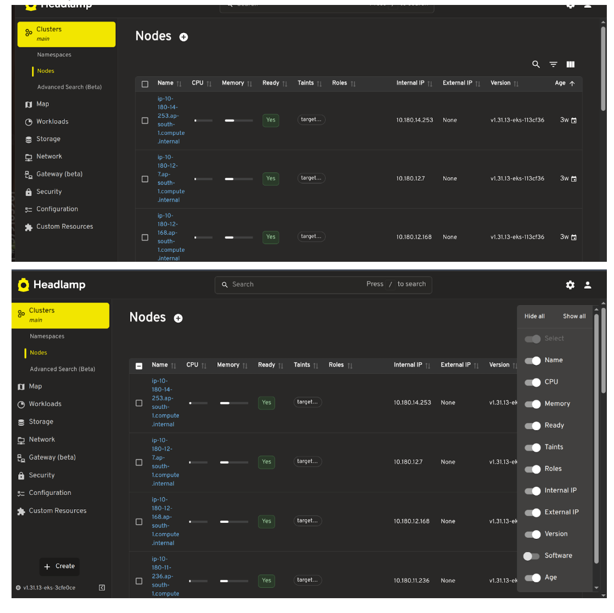

### Datadog

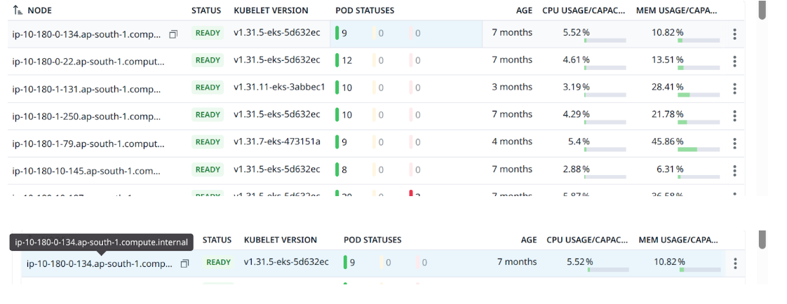

The way the data is organized in the datadog is very clean. All in a single line representation and on hover we can able to see the full description of it and clicking the node moving us to full detailed page which is not incase with headlamp and we can able to watch the how many pods running for each node

Each line showing in graphical and numerical values which is also give more insights

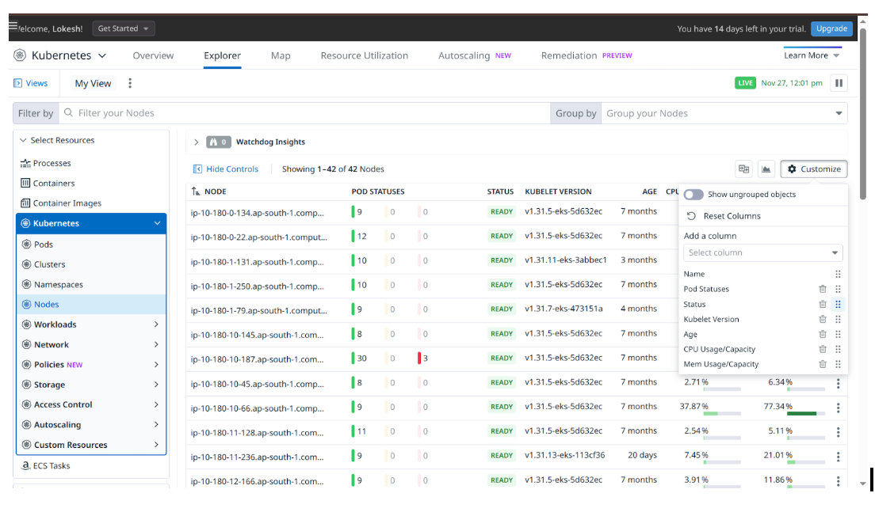
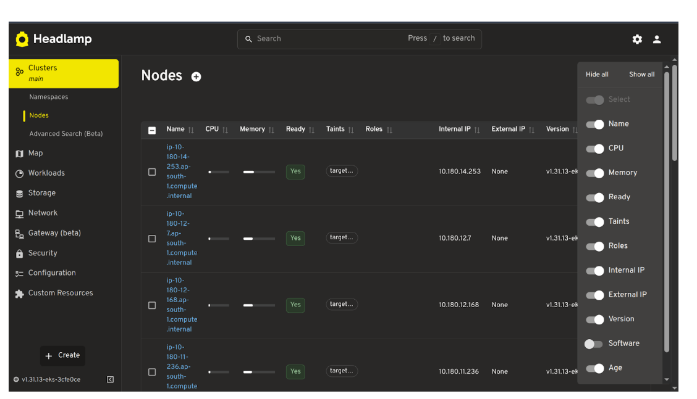

Here in Headlamp the its provide what to show by toggling the option while in datadog we can add required column from the dropdown, order it according to our wish so its looks cool but if user wants temporarily hide some column and bring back is little difficult in datadog when compared to the Headlamp

**Editing and viewing in YAML:**
In headlamp we can view and edit yaml file which is not possible in case of datadog

### Headlamp

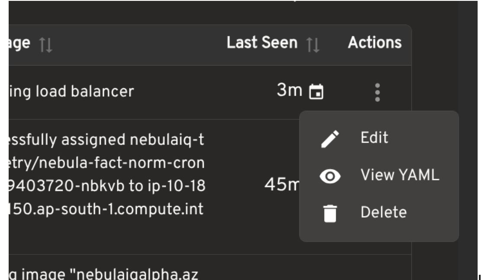
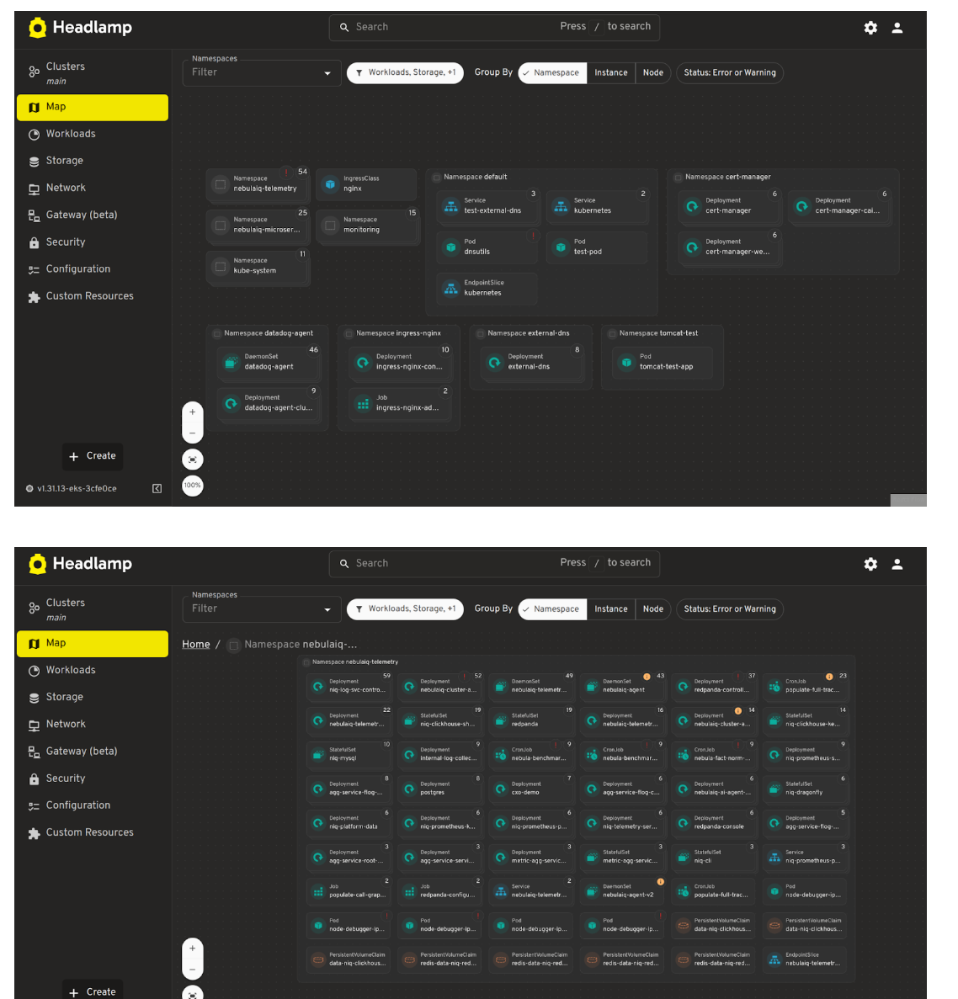

Headlamp map overview showing the name and some warn signs and how pod and its data connecting in flow chart and showing the Text based information about that pod

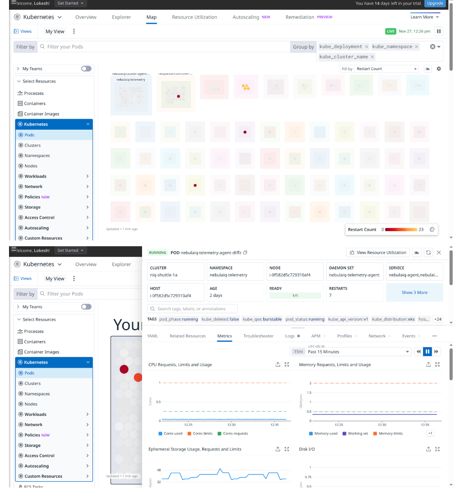
While the datadog is graphically its good and showing the effect pods by color which is also good but we need to hover on that pod to know which pod it is and the Datadog showing the metrics and logs clearly using graphs, charts

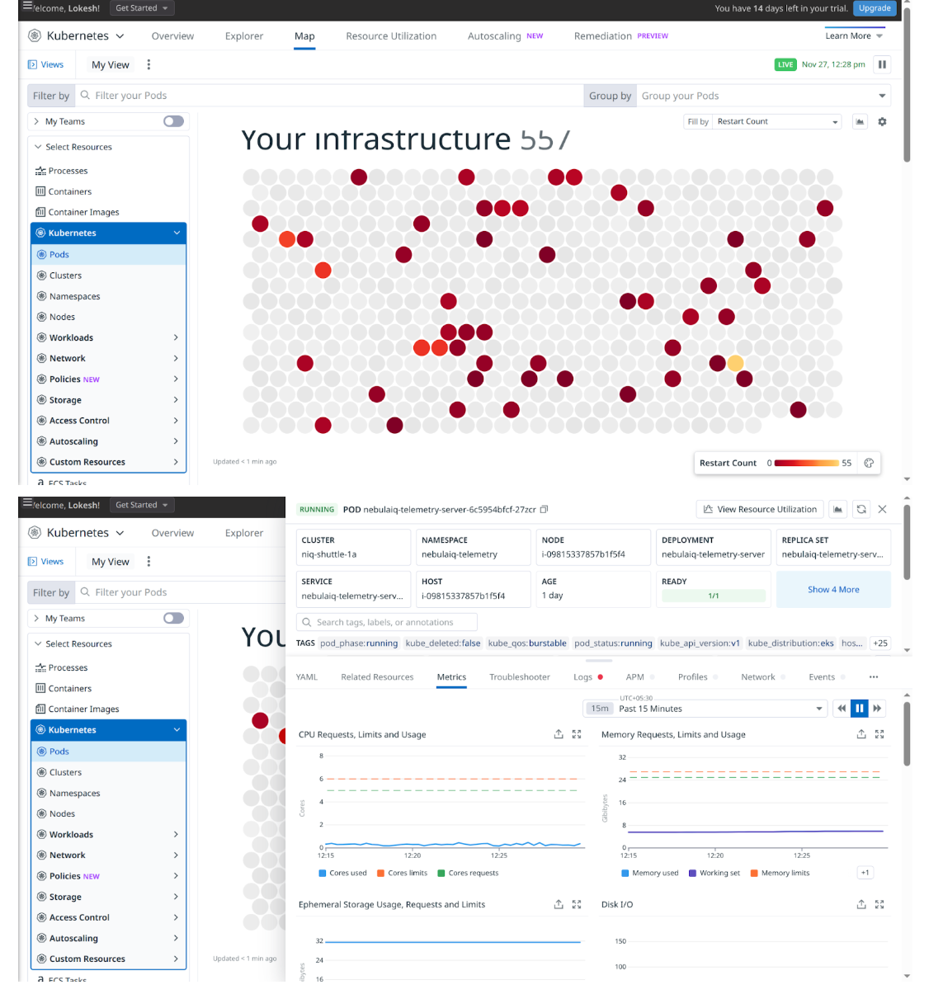

## **Conclusion Notes**

This comparison evaluates the Headlamp and Datadog dashboards for Kubernetes monitoring, highlighting their respective strengths and weaknesses.

| Feature                  | Headlamp                                                                                             | Datadog                                                                                                                                                                                                                          |
| ------------------------ | ---------------------------------------------------------------------------------------------------- | -------------------------------------------------------------------------------------------------------------------------------------------------------------------------------------------------------------------------------- |
| **Dashboard Overview**   | Clear view of resource utilization (nodes, pods running) and warnings/errors.                        | Comprehensive insights available, but lacks the immediate view of out-of-total resource usage visible in Headlamp.                                                                                                               |
| **Nodes View**           | Provides options to toggle what information is displayed. Lacks direct link to a full detailed page. | Clean, single-line representation with detailed description on hover. Direct link to a full detailed page for each node. Easier to order and add columns, though temporarily hiding/bringing back columns is slightly difficult. |
| **YAML Editing/Viewing** | **Possible** (View and Edit).                                                                        | **Not possible** (Cannot view or edit YAML files).                                                                                                                                                                               |
| **Map/Topology View**    | Shows pod/data connections in a flow-chart format with text-based information and warnings.          | Graphically strong, uses color to show affected pods, and clearly displays metrics and logs using graphs/charts. Requires hovering to identify specific pods.                                                                    |
